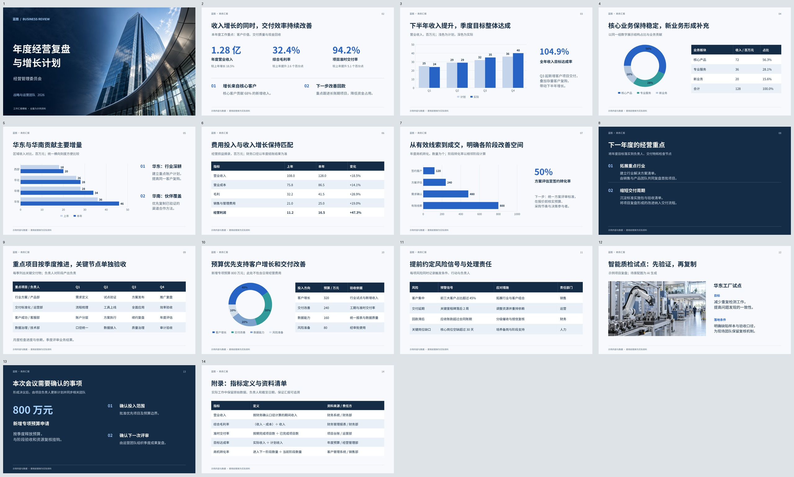
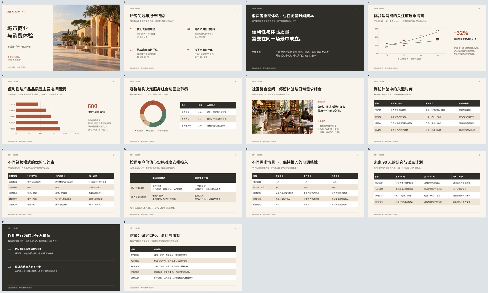

# MusterOffice

**面向 AI Agent 的办公计算引擎，首先支持可编辑演示文稿。**

[English](README.md) · 简体中文

[在线体验 Musterwork](https://app.musterwork.com) · [模板示例](#模板示例) · [快速开始](#快速开始) · [接入-agent](#接入-agent)

MusterOffice 为 Agent 和应用提供结构化的演示文稿创建、查询、编辑、渲染和导出能力。
Rust 核心在原生环境和 WebAssembly 中共享计算，通过薄 SDK、CLI 和 MCP 接入。

项目已用于 [Musterwork](https://www.musterwork.com) 的演示文稿工作流。
你可以直接在线体验，也可以从源码构建，将演示文稿计算接入自己的应用。
引擎可以独立运行，无需依赖 Musterwork、特定模型服务或账号系统。

## 在线体验

打开 **[Musterwork](https://app.musterwork.com)**，让 Agent 帮你制作演示文稿，例如：

> 使用附件中的模板，制作一份季度经营汇报，包含收入图表、预算表格和行动计划，
> 最后导出可编辑的 PPTX。

可以下载下面任一模板作为附件。模板内容为中文，请将示例文字和虚构数据替换为实际资料。
在线体验需要满足 Musterwork 产品本身的账号和运行环境要求。

## 模板示例

以下两套 Musterwork 原创模板已通过 MusterOffice 导入和渲染。
每套都提供可编辑 PPTX 与全页预览，可在 GitHub 中直接查看；点击图片可查看原尺寸。

### 蓝图 · 商务汇报

14 页，适合经营复盘、收入分析、预算、路线图和会议决策。
包含 **5 个原生图表、6 个原生表格和 2 张配图**。

[下载 PPTX](examples/templates/business-blueprint/business-blueprint.pptx) · [查看原图](examples/templates/business-blueprint/preview.jpg)

[](examples/templates/business-blueprint/preview.jpg)

### 视野 · 内容报告

14 页，适合专题研究、客群分析、用户旅程、竞争比较和行动计划。
包含 **3 个原生图表、7 个原生表格和 2 张配图**。

[下载 PPTX](examples/templates/editorial-perspective/editorial-perspective.pptx) · [查看原图](examples/templates/editorial-perspective/preview.jpg)

[](examples/templates/editorial-perspective/preview.jpg)

图表保留数据和嵌入工作簿，表格保留可编辑单元格。
模板引用 **Noto Sans SC（思源黑体）**，仓库不附带字体文件；在编辑器中安装该字体，
可更接近预览中的排版。业务数据和案例均为虚构，配图由 AI 生成。
详情见[示例使用与来源说明](examples/templates/README.md)。

## 快速开始

### 1. 构建 CLI

安装 Git 和 [rustup](https://rustup.rs)。仓库通过 `rust-toolchain.toml` 固定 Rust 1.92.0；
第一次构建时，Cargo 会下载锁文件指定的依赖。在终端执行：

```sh
git clone https://github.com/wanquanY/MusterOffice.git
cd MusterOffice
cargo build -p mo-cli --locked
```

下面命令使用 macOS 或 Linux 的 POSIX shell。CLI 输出到 `target/debug/mo-cli`。
此处的基础 PPTX 导出不需要原生图形库，也不需要安装 Office 应用。

### 2. 导出第一份 PPTX

使用仓库内的两页示例文档及其图片资源：

```sh
mkdir -p .codex-work/quickstart
target/debug/mo-cli pptx-export \
  fixtures/presentations/native-export/request.json \
  fixtures/presentations/native-export/resources.bin \
  .codex-work/quickstart/hello.pptx

target/debug/mo-cli pptx-inspect .codex-work/quickstart/hello.pptx
```

用演示文稿编辑器打开 `.codex-work/quickstart/hello.pptx`。
这份[小型示例](fixtures/presentations/native-export/README.md)包含可编辑文字、形状、组合、图片和连接线。
可以查看或修改[请求 JSON](fixtures/presentations/native-export/request.json)，了解文档模型。
再次执行时请使用新的输出文件名，导出不会覆盖已有文件。

也可以用相同方式检查完整模板：

```sh
target/debug/mo-cli pptx-inspect \
  examples/templates/business-blueprint/business-blueprint.pptx
```

### 3. 调用结构化操作

应用和 Agent 工作流可以使用 `compute`，它与 Rust SDK、MCP 使用相同的调用合同。
下面通过文字和位置声明组合三页演示文稿：

```sh
mkdir -p .codex-work/quickstart/temporary
printf '[]\n' > .codex-work/quickstart/inputs.json

target/debug/mo-cli compute \
  fixtures/presentations/compose/invocation.json \
  .codex-work/quickstart/inputs.json \
  .codex-work/quickstart/temporary \
  .codex-work/quickstart/composed

target/debug/mo-cli compute-schema computation-invocation \
  > .codex-work/quickstart/invocation.schema.json
```

新建的 `composed` 目录中，`result.json` 保存可继续编辑的文档快照。
后续编辑或导出请求显式传入该快照；资源清单将资产声明映射到调用方提供的文件。
包含 PNG 预览的完整导出还需要配套原生导出 worker 和显式字体。
详见[原生渲染与播放](#原生渲染与播放)及[调用合同](contracts/generated/computation-invocation.schema.json)。

## 接入 Agent

MCP 适配器使用独立的 Cargo workspace：

```sh
cargo build --manifest-path tools/mo-mcp/Cargo.toml --locked
```

创建彼此独立的输入、输出和临时目录，将其**绝对路径**写入 `caller-files.json`：

```json
{
  "inputDirectory": "/absolute/path/to/inputs",
  "outputDirectory": "/absolute/path/to/outputs",
  "temporaryDirectory": "/absolute/path/to/temporary",
  "computationSlots": 2,
  "controlSlots": 2
}
```

在 MCP 客户端中注册服务。采用 `mcpServers` 配置格式的客户端可以参考：

```json
{
  "mcpServers": {
    "musteroffice": {
      "command": "/absolute/path/to/MusterOffice/tools/mo-mcp/target/debug/mo-mcp",
      "args": ["/absolute/path/to/caller-files.json"]
    }
  }
}
```

服务提供 `mo_capabilities`、`mo_schema` 和 `mo_presentations_compute`。
先查询实际能力和 Schema，再执行计算。Agent 的文件工具需要能读写配置的输入、输出目录。
在配置中加入配套 `exportWorker` 的路径和 SHA-256，可启用渲染与完整导出；
创建、导入和编辑不要求导出 worker。

worker 配置及工具调用见 [MCP 接入说明](tools/mo-mcp/README.md)。
需要打包 Skill 和 MCP 时，使用 [Agent 开发包构建器](tools/agent-package/README.md)
及[演示文稿 Skill](integrations/skills/musteroffice-presentations/SKILL.md)。

## 嵌入自己的应用

| 接入方式 | 使用入口 |
| --- | --- |
| Rust SDK：创建、组合、导入、编辑、导出 | [SDK 说明](tools/sdk/README.md)与[原生导出示例](tools/sdk/example/src/main.rs) |
| 浏览器 / WebView 中的 TypeScript 与 WASM 播放 | [播放包](tools/playback-sdk/README.md)与[示例](tools/playback-sdk/example.mjs) |
| 原生无界面播放 | [播放示例](tools/sdk/playback-example/src/main.rs) |
| 交互编辑接入 | [编辑客户端](packages/editor-client/README.md) |
| 配套 SDK / worker / WASM 版本包 | [发行装配说明](tools/release/README.md) |

调用方提供文档字节、素材、字体、取消信号及最终输出存储；MusterOffice 负责文档计算和诊断。
连续播放由应用运行时驱动，无需每一帧都发起 Agent 工具调用。

### 原生渲染与播放

渲染使用固定版本的 HarfBuzz、Skia 和图片编解码组件。
构建 `mo-export-worker` 或 `mo-raster-worker` 前，先准备：

- [HarfBuzz 组件](docs/implementation/harfbuzz-component.md)
- [Skia 组件](docs/implementation/skia-component.md)
- [图片编解码组件](docs/implementation/image-codec.md)

将 `MO_HARFBUZZ_LIB_DIR`、`MO_SKIA_LIB_DIR` 指向经过验证的原生组件构建目录，然后执行：

```sh
cargo build -p mo-export-worker -p mo-raster-worker --locked
```

SDK、worker 和 WASM 应来自同一套验证构建。字体字节由调用方显式提供；
核心不会搜索系统字体，也不会自动获取外部资源。

## 当前状态与开发

当前为早期源码版本，重点完善日常演示文稿工作流。
创建、导入、已支持的编辑、原生 PPTX 导出、渲染和播放均已有实际实现。
能力范围取决于输入和具体操作；完整 PowerPoint/WPS 互操作及全部高级能力仍在推进。
分页文档与电子表格属于未来方向。

目前没有公开的软件包管理器发行包或 GitHub 预编译发行包，请按上述说明从源码使用。
原生渲染已有 macOS 和 Linux 构建配置，Windows 渲染支持尚未完成。

开发 TypeScript 接入层需要 Node.js 22+ 和 pnpm 10.2.1，运行
`pnpm install --frozen-lockfile` 与 `pnpm check:types`。
详细范围和证据见[当前验证入口](docs/implementation/current-verification.md)、
[实现进度](docs/implementation/progress.md)、[架构](docs/architecture/overview.md)
及[决策记录](docs/decisions/README.md)。
提交 [Issue](https://github.com/wanquanY/MusterOffice/issues) 时，请附最小复现、提交版本和运行平台。

## 许可证

项目原创源码和随附原创模板采用 [Apache License 2.0](LICENSE)。
第三方材料保留各自的许可和署名，详见[第三方声明](THIRD_PARTY_NOTICES.md)。
