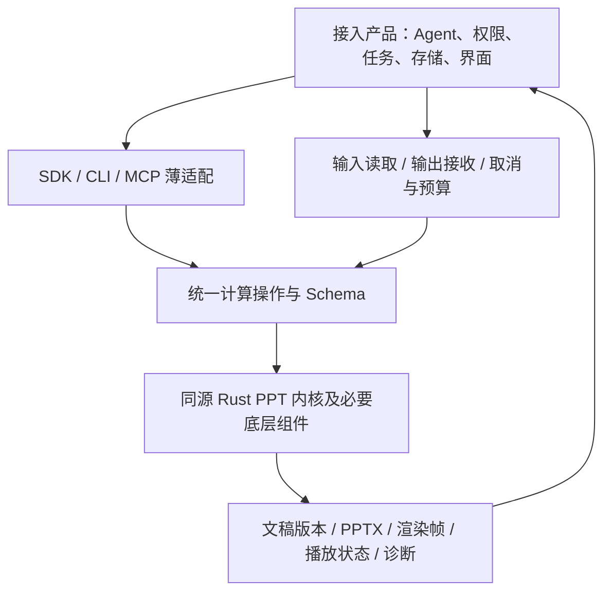

# Agent 生态接入：SDK、MCP、CLI、Skill 与 Plugin

2026-09-27 · 当前职责按 [ADR 0007](../decisions/0007-kernel-only-integration-boundary.md) 修订。完整公共接入尚未交付；已有标准持久宿主/MCP 的阶段实现保留事实记录，不能据此声明已符合新边界。

## 1. 产品形态

MusterOffice 提供完整 PPT 计算能力和薄接入，不建设账号、权限系统、持久存储、任务平台或产品页面。接入产品保留这些责任。详细输入输出、资源所有权与迁移要求见[内核与产品边界](../design/implementation/kernel-host-boundary.md)。

| 入口 | MusterOffice 交付 | 接入方提供 |
| --- | --- | --- |
| SDK | 高层文稿操作、常用内存/流适配、Native/WASM、无界面渲染/播放接口 | 输入资源、输出接收、计算配置；需要时接自己的存储和任务 |
| MCP | 能力发现、操作 Schema、工具/资源协议、进度和取消映射 | 客户端、输入输出桥接、部署权限；持久任务由现有服务承担 |
| CLI | 同源操作与结构化结果、明确输入输出的薄 I/O 适配 | 已授权文件/流、命令生命周期及结果保存 |
| Skill | 创建、编辑、检查、修复和交付工作流 | Agent 与工具执行环境 |
| Plugin | 对特定平台的安装、版本、MCP/Skill 注册配置 | 平台自己的安装权限、工具权限和用户界面 |

普通 SDK 用例不要求实现六个宿主端口；MCP 客户端不需要修改自身数据库。提供内存、流和调用方文件句柄的通用绑定，复杂产品才映射自己的附件/存储对象。包名、ABI、安装命令和首批平台清单仍待冻结，本文不是已发布 SDK 的使用说明。

## 2. 计算与宿主边界

Operation Service 在目标边界内只负责计算合同的校验、派发与结果封装，不要求独立服务器或业务数据库。文档模型、原子事务、布局、格式和播放语义由同一内核实现，MCP/SDK 不形成两套质量规则。

计算 API 与算法已移至 `mo-presentation-operations`；Native SDK 和主 WASM 使用它，旧 `mo-operation-service` 作为宿主合同兼容层调用同一实现。默认 `mo-mcp` 已退出 `mo-standard-host` 的持久路径，旧路径由显式 `legacy-host` feature 和兼容程序保留，见[薄 MCP 实现](../implementation/thin-mcp.md)。旧产品数据仍需按实际责任迁移，不能通过删除历史数据或跳过验证完成拆分。

## 3. 三种运行环境，同一责任划分

| 环境 | 调用与计算 | 持久化/权限/界面 |
| --- | --- | --- |
| 产品内嵌 | SDK 直接调用；按平台采用本地计算或隔离 worker | 全部由接入产品拥有 |
| 本地 Agent | 配置 MCP 或 Skill＋CLI；通用文件/流桥接 | 文件权限和任务生命周期由 Agent 宿主/操作系统管理 |
| 远程部署 | 薄 MCP 服务运行同一计算能力，输入输出经过宿主通道 | 接入产品或部署网关鉴权、存储、恢复和展示 |

MCP 服务不自建账号、上传页面或内容库。宿主支持持久 Job/Tasks 时可以映射；没有时只声明同步或连接内计算能力。普通调用不会被强制包装成数据库任务，计算句柄在进程重启后失效，恢复由产品重新提供输入或恢复它的任务。

资源不是权限：字节摘要、文档 ID 和请求 ID 都不能授予读取权。宿主在交付读取句柄之前授权，内核只检查输入完整性、格式、句柄有效性和计算预算。大文件通过有界数据通道，不能反复塞进模型上下文。

## 4. Musterwork 接入

目标链路：Agent/Skill → Musterwork 原 Invocation → SDK 或薄 MCP → 内核计算与实际文件验证 → 原 Runtime 提交 Artifact → Musterwork 自己的查看/编辑/播放界面。

Musterwork 继续持有身份、文件/网络、任务、fence、幂等、存储、历史和结果发布。内核显式返回输出及依赖；产品按原规则保存和登记引用。原子编辑是内核能力，原子业务提交是产品能力。

正式集成使用公共 SDK/MCP 合同及小范围产品桥接，不因某个产品需要特殊数据库列而改变通用计算模型。需要修复的产品共享存储缺陷另列依据、影响与回归；全产品引用追踪/垃圾回收不成为所有 Agent 使用内核的前提。已有改动不能无审查删除，详见[适配实施合同](../design/implementation/musterwork-adapter-spec.md)。

渲染/播放 SDK 提供无界面的页选择、采样、时间推进、seek、状态及诊断接口。Musterwork 实现窗口、按钮、编辑交互与附件展示；连续帧和媒体不走模型或逐帧 MCP RPC。

## 5. 独立接入与分发

完成 SDK 或 MCP 配置后，使用支持的输入输出方式即可创建、导入、修改、预览和导出；不要求引入 Musterwork 私有源码、数据库或 AgentLoop。是否能直接使用某种客户端附件取决于已声明的桥接能力，不能把 MCP 连接成功当作任意文件已可访问。

SDK 不强带 MCP/HTTP；本地 MCP 不强带 HTTP 或产品 UI；各入口不捆绑未来办公领域。计算组件、字体和 codec 按实际支持档案安装，完整一期能力与离线闭包均保留。具体客户端 Plugin 的安装方式分别验证，不宣称一个 manifest 能适配所有产品。

当前[Agent 开发包](../implementation/agent-package.md)从唯一 Skill/便携身份生成 Agent Plugins 1.0.0 和 Codex 兼容清单，包内固定原生 MCP 与对应 worker；调用方目录配置独立于包路径。安装器、认证、附件和结果保存由客户端负责。清单、搬迁后运行及实际导出已有验证，用户客户端激活与正式发行尚未验收。

完整一期交付仍包含 Native/WASM、SDK、CLI、MCP 本地与远程适配、Skill、Plugin 和 Musterwork 产品链路。MCP Apps/成品 Viewer 不再是 MusterOffice 必需交付；产品可自行使用其 UI 框架展示内核结果，动态播放计算门槛不变。

## 6. 验收与当前差距

公共 [I01–I20](../design/agent-interfaces.md) 要求独立客户端实际完成输入 → 创建/导入 → 原子修改 → 渲染 → 原生 PPTX 输出，并验证错误、取消、资源释放及宿主保存。普通 SDK/MCP 路径不初始化 MusterOffice 自有数据库，不要求账号或产品页面。

直接计算、SDK、CLI/MCP 采用相同文稿、资源、质量档案与语义结果。封装的 CPU、内存、复制、通信、冷启动和安装成本单列，并进入完整端到端测量；未实测不承诺零开销。全部高级能力、Office/WPS 编辑往返和产品替换门禁分别验收。

Native 高层 SDK 已实现进程内文稿、借用资源与直接导出，计算合同已独立；本地薄 MCP、可选 [2026 HTTP](../implementation/http-mcp.md)及 [Skill/Plugin 开发包](../implementation/agent-package.md)已共用该计算，旧标准宿主隔离兼容。远程附件桥接、其余高层能力、客户端实际激活与完整接入仍需实现和验证。当前没有完整可安装发行物；开发包与历史阶段通过不等于 I01–I20 已通过。
