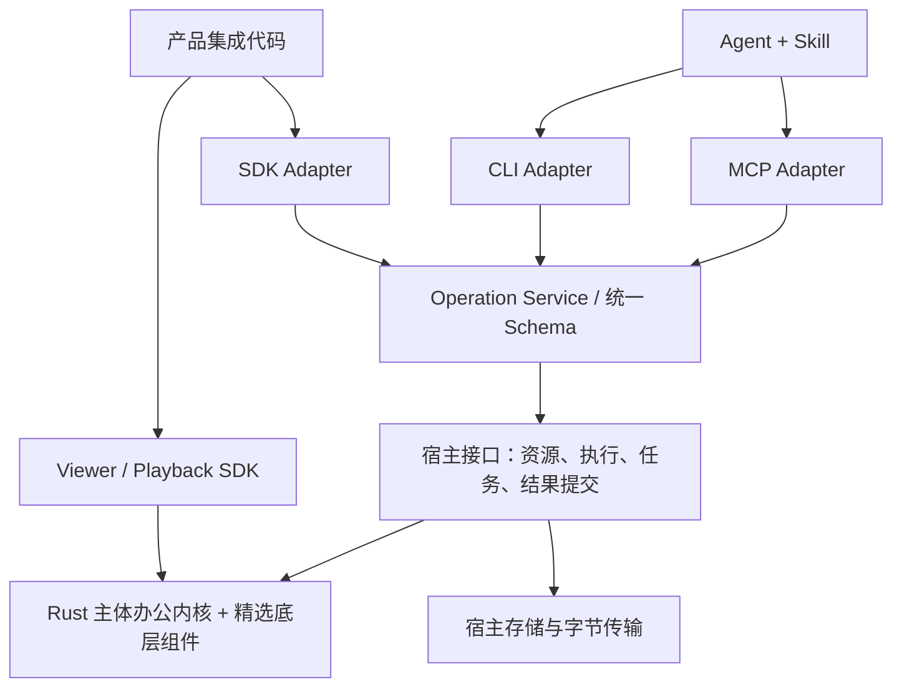

# Agent 生态接入：MCP、Skill、Plugin 与 SDK

版本 0.1 · 2026-09-24 · **总体接入设计，完整适配尚未实现、未发布**。用户已要求标准化、可独立接入；本稿明确交付形态、责任与验收。技术方向见 [ADR 0003](../decisions/0003-language-and-component-strategy.md)，接入决定见 [ADR 0004](../decisions/0004-agent-integration-surfaces.md)。标准操作、资源、[导出宿主](../implementation/export-host.md)、[MCP stdio](../implementation/mcp-recovery.md)和 [TS 控制/资源客户端](../implementation/operation-client.md)已有部分实现；完整 MCP/SDK、Skill/Plugin 与产品集成仍需分别交付。

## 1. 对外产品形态

MusterOffice 对外是一套办公能力，按接入环境提供不同包装。**通用 Agent 用 MCP，任务方法用 Skill，安装体验用 Plugin，产品内嵌与实时播放用 SDK。** 这些层共用一份操作合同和同一内核，不能形成四套独立实现。

| 形态 | 使用者 | 负责什么 | 不负责什么 |
| --- | --- | --- | --- |
| MCP Server | 已有 MCP Client 的 AI 产品 | 能力发现、类型化工具、结果/资源引用、任务查询 | 模型推理、逐帧绘制、替代宿主授权 |
| Agent Skill | 支持技能格式的 Agent | 选择操作、模板/设计方法、检查/修订流程 | 文件引擎、常驻任务、强制执行权限 |
| 产品 Plugin | 具体 AI 产品的安装者 | 安装依赖、注册 MCP/Skill、配置权限和可选预览 | 制定另一套办公协议或业务规则 |
| SDK / 原生接口 | 产品研发团队 | 低开销调用、资源/显示/播放、嵌入宿主 | 自动获得文件权限或依赖模型 |
| CLI | 自动化、Shell Agent、开发者 | 同一操作合同的命令入口与诊断 | 要求必装 Node.js 或启动图形界面 |

“Plugin”在本项目指分发适配层；各产品的 manifest、安装和权限机制不同。官方维护公共发行清单，再生成/维护平台包装，不承诺一个文件在所有 AI 产品中一键安装。公共能力不依赖某个插件商店。

## 2. 统一操作服务



Operation Service 是宿主侧可嵌入模块，不等于必须部署一个远程服务。它负责版本/参数校验、操作派发、结果封装与调用上下文传递；不重新实现领域计算。不同入口共用错误码、能力档案、资源身份、revision 和操作幂等语义。

核心接口位于服务下方，不认识 MCP/Plugin、账户或文件系统。核心的 native/WASM 绑定和具体 C/C++ 依赖不进入 Agent tool 参数。领域操作与原生 ABI 分别版本化，不能把某种语言结构体布局当公开网络协议。

协议 Schema 是唯一机器合同来源，生成或验证 SDK 类型、MCP input/outputSchema、CLI 帮助和协议文档。当前已实现的 draft 操作由 Rust 生成 Schema 与 TS 类型；本稿中的完整 MCP/SDK/分发合同仍是设计目标，不能将其视为已存在的可安装包。

## 3. 两种宿主，保持单一任务所有者

| 模式 | 资源/任务所有者 | 部署与用途 |
| --- | --- | --- |
| Standalone Host | MusterOffice 标准宿主 | 本地 stdio 或自托管 HTTP；自带有界存储、任务记录、资源代理与输出管理 |
| Embedded Host | 接入产品注入的 Runtime/存储 | Musterwork 或其他产品已有任务、身份和 Artifact 时使用 |

标准宿主与内核分包；标准宿主可以依赖系统文件/网络设施，核心不能。产品只嵌入核心/SDK时不必携带 HTTP 服务、OAuth 组件或未来办公领域。

建议标准宿主、CLI 和本地 MCP 使用原生发行物，优先由 Rust 承载适配，不要求为了调用内核再安装 Node.js；具体 MCP 库按协议覆盖、体积和维护质量选择。TS SDK 服务于已有 JS/浏览器宿主，不作为其他平台调用的强制中间层。此分发实现细节仍需 E0 验证。

宿主接口至少有 ResourceProvider、ResultSink、ExecutionDriver、JobStore、AuthorizationContext、ResultCommitter。已有产品选择 Embedded 时，JobStore 是现有任务记录的映射，不再建立第二套独立队列；MCP task/job ID 只是同一业务操作的可查询投影。

Standalone 的 stdio 进程可以是整个客户端连接期间的服务，多次调用共享明确保存的文档版本；不能每个 Tool 调用都启动/退出并丢失文档。进程重启后，持久操作通过 JobStore/资源存储恢复；未持久化的播放会话明确失效。文档数据生命周期不绑定一条聊天消息。

## 4. Musterwork 的具体接入形式

官方 Musterwork 集成包在逻辑上包含：

```text
MusterOffice for Musterwork
  presentation Skill
  MCP tool registration / connection configuration
  host bridge: Invocation, resource, job, cancellation, result
  Artifact adapter: PPTX, model, preview, playback, diagnostics
  viewer/player SDK integration
  version and capability manifest
```

这是需要实现的集成包合同，不假设 Musterwork 当前已有同名 Plugin manifest 或商店。其安装/内置发行方式在 Musterwork 发行 owner 处落地；如暂以产品内置能力发布，仍遵守相同模块边界，不能复制内核到产品源码。

正常链路：Agent 加载 Skill → 调用 MCP 工具 → Musterwork Runtime 创建/绑定 Invocation → 宿主桥接层按现有策略选择 Web/Desktop/Managed → 内核生成并检查候选 → Runtime 校验 fence、摘要并提交 Artifact → 产品展示与下载。

MCP 表达的是调用合同，执行地点由宿主策略决定。Web 页面不能直接启动 stdio；Musterwork 的浏览器执行继续经过既有受控客户端网关，在 Worker 中运行 WASM。Desktop 可用受管原生进程；无客户端任务用 Managed。服务不能因工具调用来自云端就默认把所有计算和文件迁到云端。

Viewer/Player SDK 从已授权资源和固定文档/plan 获得数据，在本地连续呈现。Agent 可以通过工具设置动画、采样指定时间帧、生成播放入口；60 FPS tick 和媒体帧不经模型或逐帧 MCP RPC。

纯内部调用可以通过 SDK 直接进入同一 Operation Service，以减少序列化；必须携带同样的调用上下文并通过等价检查，不形成绕开 Runtime 的第二条业务提交路径。[完整替换合同](../design/presentations/musterwork-integration.md)继续拥有消费者及历史版本映射。

## 5. 其他 AI 产品的四条接入路径

| 路径 | 集成者必须提供 | MusterOffice 提供 | 验收结果 |
| --- | --- | --- | --- |
| 本地 MCP | 支持的 MCP Client、明确授权的文件/附件入口 | 目标平台二进制、stdio 服务、配置样例、可选 Skill | 配置后生成/改稿/检查/取得 PPTX |
| 远程 MCP | HTTP MCP Client、身份和文件交互方式 | 可自托管服务、标准授权、上传/下载入口及 Skill 内容 | 无本机执行环境也能完成任务 |
| Skill＋CLI | Skill loader、命令执行和授权工作目录 | 可移植技能目录、原生命令、结构化响应 | 不实现 MCP Client 也能接入 |
| SDK 嵌入 | 宿主资源/执行/任务/提交适配 | Rust/native、TS/WASM 接入层与示例 | 深度集成现有 UI/数据体系，复用全部计算规则 |

普通 MCP Client 不一定支持文件上传、交互播放器或附件保存。配置指南必须明确这些条件；不能把“连上 MCP”宣传为自动拥有任意附件和 UI 能力。标准宿主提供可独立使用的授权上传/下载流程，简单客户端仍可完成交付；成熟产品可将自身附件直接映射为资源句柄。

接入不要求 Musterwork 数据库、账号、模板服务或 AgentLoop。也不要求使用 MusterOffice 提供的模型供应商；内核与标准宿主均不调用模型完成排版或文件校验。

## 6. 一期必须交付的开发者资产

| 资产 | 一期要求 |
| --- | --- |
| 版本化 Operation Contract | 能力清单、Schema、错误、幂等、异步与资源合同 |
| 原生计算与 WASM 发行物 | 实际平台支持矩阵、组件摘要、依赖和资源清单 |
| 标准宿主与 CLI | 本地独立运行、可自托管部署、结构化调用/诊断、资源管理 |
| MCP Adapter | stdio、Streamable HTTP、版本兼容、工具/资源和任务适配 |
| Presentations Skill | 文件目录格式及可选 MCP Skills 分发；按需加载参考资料 |
| TS SDK 与原生嵌入接口 | 版本化调用、数据通道、Viewer/Player 接入和生命周期 |
| Musterwork 集成包 | 全消费者、任务 Owner、Artifact 和用户操作链路 |
| 外部接入示例与 conformance kit | 本地/远程 MCP、CLI、SDK 四类独立示例及跨入口一致性测试 |
| 产品 Plugin 包装 | Musterwork 包装必需；其他平台按首批兼容矩阵交付，不能仅给空 manifest 算通过 |

包名、命令名、发布地址、具体平台与第三方 Plugin 首批名单仍待冻结。文档中展示的接口名是候选合同，不表示包已发布。无需安装全部形态：只用 MCP 的产品无需学习 Rust、C ABI 或 WASM；只嵌入计算核心的产品无需带 MCP Server。

## 7. 性能、隐私和权限

MCP/CLI 承载指令和小型结构化结果，资源字节通过授权存储/流/文件句柄传输。整份 PPTX、字体、媒体和全量预览不反复转换为 base64 塞进工具返回；诊断使用摘要、对象查询和少量必要帧。

身份、租户、路由、执行权限、task fence 由可信宿主注入，不让模型在 tool arguments 中指定后就生效。Skill 只描述任务方法，不能授予网络/文件/执行权限。安装授权与后续任务授权按接入产品规则处理，不新增重复的通用人工批准步骤。

文稿内容、备注、模板和外部素材均为数据；其中指令不得改变 Skill、工具权限或执行路由。用户数据默认不成为遥测或公开测试材料。标准宿主的权限、保存周期和删除方式在安装配置中明确，不能因接入便利引入隐式上传。

## 8. 完成定义

“便捷接入”以可执行的外部验收证明：在没有 Musterwork 的干净环境，用独立客户端配置通用 MCP，加载可选 Skill，导入/创建文稿，修改指定对象，完成质量检查，获得原生 PPTX，并在断线后查询任务和取回结果。

至少有一个第三方 MCP 客户端不修改自身核心代码即可完成该链路；客户端名称、构建和扩展能力在发布前固定。首批 Plugin 需要实际安装/升级/卸载及权限验证；不能以标准存在推断每个 AI 产品均已兼容。

具体工具、资源/任务协议、技能内容、发行清单和 I01–I16 验收见[接口规格](../design/agent-interfaces.md)。一期完成除了演示文稿能力与 Musterwork 替换，也必须满足这些开放接入门槛。
