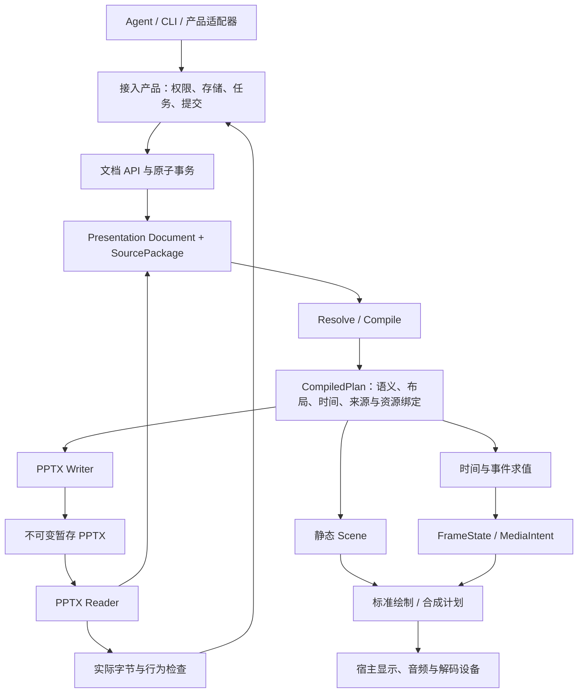

# MusterOffice Presentations：完整演示文稿内核设计

版本：**0.4** · 2026-09-27 职责修订 · 状态：**实施设计基线，部分实现，完整一期未验收**。

产品名称、独立项目、一期完整演示目标及 Rust 主体＋TS 薄接入＋精选 C/C++ 组件策略已确认；具体组件、许可证、平台版本和预算按各自证据锁定。接入职责以 [ADR 0007](../decisions/0007-kernel-only-integration-boundary.md)和[接入总设计](../architecture/agent-integration.md)为准。已有源码及阶段验证，完整状态见[实现进度](../implementation/progress.md)，不能由设计稿推断能力已验收。

本轮按最终效果补充[一期实施规格](implementation/README.md)：104 项能力计划、完整领域操作、算法与组件边界、质量/性能档案、Musterwork 源码合同映射及实施门槛；[设计合同](../contracts/README.md)提供机器可校验的导出/交付边界。它们是后续实施依据，不代表相应功能已经实现。

## 1. 目标与完成定义

第一期必须让 Musterwork 使用 MusterOffice 完成演示文稿的创建、导入、查询、编辑、渲染、播放、导出、检查及再次编辑，覆盖动画/转场、音视频、SmartArt 和公式。交付 PPTX 可在目标 Office/WPS 中打开、按原生对象编辑和播放。目标依据为 [ADR 0002](../decisions/0002-phase-one-complete-presentations.md)。

“完整”同时包含文档表达、计算、文件语义和产品链路。只支持静态页面、只保留高级对象的 XML、只生成可看的截图、或仅替换一个生成入口，都不能代表第一期完成。能力目录和目标应用构成可验收的承诺集合；尚未穷举的效果和扩展必须在范围冻结前裁定，不能默认为排除。

| 约束 | 对方案的要求 |
| --- | --- |
| 质量与其他成熟产品无明显差异 | 内容、视觉、播放和后续编辑分别对照；原生对象不得因性能目标被图片化 |
| 轻量、高性能、小体积 | 按模块装配；完整统计核心、宿主、字体、媒体和全部传递依赖；先定工作负载再定预算 |
| Agent 原生 | 稳定身份、显式资源、原子修改、版本冲突、结构化诊断、可取消和增量执行 |
| 自主可控 | 核心不依赖商业 Office SDK、厂商许可服务或特定模型；底层基础组件可依法复用 |
| 跨平台 | 同一领域语义、布局和格式算法运行于原生与 WASM；宿主负责设备适配 |
| 完整替换 Musterwork | 生成、源文件预览、可编辑导入、模板维护、历史产物、外部编辑和无客户端任务都迁移 |

计划以薄 MCP/SDK/CLI、Agent Skill 和平台 Plugin 交付同一无界面内核。MusterOffice 不提供账号权限、持久存储、业务任务平台或产品页面；Musterwork 自行实现 Agent 编辑、预览/播放、下载和外部工具编辑的产品流程。PPT 页模型、完整渲染与无界面播放属于内核；边界详见[实施合同](implementation/kernel-host-boundary.md)。PDF 不是一期用户交付或运行依赖；备注、讲义和打印版式仍有领域语义与验证。

## 2. 设计组织与唯一责任

| 规格 | 唯一负责的问题 |
| --- | --- |
| [公共 Agent 接口与发行](../design/agent-interfaces.md) | MCP 工具、资源/任务、Skill、Plugin、SDK 的统一合同和接入验收 |
| [实施规格与机器合同](implementation/README.md) | 104 项能力、数据/操作、算法、验收档案、实际产品字段及实施分工 |
| [文档模型与 Agent 协议](presentations/document-model.md) | 可编辑事实、来源保留、继承、稳定引用、事务和编译计划 |
| [排版与原生对象](presentations/layout-and-native-objects.md) | 文字、字体、几何、表格/图表、SmartArt、公式的计算和编辑性 |
| [时间、事件与媒体](presentations/timeline-media.md) | 动画/转场求值、交互、跳转、seek、媒体同步和帧呈现 |
| [PPTX 与 Office/WPS 互操作](presentations/ooxml-interoperability.md) | 原生读写、包依赖、未知字段保留、外部编辑和目标应用合同 |
| [执行、资源与性能](presentations/runtime-performance.md) | 宿主边界、资源/输出接口、隔离、内存、取消、性能工作负载 |
| [Musterwork 替换合同](presentations/musterwork-integration.md) | 全部消费者、工具/产物版本、迁移、提交和旧依赖退役 |
| [能力、验证与实施门槛](presentations/verification-and-roadmap.md) | 一期覆盖、证据、风险实验、评审问题追踪和完成门槛 |

配套资料：[v0.2 历史基线](../archive/presentations-v0.2.md)、[设计评审](../reviews/2026-09-24-presentations-design-review.md)、[迁移资料索引](../references/musterwork/README.md)。历史设计不再承担现行规范职责。

## 3. 总体架构

只有 `Presentation Document` 是可编辑的语义事实源。`SourcePackage` 保存来源结构和未知内容，修改必须经由文档事务；`CompiledPlan`、Scene、帧状态、预览、PPTX 和 QA 都是绑定 revision 的派生物。不能把 HTML、JSON、XML 和绘图命令同时作为可任意写入的文档。

编译计划同时服务原生写出与绘制。Writer 使用对象语义、编辑约束和已解析布局，不能从字形路径或像素反推原生对象。Reader 同时用于外部文件导入和实际导出字节的重读；自读自验并不构成 Office/WPS 认证。

核心持有时间规则及媒体语义；宿主提供实际时钟、用户事件、编解码、音频和显示设备。核心不访问任意路径、网络、系统隐式字体、身份或模型。宿主不能自行定义另一套文本、动画或图表规则。

## 4. 一期能力结构

| 能力域 | 一期设计要求 | 主要风险 |
| --- | --- | --- |
| 文稿/页面 | 母版、版式、主题、占位符、分节、隐藏页、备注、讲义、自定义放映 | 继承被压平、共享部件误改 |
| 文字与图形 | 富文本、多语种、项目符号、文本框、连接线、预设/自定义几何、图片和效果 | 字体/换行、复杂几何和目标应用差异 |
| 表格与图表 | 原生表格、可编辑图表及数据；分类、数值和格式保持 | 嵌入工作簿、标签、坐标轴和缓存漂移 |
| 时间与交互 | 动画、转场、文字/图表分步、点击/触发、路径、跳转、播放状态 | 单纯静态 Scene 无法表达 |
| 媒体 | 音视频、封面、剪裁、书签、音量、循环、跨页时序 | 编解码、浏览器权限、资源队列和离线兼容 |
| SmartArt | 数据、层级、布局、样式/颜色及原生再编辑 | 只输出组合图形或只保留旧缓存 |
| 数学 | 结构化公式、行内/独立排版、原生数学对象 | 把公式转为 SVG 后丧失数学编辑 |
| 交换与检查 | 外部文件读取、选择性修改、导出、再导入、差异诊断 | 未知内容损坏、内部验证循环自证 |

能力目录已展开为[104 项能力计划](implementation/capability-matrix.md)，记录 read/create/edit/render/play/write/preserve 和工作流状态。Morph、3D、扩展图表、墨迹纳入一期设计；OLE、旧格式、加密及签名明确原生语义与宿主边界。标准中每个效果/算法/原生枚举仍须在 E0/E2 形成可验证注册表，不能用少数示例代表完整覆盖。

容量是运行配置和已测支持域，不是文档模型的永久上限。首轮 Musterwork 回归至少保留 40 页创作/可编辑导入与 80 页源文件预览；不得把两种准入混为一个 40 页限制。

## 5. 端到端合同

### 5.1 创建与修改

`capabilities → create/open → inspect/resources → transact → compile → diagnose → write → reopen/verify → host commit`。

Agent 先获取能力和资源合同，再提交类型化操作；正文和数据属于不可信内容，不能变成脚本或宿主指令。一次文档事务绑定基础 revision，修改对象同时更新其引用、时间目标和来源依赖，失败全部回滚；跨进程幂等记录与持久提交由产品拥有。布局诊断只提供建议，不自动删除文字、缩小字体或改变数据。

宿主提交使用不可变 PPTX 的内容摘要与任务 fence；预览和诊断绑定同一字节摘要。最终交付以真正写出的文件为准。输出被 Office/WPS 再编辑后，旧预览与旧 QA 立即失效。

### 5.2 播放

`open/compile → prepare resources → start session → input events/tick → evaluate → present → stop/dispose`。

播放会话绑定不可变文档 revision，与编辑事务分离；点击顺序和媒体事件组成可重放事件日志。seek 到相同时间但不同交互历史可以产生不同状态；API 不能把“第 8 秒”假定为完整播放上下文。

静态预览是明确状态的采样，例如编辑态、初始放映态、指定事件后的帧；不得用一张静态封面宣称整页动态内容已检查。

### 5.3 外部文件与模板

外部 PPTX 先进行有界包检查，再形成语义能力报告和来源图。模板是文档、约束、绑定及资源集合，不能靠截图重建取代本来可读取的结构。参数化操作要检查动画目标、图表数据、SmartArt 和公式引用；模板后续修改不能污染已经提交的文稿版本。

## 6. 关键取舍

1. **同源计算与多后端呈现。** CPU 标准渲染用于可复现帧和诊断；实时播放采用保留图层及合成计划，GPU 路线必须在 E0 评估。不能把每帧完整 PNG 编码作为播放架构。
2. **显式 Office 行为规则。** 标准只描述部分格式语义；换行、字体选择、标签布局等差异通过具体应用样本裁定，并归属于领域规则或格式映射，不散落在宿主条件分支。
3. **原生对象优先。** 需要渲染缓存时同时保留原生可编辑语义；不得以静态效果相似代替 SmartArt、公式、图表或时间行为。
4. **完整语义，按需资源。** 不使用媒体的文稿不初始化解码器；字体按需要分发，但无字体环境仍要满足已承诺的编辑能力。安装体积和全离线体积分别如实记录。
5. **独立核心与可靠宿主。** 核心计算可以短生命周期运行，任务恢复、重试、路由和最终提交由接入产品负责。无客户端场景由产品调用受管原生计算，不依赖 MusterOffice 自有持久宿主。
6. **内容正确先于预算过关。** 超出限额返回可解释诊断；不得静默丢页、丢动画、替换字体、重新压缩素材或移除验证。

## 7. 技术方向与证明义务

按 [ADR 0003](../decisions/0003-language-and-component-strategy.md)，采用 Rust 为主体的纯计算核心、原生与 WASM 绑定、TypeScript 薄接入方向；允许精选 C/C++ 组件。“纯计算”不表示“全部依赖纯 Rust”。Unicode、字体塑形、ZIP/XML、图形基元复用经过审查的基础组件；演示文稿语义、编译、互操作、时间模型和诊断由本项目拥有。

选型实验需要同时证明：跨端语义一致、复杂排版可控、动态呈现可实现、格式与原生编辑闭环成立、完整依赖和资源可接受。语言选择不能代替这些证据。Rust 为主、必要的混合方案与 C++ 主体对照使用最小纵向样本比较；若需改变已确认主体方向，另记证据和决定。具体实验/实现范围未因此自动获得授权。

需要区别三个“确定性”：语义/布局/事件轨迹可精确比较；同一标准绘制后端按固定算法与字体比较；宿主 GPU 和媒体帧按已批准的视觉/时间容差比较。不能承诺所有设备的 GPU 像素和解码音频逐字节一致。

## 8. 质量与体积怎样共同成立

用户体验目标应同时测四项：首次打开与安装成本、完成生成的延迟、编辑与播放响应、持续运行的峰值和释放。静态文件、复杂对象和媒体工作负载分组，禁止用简单 10 页样本代表完整一期。

[性能规格](presentations/runtime-performance.md)提供拟议的静态预算与动态实验目标。预算包含写出、实际字节重读及规定检查；以降低 DPI、关闭检查、复用上次最终图片或移除完整字体取得的结果必须另列，不能作为正式达标数据。

[验收规格](presentations/verification-and-roadmap.md)将结构、视觉、编辑、动态行为、资源和产品任务分开判定。原生/WASM 一致、内部自检和 Office/WPS 互操作不得互相替代。

## 9. 实施阶段与完成门槛

| 阶段 | 产物 | 退出门槛 |
| --- | --- | --- |
| D1 设计冻结 | 本组规格、能力目录、目标应用与预算矩阵 | 高级语义无旧排除项；未决范围被逐项裁定；技术提案完成评审 |
| E0 高风险验证 | 跨字体编辑、母版、图表、SmartArt、公式、动画媒体样本 | 原生/WASM 和目标应用闭环，资源/体积证据足以选择路线 |
| E1 纵向内核 | 文档事务、资源、编译、读写、动态对象、标准帧与宿主协议 | 不需要倒置领域职责即可继续补齐能力 |
| E2 完整能力 | 逐项实现、组合覆盖、破坏性输入和性能工程 | 一期清单所有适用维度达到已验收 |
| E3 产品替换验证 | 全消费者、新旧产物、客户端/受管宿主、外部编辑 | 产品链路、迁移与失败恢复通过；无旧组件隐式依赖 |
| E4 正式替换 | 新任务默认走自研；受控退役旧链路；独立 Agent 接入可用 | 一期能力、非回归和 I01–I20 接入门槛同时通过，历史结果仍可使用 |

阶段是实现顺序，不是缩减第一期目标。互操作、性能和产品接入从 E0/E1 即开始验证。[实施计划](implementation/delivery-plan.md)固定实验输入、失败条件及 P00–P09 工作包。当前已有部分实现与证据，完整阶段门槛仍未通过，进度另行登记。

## 10. 设计收敛与证据待办

| ID | 事项 | v0.4 设计选择 / 仍需取得的证据 |
| --- | --- | --- |
| D01 | 具体基础组件、混合链接与 ABI | [算法/组件](implementation/algorithms-and-components.md)已固定模块与窄 ABI；HarfBuzz/Skia 等候选需 E0 质量、依赖、体积与许可证据 |
| D02 | 目标 Office/WPS 和运行平台精确版本 | [验收档案](implementation/acceptance-profiles.md)固定应用族与锁文件字段；实际构建号/差异由外部测试登记 |
| D03 | 完整一期的边界扩展 | [能力矩阵](implementation/capability-matrix.md)已裁定本轮设计边界；高级扩展纳入，逐枚举实现和目标交集仍需证据 |
| D04 | 字体与媒体分发 | 完整编辑字体与离线资源闭包为必需；具体家族/codec/许可与实测大小在 E0 锁定 |
| D05 | 实时合成后端 | 保留场景、CPU 标准绘制和 GPU 合成已定为设计路线；E0 验证全部效果和跨端支持域 |
| D06 | 预算与设备 | 已定义冷/热、静态/动态、完整依赖和安装/下载口径；E0 登记设备及完整演示预算，不编造实测 |
| D07 | 公开许可与迁移权属 | 见[许可治理](../governance/licensing.md)，不能从“计划开源”推导已许可 |
| D08 | 产品版本与替换启用 | [适配实施合同](implementation/musterwork-adapter-spec.md)已映射现有字段和 MW01–MW16；配套实现分配 successor 并完成产品验收 |
| D09 | Agent 接入与发行档案 | 按 ADR 0007 拆分计算与宿主合同、收敛薄 SDK/MCP；依赖锁、客户端/平台包及 I01–I20 待完整验证 |

产品级状态统一在[决策清单](../decisions/README.md)维护。任何待验证数字、候选 API 或组件名称，都不能自动升级为 Accepted、Implemented 或 Verified。
