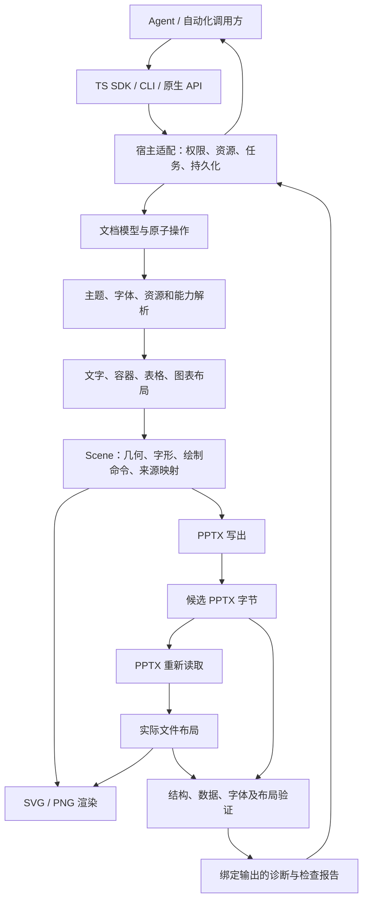
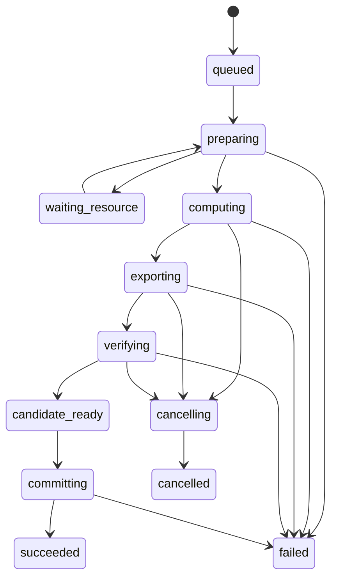

# MusterOffice Presentations：产品与技术详细设计

> 文档版本：0.2 · 日期：2026-09-24 · 状态：**名称与独立项目已确认；技术方案仍为评审稿**。
>
> 产品：MusterOffice。本文负责首个领域模块 Presentations；其他办公领域见[产品定位](../product/vision.md)和[整体架构](../architecture/overview.md)。
>
> 独立本地仓库已经初始化。开发语言、实现范围、许可证、远程托管和公开发布时间尚未确定；示例接口、性能预算及代码目录仍是提案，不能视为已实现。

## 阅读导航

- [1. 决策摘要与设计状态](#s01)
- [2. 背景、现状与问题归属](#s02)
- [3. 产品定位、使用者与价值](#s03)
- [4. 范围、功能分级与兼容承诺](#s04)
- [5. 产品流程与交互设计](#s05)
- [6. 独立仓库与开源产品结构](#s06)
- [7. 开发语言与基础组件选型](#s07)
- [8. 总体架构与职责边界](#s08)
- [9. 文档、布局与资源数据模型](#s09)
- [10. Agent API、事务与诊断协议](#s10)
- [11. 排版、字体、图表和绘制算法](#s11)
- [12. PPTX 导入、导出与兼容设计](#s12)
- [13. 跨平台运行与宿主适配](#s13)
- [14. 性能、内存、缓存与二进制传输](#s14)
- [15. 质量验证与验收标准](#s15)
- [16. 安全、隔离、隐私和可信边界](#s16)
- [17. 可观测性、调试与错误恢复](#s17)
- [18. 工程、测试、CI 与版本治理](#s18)
- [19. 开源许可、分发和社区治理](#s19)
- [20. Musterwork 接入与迁移](#s20)
- [21. 阶段计划与进入退出条件](#s21)
- [22. 风险、成本与待决策清单](#s22)
- [附录 A. 完整调用示例与错误码](#appendix-a)
- [附录 B. 验收用例与需求追踪](#appendix-b)
- [附录 C. 资料、代码依据与评审清单](#appendix-c)

<a id="s01"></a>

## 1. 决策摘要与设计状态

### 1.1 已确认要求

| 编号 | 已确认要求                                   | 设计含义                                                                 |
| ---- | -------------------------------------------- | ------------------------------------------------------------------------ |
| C01  | 无需采购 Apryse 等商业 SDK                   | 商业授权不作为内核运行或发行前提；所有引入依赖仍需核对分发条件           |
| C02  | 专门面向 Agent 设计，计划开源                | SDK、CLI、结构化协议优先；可脱离特定模型、Skill 和业务平台使用           |
| C03  | 轻量、高性能、多端跨平台                     | 统一计算核心；核心依赖闭包、字体、首次下载、内存均单独测量               |
| C04  | 保持现有效果、质量和可编辑性                 | 当前已支持功能逐项迁移，质量门槛保持；原生文字、表格和图表不得整页图片化 |
| C05  | 桌面端本地生成；Web 尽量客户端生成           | 客户端具备完整计算路径；业务服务器不承担默认排版、绘制和 Office 转换     |
| C06  | 核心交付为可下载 PPTX，没有 PPTX 转 PDF 需求 | PDF 不是首版输出、运行依赖或验收前提                                     |
| C07  | 先有完整设计，再决定实现                     | 本次允许独立项目初始化；技术选型和实现仍需明确范围                       |
| C08  | 独立项目在其主工作区、main 分支工作          | 本地目录 MusterOffice 已初始化，不另建 worktree；公开发布另行确认        |
| C09  | 产品名称为 MusterOffice                      | 旧 AP-Kernel 讨论代号退役；命名决定见 ADR 0001                           |
| C10  | 支持未来扩展其他 Agent 办公场景              | 演示文稿是首个方向，其他领域保留独立模型和能力边界                       |

### 1.2 已确认定位与待评审技术方案

MusterOffice 已确认为独立的 Agent 办公内核项目，计划开源，未来可扩展多个办公领域。Musterwork 是预期的首个接入产品。本文的 Presentations 模块围绕文档语义、确定性布局、可编辑 PPTX、实际文件渲染和对象级诊断建立闭环。

推荐以 Rust 作为纯计算核心候选，编译为原生库及 WASM；TypeScript 提供主要 Agent SDK 和浏览器宿主封装。基础字体塑形、Unicode、ZIP/XML 和二维绘制复用可审计的开源组件。项目自行拥有演示文稿语义、版式规则、兼容合同和质量验证。

选择 Rust 的建议来自“无 DOM 的跨端计算、内存控制和原生/WASM 复用”这些需求，不来自 Musterwork 已经使用 Rust。性能、体积和跨端一致性尚需选型试验，不能从语言名称推导结果。

首个验证里程碑处理一套代表性能力；正式替换 Musterwork 的里程碑必须覆盖当前能力基线。两者不得混为“首版已经无损替换”。

### 1.3 本文中的状态标记

- **已确认**：来自用户明确要求，可作为设计约束。
- **建议**：本文给出有取舍依据的推荐，批准前不执行。
- **待验证**：必须通过实验或实际应用对照才能成立。
- **待决策**：需要项目负责人选择；集中记录在第 22 节。
- **现状证据**：来自当前代码或历史报告，只说明其记录的范围。

本文中的“必须”表示：**如果批准本设计，这就是对应能力的合同和验收要求**，不表示实现已经存在。所有性能数字均为拟议预算，不是本次实测。

<a id="s02"></a>

## 2. 背景、现状与问题归属

### 2.1 要解决的问题

当前演示文稿链路经历过依赖缺失、客户端与服务器职责混杂、任务长时间等待、预览依赖加载失败、浏览器主线程卡顿和桌面安装体积增长。它们涉及多个层次，不能统一归因于 PPTX 文件格式。

| 层次       | 问题                                          | 新项目应承担的责任                              |
| ---------- | --------------------------------------------- | ----------------------------------------------- |
| 文稿计算   | 中文换行、图表标签、字体和导出显示差异        | 核心排版、文件语义和渲染兼容                    |
| 资源与性能 | 大字体、多次拷贝、全量重算、未释放缓冲        | 资源闭包、按页执行、缓存和明确的内存所有权      |
| 执行宿主   | 网页关闭、任务取消、Worker 崩溃、内容连接等待 | 宿主适配协议与可恢复状态；业务 Runtime 持有任务 |
| 产品展示   | 一直转圈、内部错误直出、无法区分失败阶段      | 产品适配器映射阶段和可操作反馈                  |
| 开发工具   | Vite 预构建缓存失效                           | 属于开发环境，不作为内核算法问题修复            |
| 模型供应商 | Jev 决策模型调用失败                          | 属于模型接入，不进入演示文稿内核                |

### 2.2 可复用基础

当前 `packages/presentation-engine` 包含结构化文档、稳定节点 ID、主题、模板、原子修改、源 PPTX 提取、原生 PPTX 写出及检查。`packages/presentation-client` 已实现部分客户端资源管理、Worker、字体包和缓存。

当前布局仍有 DOM 测量依赖，客户端候选包含 Apryse 适配器；这些不是本方案目标架构。旧链路有可复用的行为与测试，但不能未经权属和依赖审查整体复制为开源项目。

旧轻量候选报告曾记录图表分类标签差异；Apryse 与 LibreOffice 也有环形图几何和字重差异。这说明必须用目标应用和具体样本确定正确行为，不能把任意现有渲染器当成绝对真值。[历史验证依据](../references/musterwork-baseline.md)

### 2.3 现有能力不是新项目的已完成功能

本设计不把现有 JS 代码改名后称为“自主跨平台内核”。后续需逐项确认：代码是否纯计算、是否依赖 DOM/Node、是否含产品身份、是否可合法迁出、是否有对应验收。

当前客户端合同与资源优化的参考依据是[客户端接入历史依据](../references/musterwork-baseline.md)。该文档记录旧候选的实施情况，本文记录新的开源方向；在设计批准和迁移验收前，不追溯改写旧证据。

<a id="s03"></a>

## 3. 产品定位、使用者与价值

### 3.1 产品定义

MusterOffice Presentations 是一个可嵌入、可离线、无界面的演示文稿内核。它接收结构化内容和操作，生成布局、预览、可编辑 PPTX 与可定位诊断，使 Agent 能完成“生成—检查—修改—交付”。

Agent 是主要调用者，开发者是集成者，人仍是最终文稿的阅读者和评审者。因此“面向 Agent”要求机器接口可靠，同时要求最终视觉质量和人类可编辑性。

### 3.2 使用者与工作任务

| 使用者     | 工作任务                     | 成功标准                                     |
| ---------- | ---------------------------- | -------------------------------------------- |
| 内容 Agent | 从事实和大纲生成品牌演示文稿 | 内容完整、排版可控、可交付 PPTX              |
| 修订 Agent | 修改指定图表、文字或页面     | 定位稳定；局部变更不破坏其他页               |
| 检查 Agent | 检查溢出、遗漏、图表与来源   | 获得对象级证据和裁剪图，不必每次读取整个文件 |
| 平台开发者 | 接入 Web、桌面端或后台流水线 | 一套语义、可取消、可计量、可隔离             |
| 私有化客户 | 在内网和授权设备执行         | 资源可预置，无厂商联网许可验证依赖           |
| 开源维护者 | 复现和修复兼容问题           | 最小样本、能力矩阵、可重复基准和明确规范     |

### 3.3 核心价值与边界

1. **可表达**：支持内容角色、约束布局、主题与精确绘制，避免只提供像素坐标堆砌接口。
2. **可修改**：稳定对象身份、原子事务、版本检查，支持多轮迭代。
3. **可诊断**：错误有页、节点、范围、度量和证据，Agent 可以决定修复动作。
4. **可复现**：固定文档、资源和引擎配置可复现语义与布局；外部 Office 兼容单独验收。
5. **可交付**：原生可编辑 PPTX；结构检查和实际文件检查绑定具体输出。
6. **可嵌入**：核心不带登录、模型调用、计费、云平台、编辑器 UI 或任务调度系统。

内核不负责判断事实真伪、自动选择商业结论、调度 Agent 思考或替用户批准发布。视觉美观可以给出约束和诊断，内容意义与最终审美仍需要模型及人类评审。

### 3.4 可衡量的产品指标

- 首次调用成功率按参数有效性、资源完备性、计算成功、交付验收分别统计。
- 记录每份文稿修订轮次、诊断被消除比例、非目标页面变化比例。
- 记录冷启动、首屏、完整导出、单页修订延迟和峰值内存。
- 记录原生对象保留率、模板迁移覆盖率、目标应用回存后的数据保留率。
- 数据由宿主本地统计；内核默认不发送遥测。指标提升不能通过减少检查、降低分辨率或隐藏失败实现。

<a id="s04"></a>

## 4. 范围、功能分级与兼容承诺

### 4.1 三个交付层级

| 层级        | 定义                                                   | 可宣称的结果                      |
| ----------- | ------------------------------------------------------ | --------------------------------- |
| V0 纵向验证 | 有界的中文、图表、表格、图片与原生/WASM 流程           | 架构可行性；不能宣称替代当前产品  |
| V1 核心可用 | 稳定 API、正式声明的创建/编辑/导出能力和测试语料       | 可被其他 Agent 集成，明确兼容范围 |
| M1 产品替换 | 覆盖 Musterwork 当前成功场景、模板、历史产物及运行合同 | 通过迁移门禁后替换既有实现        |

V1 的范围可以明确有限，M1 不能以减少现有功能达标。V1 和 M1 的先后由实际能力覆盖决定，不绑定营销版本号。

### 4.2 功能矩阵

“必需”表示对应里程碑的退出条件；“部分”必须提供子能力清单，不能使用一个布尔值代表完全支持。

| 能力                           | V0                      | V1 建议             | M1 替换要求                       |
| ------------------------------ | ----------------------- | ------------------- | --------------------------------- |
| 文档/页面/对象 CRUD、稳定 ID   | 必需                    | 必需                | 与现有操作语义对齐                |
| 原子修改、版本冲突、确定性重放 | 必需                    | 必需                | 与 Runtime 持久化对齐             |
| 中文、英文、数字、标点换行     | 必需                    | 必需                | 现有字体与样式全部回归            |
| 富文本、段落、项目符号、超链接 | 基本富文本              | 必需                | 保留已支持特性                    |
| 阿拉伯语、印地语等复杂文字     | 架构预留并有反例        | 经能力档案声明      | 不扩大到“全球文字完整支持”的承诺  |
| 绝对定位、行列布局、约束       | 必需                    | 必需                | 现有 block/flex/grid 语义逐项映射 |
| 母版、版式、主题、占位符       | 一个主题                | 必需                | 现有模板及用户模板基线通过        |
| 图片、裁剪、透明、旋转         | PNG/JPEG、contain/cover | 必需                | 支持过的格式与变换保留            |
| 矢量、渐变、阴影、分组、连接线 | 基础形状                | 必需                | 已支持效果逐项通过                |
| 表格、合并单元格、行高、边框   | 基础表格                | 必需                | 原生可编辑且布局不退化            |
| 原生图表与内嵌工作簿           | 柱状图＋环形图          | 常用类型完整合同    | 当前各类型、格式和样式全部覆盖    |
| PPTX 导入与内容查询            | 自有样本读取            | 明确支持的外部子集  | 当前模板和源文件导入能力不退化    |
| 预览 SVG/PNG、局部裁剪、缩略图 | 必需                    | 必需                | 与最终 PPTX 绑定                  |
| 实际文件检查、兼容报告         | 必需                    | 必需                | 保持现有检查项并完成新合同迁移    |
| CLI、TS SDK、浏览器 Worker     | 必需                    | 必需                | 接入产品正式工具链                |
| 原生库、跨平台分发             | 本机原生                | Windows/macOS/Linux | 目标平台完整测试                  |
| Python SDK                     | 预留协议                | 可选首批发布        | 不阻塞 Musterwork 接入            |
| MCP/其他 Agent 框架适配        | 不需要                  | 独立适配包          | 不进入核心依赖                    |

### 4.3 首版不主动新增的产品能力

首版不建设可视化办公编辑器、协同光标、宏执行、完整动画播放、音视频编辑、旧 `.ppt` 二进制格式、DOCX/XLSX 编辑器或 PDF 转换服务。图表内嵌 XLSX 数据是 PPTX 能力的一部分，不等于建设电子表格产品。

这些范围限制只约束新项目承诺，不授权删除 Musterwork 已支持能力。若基线调查发现相关能力已存在且被使用，必须重新评审范围。

### 4.4 支持状态按维度表示

每个特性分别声明 `read`、`render`、`edit`、`write`、`preserve`、`verified_targets`。例如“能保留 SmartArt 部件”不等于“能编辑或正确渲染 SmartArt”。

支持状态为 `supported`、`partial`、`opaque_preserved`、`unsupported`，附限制和测试用例 ID。未支持特性必须在昂贵计算前报告。

不允许静默丢弃对象、把图表改成图片、隐藏标签、降低字体大小或改写内容来取得“成功”。显式的有损转换只能作为独立操作，携带损失报告，并由调用方授权。

<a id="s05"></a>

## 5. 产品流程与交互设计

### 5.1 从需求到交付

1. Agent 查询能力、版本、可用字体和模板。
2. Agent 创建内容大纲，选择主题，提交结构化文档。
3. 内核执行结构检查、资源检查、布局，返回预览和诊断。
4. Agent 查询问题对象，按约束提交修订事务；局部重算。
5. 导出候选 PPTX，重新打开实际文件，检查内容、资源和布局。
6. Agent 根据预览和报告进行语义/视觉复核。
7. 宿主按自身发布策略提交文件及绑定的报告，产品显示下载和预览。

一个正常调用不要求 Agent 先学习 OOXML、安装 Office 或手动拼接资源 Base64。

### 5.2 导入和修改现有文稿

导入先输出文档摘要、页面结构、可编辑范围和未支持对象。Agent 可按标题、对象 ID、角色、图表系列名查询。修改事务必须基于确定的版本；导出后核对未修改对象及其依赖部件。

对不能安全修改的对象，返回具体限制和受影响范围。保留原始部件时，还需分析主题、母版、图片、关系引用是否被本次修改触及；不能仅凭“原 XML 还在”宣称保真。

### 5.3 诊断与修复闭环

诊断默认只返回摘要和错误对象，完整逐字坐标、所有页图通过分页或按需查询获取。建议动作是受约束的操作候选，不自动执行、不自动放宽质量阈值。

例：文本超出 18 px 时，可以建议增加文本框高度、调整布局或由 Agent 精简内容。若调用方设置最小字号 24 pt，则建议不得通过缩小至 18 pt 消除错误。自动拆页也必须是显式策略，保留标题、引用和续页关系。

### 5.4 嵌入产品后的状态展示

| 内核/宿主阶段 | 用户展示建议         | Agent 获得的信息               |
| ------------- | -------------------- | ------------------------------ |
| 检查资源      | 准备字体和图片       | 缺少的资源 ID、下载由谁负责    |
| 布局          | 排版第 3/10 页       | 阶段进度、诊断数量、可取消     |
| 导出          | 生成可编辑 PPT       | 输出准备状态                   |
| 验证          | 检查文字、图表和版式 | 实际文件摘要、检查覆盖范围     |
| 等待连接      | 连接中断，已保存进度 | 阻塞条件、租约状态、可恢复阶段 |
| 完成          | 预览 / 下载 PPTX     | 候选结果和完整报告引用         |
| 失败          | 明确原因和下一步     | 错误码、是否可重试、保留内容   |

产品不默认展示模型名、Token、内部字体摘要、WASM 实例或原始工具 JSON。开发诊断有独立入口。离线、断线和执行失败必须有不同状态，不能统一保持旋转动画。

### 5.5 最小演示产品

建议提供一个无登录、可本地运行的参考页面：左侧结构化请求和诊断，中间页面预览，右侧文档结构；支持本地打开、修改、导出和性能统计。它用于集成与复现，不发展成办公编辑器，不接入 Musterwork 用户数据。

### 5.6 模板、版式与品牌配置

模板包包含不可变版本、主题、版式、具名内容槽、每个槽的类型/容量、必需资源、缩略图和许可。Agent 先检查模板，再实例化到独立 Document；后续模板发布新版本不自动改变已生成文稿。

内容槽区分标题、正文、图表、表格、图片和备注，提供机器可读的可用空间、建议内容长度及样例。长度建议不是质量判定；实际布局仍需测量。必填槽未填、示例数据未替换时给出明确诊断，不静默保留虚构业务结论。

模板目录、市场、访问控制和在线发布由宿主拥有；内核提供 `template.inspect`、`template.instantiate`、`template.validate`。自有结构化模板与从 PPTX 导入的模板采用相同能力报告，但导入模板必须保留源对象关系。

品牌配置包含颜色、字体角色、字号层级、图表配色、留白、Logo 使用规则和对比度策略。应用品牌的操作给出变更预览与不兼容项，不假设更换主题一定对所有外部对象安全。

### 5.7 无障碍与阅读顺序

Document 保留页面标题、替代文字、语义角色、阅读顺序、表格表头和图表文字说明。导出器对目标格式可表达的属性写入相应部件，不能表达的属性在兼容报告中说明。

参考预览 UI 支持键盘翻页、缩放和结构化文本阅读；视觉检查包含对比度和低可读性提示。内核生成 SVG 字形路径时仍提供文本及来源映射，不能让截图成为唯一可访问结果。无障碍标准的正式符合性声明另设验收，首版不凭存在 alt 字段就宣称全面符合。

<a id="s06"></a>

## 6. 独立仓库与开源产品结构

### 6.1 仓库方案比较

| 方案                       | 优点                                   | 代价                                 | 建议                         |
| -------------------------- | -------------------------------------- | ------------------------------------ | ---------------------------- |
| 独立仓库、独立版本         | API 边界清楚；外部贡献、许可和发布独立 | 需要维护产品适配和跨仓库集成测试     | **推荐**                     |
| Musterwork 内孵化后再抽离  | 初始接入直接                           | 产品身份和依赖容易渗透；抽离成本后移 | 可用于受控实验，不能长期含混 |
| 保持产品内部包，仅公开快照 | 操作简单                               | 开源仓库难成为事实源，版本不可追踪   | 不推荐                       |

独立本地仓库已根据用户要求初始化，项目名称为 MusterOffice，主分支为 main；决定见 [ADR 0001](../decisions/0001-project-identity.md)。本文与项目规范从本仓库继续维护，Musterwork 保留导航和其自身接入设计。远程托管、公开归属与发布时点仍待确认。

### 6.2 演示文稿模块的候选实现目录

以下是 Rust 候选获批后的演示文稿实现组织建议，尚未创建这些源码目录。产品级目录和未来模块须遵循[整体架构](../architecture/overview.md)，不让其他领域被迫依赖演示文稿模型。

```text
MusterOffice/
  crates/
    model/                 # 文档、操作、版本和类型
    typography/            # 字体选择、文字塑形、段落布局
    layout/                # 容器、约束、表格和图表布局
    scene/                 # 已解析几何、绘制命令、来源映射
    render/                # SVG 和确定性栅格输出
    ooxml/                 # OPC、PPTX 读写与原生对象
    diagnostics/           # 检查规则、兼容与证据报告
    kernel/                # 对外纯计算入口
    bindings-wasm/         # WASM 边界和内存句柄
    cli/                   # 文件宿主，非任务调度服务
  sdk/typescript/          # 类型、Worker 客户端、错误映射
  sdk/python/              # 后续绑定，避免再实现算法
  adapters/mcp/            # 可选外层适配
  examples/               # 浏览器、Node、原生 Agent 示例
  specs/                  # schema、协议、兼容档案、ADR
  tests/corpus/           # 经许可的最小可复现语料
  tests/oracles/          # 外部应用生成基准的工具与元数据
  benchmarks/             # 固定输入、设备清单和统计规则
  docs/                   # 使用、设计、贡献和限制
  LICENSE / NOTICE / SECURITY.md / CONTRIBUTING.md
```

模块应按真实职责形成，不为每个函数建一个 crate；目录设计不要求第一天创建所有模块。核心不能反向引用 CLI、SDK、MCP 或任何业务应用。

### 6.3 产品接入方式

Musterwork 依赖正式包或锁定的候选发行物，不使用跨仓库相对路径，不直接从远程主分支拉取运行代码。产品与内核通过版本化适配器集成；临时迁移桥接标注删除条件。

开发可使用明确的本地依赖覆盖，但发布门禁必须拒绝个人目录、未锁定 Git 引用和缺少完整资源清单的产物。

<a id="s07"></a>

## 7. 开发语言与基础组件选型

### 7.1 语言比较

下表是工程判断，不是实测排名。

| 维度                 | 纯 TypeScript                  | Rust 核心＋TS SDK               | C/C++ 核心＋绑定           |
| -------------------- | ------------------------------ | ------------------------------- | -------------------------- |
| 复用当前生成代码     | 最直接                         | 需要逐层迁移或明确桥接          | 同样需要迁移               |
| 浏览器运行           | 直接，仍需摆脱 DOM 排版依赖    | WASM Worker，需处理内存边界     | WASM 工具链和绑定          |
| 无 JS 环境的原生嵌入 | 需 JS Runtime 或另一种运行载体 | 原生库/CLI                      | 原生库/CLI                 |
| 内存生命周期         | TypedArray 可控制，GC 仍参与   | 显式所有权，FFI/WASM 边界需审查 | 显式管理，安全审计负担较高 |
| 现成排版/绘制基础    | 有可选依赖，需验证一致性       | 可复用 Rust 或 C 组件           | 基础组件丰富               |
| 长期接口和并行计算   | 可行，但须控制跨 Worker 拷贝   | 适合统一核心，绑定是额外工作    | 可行，跨平台构建复杂       |
| 团队学习与维护       | 当前项目较熟悉                 | Rust＋浏览器两类能力            | C/C++ 与跨平台工具链能力   |

**推荐 Rust＋TS，不在设计阶段锁死。** 若试验不能满足质量、体积或工程维护要求，必须调整选型；不能把失败归因于“以后再优化”。纯 TS 也可构造不依赖 DOM 的内核，应作为相同输入下的对照选项。

Rust 的 `wasm32-unknown-unknown` 不提供正常的文件系统、线程等宿主能力；应通过接口注入资源和执行设施，不能将原生代码不加边界地编译后称为跨端完成。[Rust 目标文档](https://doc.rust-lang.org/rustc/platform-support/wasm32-unknown-unknown.html)

### 7.2 基础组件候选

| 能力           | 推荐调查方向                           | 必须验证的边界                                           |
| -------------- | -------------------------------------- | -------------------------------------------------------- |
| 字体解析与塑形 | HarfBuzz / Rustybuzz、明确的字体解析库 | 同一字体下的 cluster、glyph、advance、语言覆盖和版本差异 |
| Unicode        | 固定版本的分段、双向、断行实现         | 组合字符、emoji、RTL、中文标点及规范测试                 |
| 容器布局       | Taffy 等布局组件或限定规则实现         | 与文稿语义、表格测量及当前布局合同的差异                 |
| 二维绘制       | resvg/tiny-skia 等 CPU 路径            | 不把 SVG 支持等同于 PPTX 支持；字体和滤镜策略需控制      |
| XML/ZIP        | 可限量、可拒绝危险特性的解析组件       | 解压炸弹、重复部件、DTD/外部实体、流式输出               |
| PPTX 写出      | 自有 OOXML 层，复用当前行为和测试      | 当前 JS/PptxGenJS 依赖不能暗藏于“纯原生”发行物           |
| PPTX 读取      | 自有兼容层与来源映射                   | 母版/主题继承、未知对象保留、关系依赖                    |

HarfBuzz 负责将文字映射为定位后的字形，并不替我们完成页面布局。[HarfBuzz](https://harfbuzz.github.io/what-is-harfbuzz.html)；候选项目的实际 API、许可证和构建体积在选型阶段锁定：[Rustybuzz](https://github.com/harfbuzz/rustybuzz)、[Taffy](https://github.com/DioxusLabs/taffy)、[resvg](https://github.com/linebender/resvg)。

### 7.3 选型试验合同

比较相同字体和资源下的中文换行、混合富文本、合并表格、柱状图/环形图、图片裁剪和透明效果；输出原生/WASM 布局差异、可编辑 PPTX、Office/WPS 对照、峰值内存和完整依赖体积。

试验不得仅测“空白页渲染”或“加载 WASM 的时间”。候选通过后形成 ADR，记录版本、拒绝的替代路线和已知限制。任何候选都不能以删除基准样本获得通过。

<a id="s08"></a>

## 8. 总体架构与职责边界

### 8.1 架构图



创作预览和实际文件预览共享绘制核心，但来源、用途和身份不同。不能把创作 Scene 的截图直接标记为实际 PPTX 的验证结果。

### 8.2 分层职责

| 层         | 输入与输出                         | 禁止承担的职责                     |
| ---------- | ---------------------------------- | ---------------------------------- |
| 文档层     | 文档＋操作 → 新版本或结构诊断      | 文件下载、模型调用、用户权限       |
| 解析层     | 文档＋固定资源 → 已解析样式和内容  | 暗中使用系统字体或联网补资源       |
| 布局层     | 已解析内容＋约束 → Scene＋布局诊断 | 删除内容、改变业务数值             |
| 绘制层     | Scene → 绘制命令、SVG/PNG          | 重新决定文字换行或选择替代字体     |
| 格式层     | 文档/Scene ↔ PPTX 语义与部件      | 云对象存储、Artifact 发布          |
| 验证层     | 实际产物＋预期合同 → 报告          | 赋予产品发布权限、伪造外部应用验证 |
| 内核会话层 | 控制预算、取消点、资源句柄         | 持久任务队列、Agent 推理循环       |
| 宿主层     | 文件/网络/缓存/Worker/存储         | 另写一套布局或图表规则             |
| 产品适配层 | Runtime 合同、UI、计费、发布策略   | 将产品逻辑塞入开源核心             |

### 8.3 同一实现与多种宿主

核心只消费字节、结构和显式配置，不读取环境变量、系统字体、网络地址或任意文件路径。原生与 WASM 调用同一套算法。平台差异仅存在于字节获取、执行隔离、持久化、时钟与呈现方式。

字体塑形、换行、图表坐标与 PNG 标准栅格化不得由浏览器 Canvas 和原生系统各自实现，否则跨端统一只停留在接口层。

### 8.4 资源注入与扩展

宿主提供 `ResourceProvider`、`ResultSink`、`CacheStore`、`Cancellation` 和 `ProgressSink`。纯核心在发现缺少资源时返回需求清单，宿主准备完成后继续执行。

扩展使用版本化能力档案和静态链接模块。首版不允许运行文稿携带的任意脚本或任意动态插件；新格式、新形状和新诊断规则通过受审查的代码扩展。

<a id="s09"></a>

## 9. 文档、布局与资源数据模型

### 9.1 三种表示

| 表示              | 用途                                     | 是否持久化           | 谁能修改     |
| ----------------- | ---------------------------------------- | -------------------- | ------------ |
| Document          | 内容、主题、约束、对象语义               | 是，作为可编辑事实源 | 通过事务修改 |
| Resolved Document | 已解析主题、字体、样式、资源绑定         | 可作为内部缓存       | 解析器生成   |
| Scene             | 确定的几何、字形位置、绘制顺序、来源映射 | 可缓存，绑定完整身份 | 布局器生成   |

PPTX 是交换/交付格式；导入时必须建立来源映射。Scene 不是新的用户编辑文档，不能直接修改 Scene 后跳过语义模型。

### 9.2 Document 主结构

建议版本标识 `agent-presentation-document/1`；最终命名由项目 ADR 决定。主要字段如下：

| 字段                | 内容                               | 规则                                  |
| ------------------- | ---------------------------------- | ------------------------------------- |
| `schema_version`    | 格式版本                           | 未知主版本明确拒绝                    |
| `document_id`       | 稳定文档 ID                        | ID 不随内容修改而改变                 |
| `revision`          | 文档内容摘要                       | 根据规范编码派生，不由 Agent 自报可信 |
| `title`, `language` | 标题、默认语言                     | 文本保留原意，禁止静默标准化业务内容  |
| `canvas`            | 宽、高、背景                       | 固定页面单位和颜色空间                |
| `theme`             | 颜色、字体角色、间距、图表默认样式 | 令牌引用必须可解析，禁止循环          |
| `resources`         | 内容寻址资源清单                   | 不含登录令牌或任意本机路径            |
| `pages`             | 有序页面集合                       | 页 ID 稳定，顺序显式                  |
| `metadata`          | 来源、作者声明、备注、无障碍信息   | 外部字符串按不可信数据处理            |
| `source_map`        | PPTX 部件与对象对应关系            | 单独声明保留与可编辑状态              |

禁止未知语义字段被默默忽略。可忽略的扩展必须使用命名空间，并标明是否影响布局、绘制、编辑和导出；影响结果的未知扩展返回 `unsupported_feature`。

### 9.3 对象模型

通用字段：`id`、`kind`、`role`、`layout`、`style`、`accessibility`、`source_ref`。节点树表达归属，连接线使用对象引用，不通过数组序号定位。

节点可带 `constraints` 表达硬/软约束，其优先级与来源显式记录。内容约束和布局约束分开：例如“保留所有类别标签”是内容约束，“图表不超出右栏”是布局约束，不能通过满足后者自动取消前者。

| 类型       | 核心内容                                       |
| ---------- | ---------------------------------------------- |
| 容器/分组  | 子节点、行列布局、绝对布局、约束、裁剪策略     |
| 文本       | 段落、富文本 run、语言/方向、项目符号、链接    |
| 图片       | 资源 ID、fit、crop、旋转、透明、替代文字       |
| 形状/路径  | 几何、填充、描边、圆角、变换                   |
| 连接线     | 起终对象、锚点、路由及箭头                     |
| 表格       | 列定义、单元格、跨度、边框、行高策略           |
| 图表       | 数据系列、类别、坐标轴、图例、格式、标签、颜色 |
| 不透明对象 | 原始部件闭包、支持状态、不可修改原因           |

排版约束包括最小字号、最小间距、对齐、宽高上下限、内容保留、允许拆页等。硬约束冲突必须报告；软约束按明确优先级求解，输出未满足项。

### 9.4 单位、精度与确定性

- 对外建议使用具名的 `pt`、`px96` 或 `emu`；一个字段只能采用 schema 指定单位，不能凭习惯猜测。
- 内部页面几何以整数 EMU 作为持久化表示：1 inch = 914400 EMU；1 pt = 12700 EMU；1 px@96DPI = 9525 EMU。
- 字形 advance 保留字体单位与明确缩放，在约定边界统一舍入；旋转和路径计算可使用浮点，但拒绝 NaN/Infinity，并在进入 Scene 时规范化。
- 内核自己定义排序、舍入和序列化规则，避免依赖哈希表遍历、系统 locale、当前日期和随机数。
- JS 绑定不能将任意 64 位整数隐式转为不安全的 Number。限定范围的几何可用安全整数；摘要计数和大偏移使用十进制字符串或 BigInt 内部接口。
- 原生/WASM 的语义和量化 Scene 一致是硬目标。PNG 像素一致只在固定绘制器、字体、颜色空间及构建档案下承诺；浏览器展示缩放不纳入字节一致性。

### 9.5 文本索引和规范编码

对外文本范围统一采用 Unicode scalar 索引，SDK 提供 UTF-16 映射；内部塑形可以使用 UTF-8 byte offset，但必须保留转换表。操作不能切断 grapheme cluster，也不能按 UTF-16 code unit 截断 emoji。

规范编码固定字段顺序、数字形式和转义策略，拒绝重复 JSON 键和未配对代理项。新格式不自动把正文从一种 Unicode 形式改成另一种；如导入需要规范化，作为有记录的转换。旧 Musterwork 文档有其既定 canonical 行为，迁移需同时记录旧、新摘要，不能重新解释旧 revision。

### 9.6 Scene 与诊断证据

Scene 必须保存页面/对象身份、局部及全局变换、逻辑边界、实际墨迹边界、裁剪、z-order、glyph ID、font face 摘要、cluster 范围、基线和 glyph 位置。图表保留数据点到路径/标签的映射；表格保留单元格到文本行的映射。

Scene 身份至少绑定文档 revision、引擎版本、字体及图片摘要、布局档案、语言规则版本和依赖闭包。任一变化都使相关缓存失效。

### 9.7 持久化与资源包

建议定义便携工程包：版本清单、Document、资源清单和相对部件；所有路径受限。可选保存预览和诊断，但打开时必须校验它们绑定的版本。

字体资源与图片按摘要去重。网络 URL 可以由宿主用作获取来源；内核消费的是已获取且身份固定的字节。来源 URL 不是内容身份，不出现在可复现性判定中。

<a id="s10"></a>

## 10. Agent API、事务与诊断协议

### 10.1 API 族

| API                                     | 目的                             | 关键返回                           |
| --------------------------------------- | -------------------------------- | ---------------------------------- |
| `capabilities.describe`                 | 查询操作、对象、格式、平台和限制 | 版本化能力档案                     |
| `resources.requirements`                | 计算缺失字体/图片                | 资源需求及受影响节点               |
| `template.inspect/instantiate/validate` | 检查模板和创建文稿               | 模板能力、内容槽、资源需求和新文档 |
| `document.create/open`                  | 创建或导入                       | revision、摘要、支持报告           |
| `document.query`                        | 按页/角色/ID 查询                | 分页的结构与来源                   |
| `document.apply`                        | 原子批量修改                     | 新 revision、变更范围              |
| `document.diff`                         | 比较两个版本                     | 内容、样式、结构差异               |
| `layout.compute`                        | 计算或增量更新布局               | Scene 引用、诊断、缓存统计         |
| `render.pages/region`                   | 整页或对象范围预览               | 二进制句柄和来源身份               |
| `export.pptx`                           | 写出候选文件                     | 候选字节引用、原生对象映射         |
| `verify.artifact`                       | 读取实际文件并检查               | 分层质量报告                       |
| `session.release`                       | 释放会话拥有的资源               | 释放结果与剩余借用计数             |

API 支持显式分页、字段投影和二进制结果引用；不把每页 PNG 和逐字坐标塞进同一个模型上下文。

### 10.2 修改操作

基础操作包括：页面增删移动复制、节点增删移动、文字范围替换、段落样式修改、图片替换、表格行列/单元格修改、图表数据修改、主题更新、约束更新。

高层便利操作如“等宽分布”“套用版式”“拆页”必须展开为可审查的基础事务，返回实际变更和前后诊断。生成商业文案或选择结论不属于内核操作。

### 10.3 原子性与幂等

修改请求带 `base_revision` 和 `operation_id`。先校验整个操作集合、引用和能力，再生成新版本；中间失败不得留下半更新。

纯核心在内存中计算新 Document；**持久幂等与 CAS 提交由宿主拥有**。宿主将新 revision 和 operation receipt 原子提交。重复 operation ID 且请求摘要相同返回原结果；同 ID 不同请求返回 `idempotency_conflict`。内核不能声称跨进程断线具有 exactly-once 语义。

并发修订默认返回 `revision_conflict`，不做隐式 last-write-wins。三方合并可作为将来独立能力，必须给出冲突范围，不进入首版默认路径。

### 10.4 会话、句柄和 ABI

会话绑定引擎与资源档案；文档、Scene、结果是不同句柄类型，跨会话或释放后的句柄明确失败。句柄带 generation，避免数值复用访问错误对象。

WASM 接口只在边界传输受限 JSON 和字节；大对象留在会话中，用显式查询读取。不得把 WASM 内存视图长期暴露给 JS：memory growth 可能使旧视图失效。原生 FFI 固定 ABI 版本、长度、所有权和释放函数，不暴露 Rust 内部布局。

SDK 的 `dispose`/`close` 必须幂等。取消后由宿主保证实例终止及输出撤销；内核协作取消点只是第一层。

资源接口的最小语义如下；不同语言的具体签名在 E0 后冻结：

| 接口                                     | 语义                           | 所有权与失败规则                         |
| ---------------------------------------- | ------------------------------ | ---------------------------------------- |
| `ResourceProvider.resolve(id, expected)` | 将已授权资源引用解析为字节句柄 | 宿主验证权限；核心复核长度/摘要/媒体类型 |
| `ResourceProvider.read(handle, range)`   | 有界读取                       | 不允许核心打开任意路径或 URL             |
| `ResultSink.begin(metadata)`             | 创建未提交输出                 | 返回宿主私有暂存句柄                     |
| `ResultSink.write(handle, bytes)`        | 带背压地写入                   | 达到字节预算即失败，禁止静默截断         |
| `ResultSink.finish(handle, digest)`      | 完成候选输出                   | 只产生候选引用，不发布 Artifact          |
| `ResultSink.abort(handle)`               | 撤销未提交输出                 | 幂等，不能删除已提交用户文件             |
| `CacheStore.get/put(key, binding)`       | 读写绑定缓存                   | 必须检查版本/资源身份，缓存错误可重算    |
| `ProgressSink.emit(event)`               | 上报真实阶段                   | UI 订阅失败不能改变计算结果              |

需要异步资源时，核心返回 `need_resource` 及继续执行所需的状态；不在纯算法里阻塞等待网络。宿主的 deadline、权限撤销和背压错误必须能到达执行实例。

### 10.5 诊断结构

每项诊断包含：`code`、`severity`、`stage`、`page_id`、`node_id`、`range`、`message_key`、`measured`、`expected`、`suggested_operations`、`evidence_ref`。

诊断 ID 由规则版本、输入 revision 和对象位置确定，不依赖展示文案。严重程度分为 `error`、`warning`、`info`；允许警告不等于允许忽略内容损失。重试策略单独提供 `retryable` 和 `retry_after_condition`。

修复建议必须声明是否改变内容、字体、布局或交付编辑性。没有测量依据时不生成精确数字。错误汇总必须保留总数及分页信息，不能静默截断后宣称无其他问题。

### 10.6 宿主任务状态机



排队、等待资源、候选就绪阶段同样允许取消；图中省略重复箭头。业务连接中断是宿主的连接状态，与计算阶段正交。进入最终原子提交后，取消与提交由同一个宿主 CAS 决定先后；提交成功的任务不能再显示为“已取消且无文件”。

进度按真实阶段和页数报告；不假装知道所有阶段的固定百分比。每个等待状态都带原因、下一步、期限和恢复方式，期限由宿主配置。

<a id="s11"></a>

## 11. 排版、字体、图表和绘制算法

### 11.1 总体计算顺序

结构校验 → 主题解析 → 资源/字体选择 → 文本与对象固有尺寸 → 容器约束 → 段落换行 → 表格/图表细化 → 连接线 → 全局变换 → 碰撞/溢出检查 → Scene。

含循环依赖的布局必须检测；宽度决定文字高度、高度影响容器尺寸的情况采用有界迭代与固定收敛准则。超出迭代预算返回 `layout_nonconvergent`，不能无限循环或使用上一次随机结果。

### 11.2 字体与文字

字体使用显式 family/weight/style/face index/variation 实例选择。资源身份绑定实际字体字节；相同 family 名称不代表相同字体。禁止无记录地使用系统 fallback 或伪造粗体/斜体。

处理流程：

1. 按 grapheme cluster、语言、脚本、方向与样式切分；为组合字符保持上下文。
2. 根据字符覆盖和配置的 fallback 链选择实际 face；缺字定位到原文范围。
3. 进行双向文本解析和塑形，得到 glyph、advance、offset 与 cluster 映射。
4. 计算合法断行位置，结合宽度、中文禁则、空白和显式换行决定行。
5. 在断行后的上下文重新塑形必要的 run；不能假设整段塑形结果直接截断后仍正确。
6. 计算行框、基线、段前段后、对齐和项目符号；输出字形边界和使用字体证据。

Unicode 双向、断行和字素分段分别参考 [UAX #9](https://www.unicode.org/reports/tr9/)、[UAX #14](https://www.unicode.org/reports/tr14/)、[UAX #29](https://www.unicode.org/reports/tr29/)。规范提供基础规则，实际可用宽度与段落排版仍由内核决定。

正文不得通过转路径解决 PPTX 兼容问题。预览绘制可以使用已定位字形轮廓，PPTX 仍写出文本、段落和字体信息。对目标 Office 重新排版的差异，必须在互操作层处理并以实际文件验收。

### 11.3 字体嵌入与编辑性

字体包记录来源、许可文本、face 信息、摘要、覆盖范围和嵌入能力。字体的 `fsType` 是嵌入限制的技术信息，不能取代实际许可判断。[OpenType OS/2 规范](https://learn.microsoft.com/en-us/typography/opentype/spec/os2#fstype)

预览字体可按能力设计缓存；可编辑交付默认使用许可允许的完整字体或明确可编辑策略。不能将仅包含当前字符的预览子集直接当作完整编辑字体，导致用户增加文字时缺字。若字体不可嵌入，返回阻塞或明确的替代提案；未经授权不得静默换字体。

### 11.4 容器和约束布局

支持绝对布局与受控的 block/row/column/grid 语义。内核不实现任意网页 CSS；每个支持属性在 schema 中有单位、默认值和作用范围。

布局先求固有尺寸，再分配可用空间，最后排版内容。边框与 padding 的盒模型固定。`min/max`、grow/shrink、跨度、对齐和溢出策略必须有冲突优先级；循环百分比尺寸不做浏览器式猜测。

不得默认缩小字号、压扁图片或隐藏内容。自动重排保持文档内容和对象身份；拆页、文字精简和有损裁剪属于显式修改。

### 11.5 表格

合并单元格先构造占位矩阵，拒绝重叠跨度和悬空引用。列宽按固定值、比例及最小内容宽度分配；单元格按可用宽度测量文本；跨行约束参与行高求解。

边框冲突采用明确优先规则；背景、padding、对齐和段落样式统一解析。单元格溢出定位到 row/column/node。自动续页需要显式策略，重复表头并保留源表关系。导出使用原生表格，预览不可把单元格文本独立漂移到不同布局规则。

### 11.6 图表

图表首先是数据对象，再生成可视几何。建议 V1 覆盖柱/条、折线、面积、饼/环和散点；堆叠、百分比、负数、空值、格式和组合能力逐项列入支持档案，不能以类型名概括所有组合。

计算步骤：数据校验 → 坐标域 → 刻度/格式 → 标题/图例/标签测量 → 绘图区求解 → 系列几何 → 标签碰撞检查。固定图表版本和格式化规则，避免浏览器 locale 改变标签宽度。

此前 Q1/Q2/Q3 标签问题必须成为独立回归：检查类别数量、文字、位置与可见性；整体图片相似度不能掩盖标签缺失。环形图检查半径、孔径、起始角、扇区顺序和标签定位。

PPTX 写出原生 chart 和工作簿，数据缓存与工作簿必须一致。Office 可能自行布局图例和坐标轴；对无法精确控制的行为，建立目标应用基准，不能用图片替换规避。

### 11.7 图片、矢量和颜色

图片尺寸以解码后的实际像素为准，按声明的 contain/cover/crop 计算；方向信息在资源准备阶段规范化。像素预算在解码前检查并在解码后复核。资源不得通过 SVG 外部引用绕过宿主权限。

首版建议使用 sRGB 工作空间和统一 alpha 规则；输入 ICC 配置转换策略必须确定并纳入资源身份。打印级色彩管理不作未验证承诺。旋转、裁剪、透明、渐变、阴影按 Scene 的固定规则绘制。

### 11.8 预览输出

推荐 CPU 确定性绘制作为标准基线；GPU 加速是未来可选优化，不能成为首版跨平台正确性的前提。

SVG 是矢量预览交换格式，PNG 是标准页图和局部图。SVG 字形轮廓可配合结构化文本映射实现检查与无障碍；不能因此宣称 SVG 的原生文本可编辑性。Canvas/DOM 仅负责展示结果，不重新排版。

<a id="s12"></a>

## 12. PPTX 导入、导出与兼容设计

### 12.1 标准与能力档案

PPTX 的包装、标记、兼容扩展参考 ECMA-376；标准符合性与具体 PowerPoint/WPS 行为分别检查。[ECMA-376](https://ecma-international.org/publications-and-standards/standards/ecma-376/)

建议为规范格式、导入兼容和目标应用分别定义档案。首个 writer 应选择一种固定 OOXML 方言并通过目标应用测试；读取 Strict/Transitional 的范围必须显式声明，不能用“支持 PPTX”隐含全部扩展。

### 12.2 导入流水线

1. 限量读取 ZIP/OPC；校验路径、重复部件、大小、内容类型和关系。
2. 建立 presentation → slide → layout → master → theme 关系图。
3. 解析背景、占位符、颜色与字体继承；保留原始来源与有效值。
4. 提取对象、图片、表格、图表及工作簿，建立稳定 source map。
5. 输出支持报告和 Document；未知扩展按第 4 节处理。
6. 实际文件渲染时使用解析到的真实值，不从原创作文档补齐缺失内容后冒充读取成功。

### 12.3 保留未知对象

不透明保留需要闭包：原始部件、关联资源、namespace、扩展和关系映射一并保留。文档只改一处文字时，应验证未受影响部件的字节或规范语义不变。

主题变更、母版重写、页面缩放可能影响未知对象。此时拒绝不安全修改，或要求显式转换授权并给出损失报告。已有位图预览只能标记为源文件缓存，不能视作当前未知对象已正确重绘。

### 12.4 导出流水线

根据 Document 与 Scene 写出页面、主题、布局、对象、图表、工作簿、备注和资源。统一分配原生 ID 与 relationship ID，保持对象映射稳定。ZIP 排序、时间、压缩参数和元数据固定；输出内容不能含机器路径、随机工作目录或隐式当前时间。

同一构建档案下要求规范输出可重复。压缩器升级可能改变 ZIP 字节，必须升级导出档案；不能把语义一致误报为字节一致。

### 12.5 实际文件验证与独立性

writer 完成后，reader 从输出字节重新读取；验证页数、文本、数据、关系、实际字体、对象类型、编辑性和布局。检查必须绑定输出 SHA-256、引擎/字体档案和规则版本。

reader 与 writer 可以共享规范类型、单位和基础解析工具，但测试不能只由 writer 的预期结构生成断言。另设外部格式检查、恶意变异文件和 Office/WPS 基准，防止同一错误被读写双方共同接受。

新内核不依赖 PDF 提取字体信息；字体证据由实际 PPTX 的字体引用/嵌入部件，以及实际渲染时使用的 face 共同生成。预期字体列表不能代替使用证据。

### 12.6 编辑后回存

目标应用验收包含打开、编辑文字、修改图表数据、增加表格内容、保存和重新读取。关注内容、关系和可编辑性；Office 回存会合法改变 ID、ZIP 顺序或布局细节，不能要求回存文件与原文件 SHA 相同。

### 12.7 兼容承诺的表达

分别报告：

- `authoring_integrity`：创作文档结构和内容是否有效。
- `package_integrity`：输出文件及原生对象是否完整。
- `self_render_consistency`：本引擎实际文件渲染与预期布局是否一致。
- `target_interop`：哪些应用、版本、系统和字体条件通过了哪些样本。
- `visual_review`：人工或模型复核的主体、版本和结果。

不把一个 `passed: true` 同时代替这五项；运行时未安装 Office，也不影响读取已有的兼容认证范围，但不得伪造当前文档已被 Office 打开。

<a id="s13"></a>

## 13. 跨平台运行与宿主适配

### 13.1 平台矩阵，建议验收范围

| 环境                                  | 执行载体                   | 首批建议                                 | 验证内容                           |
| ------------------------------------- | -------------------------- | ---------------------------------------- | ---------------------------------- |
| Chrome/Edge/Firefox/Safari 桌面浏览器 | Worker＋WASM               | 当前及前一稳定大版本，发布时锁定具体版本 | 字节/布局、Worker、下载、CSP、内存 |
| macOS arm64/x64                       | 原生 CLI/库                | 必需                                     | 字体、取消、文件提交与内存         |
| Windows x64                           | 原生 CLI/库                | 必需                                     | 路径、句柄释放、字体及文件锁       |
| Linux x64/arm64                       | 原生 CLI/库                | 必需                                     | 无显示服务运行、资源上限与文件权限 |
| Node/其他 JS Agent Runtime            | TS SDK＋WASM；原生绑定可选 | 至少 Node 当前 LTS 档案                  | 无 DOM、二进制结果、版本固定       |
| iOS/Android 原生、移动浏览器          | 后续独立适配               | 架构可扩展，不计入首版已支持             | 内存、字体和沙箱需真机验收         |
| WASI                                  | 后续运行载体               | 不作为首版必要条件                       | 明确组件与宿主 API 后再支持        |

浏览器版本和最低系统版本在发布 ADR 固定；“可以编译”不等于“目标平台通过”。

### 13.2 Web

页面使用薄 Worker 客户端，发送结构化请求与可转移字节；WASM 在 Worker 内执行。字体和图片由受控资源适配器提供，配置好资源后计算可离线进行。整个平台能否离线登录、恢复会话是产品问题，不从内核离线能力推导。

首版不强制 SharedArrayBuffer、跨源隔离或 WASM 多线程。单 Worker 协作调度是兼容基线；并发根据预算开启，资源实例数量受限。

CPU 密集 WASM 调用期间，普通 Worker 消息不会自动中断计算。因此核心提供有界 `step`/批次入口，每批返回事件循环读取取消；必要时宿主终止 Worker。不能用一个 Promise 包装同步长任务后宣称可取消。

### 13.3 桌面端

推荐 Rust Device Runtime 通过现有任务端口启动隔离的原生内核进程；Electron 负责展示与文件交互，不再承载排版浏览器窗口。进程隔离用于崩溃恢复和资源预算，不构成第二个 Agent Runtime。

可嵌入原生库用于可信场景，但解析外部文件的默认产品路径采用独立进程。取消由协作标志与进程截止期限共同保证。引擎、字体包和资源版本在任务开始时固定。

### 13.4 无界面 Agent 和服务端可选使用

CLI 从 stdin 接收有界控制请求，从明确路径/句柄读取二进制，stdout 输出协议结果，stderr 输出日志；日志不得混入 JSON 输出。命令参数不允许任意 shell 片段。

内核可用于客户自己的服务器任务，但 Musterwork 默认交互链路不因此新增服务器渲染回退。无人值守、定时任务若需要服务端计算，属于产品执行策略，须单独决定。

### 13.5 Web 与服务端责任边界

浏览器本地执行排版、图表计算、PPTX 生成、预览和本地验证。业务服务器仍可能承担鉴权、内容存储、资源分发、任务协调和结果接收；模型调用也有独立资源消耗。

接收客户端结果时，服务端执行必要的权限、大小、摘要和结构校验，不以“客户端生成”为由信任任意上传报告。这里的轻量校验与重新渲染整份文稿是不同职责。

### 13.6 断线、关闭和恢复

原生宿主可以持久化文档版本、资源清单、完成页面和候选状态。Web 在授权的持久存储中保存相同 checkpoint；页面关闭后不承诺继续后台执行。

恢复要求输入、引擎、资源和规则版本匹配；否则按已保存文档重新计算，不能复用过期完成证明。若只有上传未完成，可重传已校验候选，不必再次排版。所有等待连接状态必须有期限或明确的用户恢复动作。

<a id="s14"></a>

## 14. 性能、内存、缓存与二进制传输

### 14.1 预算与测量口径

以下是待评审的工程目标。E0 试验建立基线后可讨论调整，但不能通过删检查、删样本、降清晰度来达标。

| 指标           | 拟议目标                                 | 测量口径                                                      |
| -------------- | ---------------------------------------- | ------------------------------------------------------------- |
| WASM 核心分发  | 压缩总量 ≤ 15 MiB                        | 包括必需 JS、WASM、编解码组件；字体/内容另列                  |
| 原生核心       | 每个平台发行文件 ≤ 30 MiB                | 包括必需动态库，排除调试符号；不混算多架构总和                |
| 首次打开       | 准备好必需资源后，首个普通页面 ≤ 1 s P95 | 计入引擎初始化、解析、布局和绘制；网络下载独立报告            |
| 完整 10 页导出 | ≤ 5 s P95                                | 资源已就绪，包含文件写出、重读、全页绘制及质量检查            |
| 完整 40 页导出 | ≤ 8 s P95                                | 同上，禁用最终页图缓存作为完整执行基线                        |
| 单页局部修订   | ≤ 300 ms P95                             | 不含模型推理、缺资源下载和最终整包压缩                        |
| UI 响应        | 导出引入的 ≥ 50 ms 主线程长任务为 0      | 浏览器实际 PerformanceObserver；事件/序列化也计入             |
| 取消           | 正常协作取消 ≤ 200 ms；强制终止 ≤ 2 s    | 从宿主收到取消到停止计算和撤销候选                            |
| 峰值内存       | 标准 10 页 ≤ 256 MiB，40 页 ≤ 512 MiB    | 内核及专用 Worker/进程增量；JS heap、WASM、图像、宿主合并计量 |
| 连续任务       | 20 次后无持续保留增长                    | 记录自然回收后的低水位与峰值，不强制 GC 伪造结果              |

参考验收设备建议为 8 GB 内存的 Apple Silicon macOS 和 8 GB 内存的 Windows x64 普通笔记本，记录实际 CPU、系统、浏览器和电源状态。Linux 使用固定资源的 CI 主机。高配开发机通过不代替目标设备验收。

标准语料包含真实中文字体、富文本、表格、柱/环图和压缩图片；图片密集语料单独测量，不以空白重复页代表 40 页。实际发布预算必须同时记录完整字体集、默认字体集、冷下载、离线分发包和最终产品安装包；小 WASM 文件不能代表总产品小。

### 14.2 执行与内存所有权

每个会话有准入预算；资源拥有者、借用者、缓存和输出缓冲分开。临时解析树、图片解码、字形路径和页图在完成阶段后释放。PNG 页图按页产生并交给 ResultSink，不累计全部未压缩位图。

跨 JS/Worker 使用 transferable buffer 时由发送方明确转移所有权；转移后发送方不可继续访问。不能为了“零拷贝”分离还被其他任务借用的缓冲。[Transferable objects](https://developer.mozilla.org/en-US/docs/Web/API/Web_Workers_API/Transferable_objects)

JS 到 WASM 的边界通常仍有拷贝，应测量和控制次数，不宣称全流程零拷贝。对较大图片实行受限解码并发；对于预算不足的合法文稿可以分批或使用宿主暂存，不能静默降低图像分辨率。超出宿主可提供能力时明确返回资源不足。

### 14.3 增量依赖图

依赖链为：资源/主题/字体 → 节点测量 → 所属布局容器 → 页面 → 导出部件及预览。页面编号、总页数、跨页引用和母版可能形成全局依赖，不能错误地只失效单页。

缓存分层：

| 缓存            | 键                                        | 失效条件                  |
| --------------- | ----------------------------------------- | ------------------------- |
| 字体解析/字形   | 字体摘要、face index、variation、塑形版本 | 字体或塑形配置变化        |
| 段落布局        | 原文、完整样式、宽度、语言/方向、字体闭包 | 任一影响断行/字形的值变化 |
| 对象/页面 Scene | 依赖子图摘要、引擎档案                    | 上游依赖变化              |
| 实际文件页图    | 实际 OOXML 传递依赖、字体、绘制配置       | 相关部件或渲染器变化      |
| 原始资源        | 内容摘要、授权命名空间                    | 损坏、清理或权限失效      |

所有缓存有容量和淘汰策略，缓存命中仍验证结果身份。权限、发布授权、未绑定输入的“通过”结论不进入计算缓存。跨租户去重由宿主审查，不能通过缓存命中暴露其他用户数据。

### 14.4 SHA-256 的使用边界

摘要用于资源完整性、不可变引用、缓存身份、版本冲突和结果绑定。在字节进入受控资源仓库时计算一次并复用；跨越不可信边界或字节变化时重新计算。

Web 在 Worker 内或使用异步原生摘要，原生在隔离工作线程/进程执行；不在 UI 主线程反复对大对象 JSON/Base64 做哈希。摘要不是签名，也不能证明质量报告由可信执行环境生成。

### 14.5 Base64、图片链接与大文件

JSON 控制协议只携带资源 ID、摘要、长度和媒体类型；图片/PPTX/字体走字节、Blob、流或宿主内容引用。Base64 不作为默认传输或持久化格式。

图片 URL 可用于宿主获取，但会受到权限、过期、跨域和内容变更影响；取得字节后固定身份。PPTX 离线交付需要嵌入资源，不能仅依赖将来仍可访问的图片链接。

某些自包含 SVG 格式需要 data URI 时，可在输出边界局部编码；这不改变整体资源协议，也不重复把所有图片包进每个工具请求。导出通过分块/背压传输，避免网关承载巨大的 JSON 请求体。

### 14.6 冷启动与字体成本

默认字体集合根据已确认的语言和风格选择；字体家族独立版本化，任务启动前列出需要加载的包。完整字体可缓存或私有化预置，不允许用一个很小的基础包掩盖首次运行必须下载巨大资源的事实。

资源全就绪、资源冷缓存、无网络三种情况分别验收。冷缓存等待提示应明确是准备资源，不能伪装成“正在导出”无限等待。

<a id="s15"></a>

## 15. 质量验证与验收标准

### 15.1 五层验收

| 层            | 检查内容                                | 能证明什么                     |
| ------------- | --------------------------------------- | ------------------------------ |
| L1 合同       | schema、操作、版本、资源闭包            | 输入与事务正确                 |
| L2 语义       | 文字、数据、页序、关系、对象类型        | 内容完整和原生对象保留         |
| L3 布局/绘制  | 字形、几何、溢出、遮挡、页图            | 本引擎计算及实际文件渲染一致性 |
| L4 外部互操作 | Office/WPS 打开、编辑、回存与基准图     | 明确目标环境中的兼容性         |
| L5 产品       | 真正 Web/Desktop Tool、取消、恢复和交付 | 产品链路可用                   |

V0 可完成其中部分样本，但报告必须列出未覆盖层级。M1 要求所有适用层级通过。

### 15.2 不能降低的标准

- 文本、图表数据、表格内容、页数、页序和备注不得无记录丢失。
- 原生文字、图表及表格的编辑能力不得被图片替代。
- 字体缺字、未授权替换、图表类别标签消失、不可见文字属于阻断项。
- 当前模板和历史成功样本中已支持的效果必须纳入基线；“新项目暂不支持”不能作为迁移通过理由。
- 不通过删除质量规则或把错误改成 warning 实现通过。

### 15.3 定量比较规则

固定版本下的 native/WASM 规范语义和整数 Scene 要求精确一致。对外部 Office 布局，先锁定版本、字体和 DPI，再按文字行、对象边界、图表数据区域和图片分别比较。

建议将文本基线/对象几何偏差超过 0.5 pt 的情况列为人工审查项，而非自动接受；具体容差由样本和评审确定。数字、标签、文本或系列缺失无论占像素多少都失败。

SSIM/像素差仅用于定位，不能作为单一放行分数。截图差异需区分抗锯齿、字体错误、换行变化、几何错误和内容遗漏。感知差异不能自动等价于功能退化，也不能自动忽略。

### 15.4 基准语料

语料至少包含：两套现有模板、中文长标题、混合富文本、标点禁则、复杂文字反例、表格合并、跨行高、常用图表、负数和空值、图片裁剪、透明、矢量、旋转分组、连接线、源模板导入和未知对象。

每个样本记录：许可、来源、输入摘要、预期语义、覆盖特性、原始应用和版本、字体清单、黄金图/数据摘要。用户私有文稿默认不进入公开语料；错误复现使用脱敏最小样本。

### 15.5 变异和差分测试

对正确输出主动删除一个图表标签、修改工作簿数值、替换字体、移出页面、破坏 relationship、截断图片，验证检查必然失败。读写往返测试和外部应用差分测试并存；自家 reader 能读自家 writer 不是充分证据。

模糊测试覆盖 ZIP/XML、字体、图片头、路径、文本、跨度和关系图。失败输入作为固定回归保留，禁止仅增加重试掩盖算法错误。

### 15.6 可编辑性验收

在目标应用中追加中文文字、改变图表某个数据点、修改合并表格内容并保存，重新打开确认内容与对象类型。自动结构检查可以证明原生部件存在，不能完全代替实际编辑测试。

### 15.7 报告与信任

质量报告包含输入 revision、输出摘要、资源身份、规则版本、检查清单、各层状态与 `not_checked`。第三方/客户端上传报告属于声明，产品必须按自身信任策略验证；报告摘要本身不是远程证明。

模型视觉评审可以附加语义检查，但不覆盖掉确定性错误。修改建议、检查报告与批准发布三个概念分开。

<a id="s16"></a>

## 16. 安全、隔离、隐私和可信边界

### 16.1 威胁模型

输入可能来自不可信 Agent、用户上传文件或第三方模板。攻击面包括 ZIP/XML/字体/图像解析、超大几何、深层树、循环关系、路径穿越、外部资源访问和对象内容中的提示注入。

文稿内的“执行命令”“忽略限制”等内容始终作为文档数据，不作为 Agent 指令。内核不执行宏、嵌入脚本或外部程序。

### 16.2 默认资源限制，建议初值

| 项目               | 初始默认档案                 | 执行规则                              |
| ------------------ | ---------------------------- | ------------------------------------- |
| Document 控制 JSON | 4 MiB                        | 解析前检查，重复键拒绝                |
| 页面/节点/树深度   | 40 / 12000 / 32              | 继承当前标准量级，扩展档案另测        |
| 单次修改操作       | 256                          | 全部校验后原子应用                    |
| 单段文本           | 30000 scalar                 | 分段与塑形有 CPU 配额                 |
| ZIP                | 4096 部件、256 MiB 总解压    | 同时检查声明和实际解压量              |
| 图片               | 单张 16M 像素、受限并发      | 解码前头信息与解码后尺寸一致          |
| 字体               | 单 face 与总量由字体档案限额 | 解析前长度、后续结构和 glyph 范围检查 |
| 输出/暂存          | 宿主按任务设置               | 结果超限不可发布为完整文件            |

这些是可协商能力上限，不是偷偷裁剪内容的阈值。合法输入超过默认档案时，返回实际需求；扩展执行必须在宿主批准的预算内进行。资源计数使用防溢出算术。

### 16.3 格式与资源防护

拒绝 ZIP 路径穿越、重复或大小写碰撞部件、非法绝对路径和超限展开；XML 禁止 DTD/外部实体。OPC 外部关系按类型分类：安全链接可保留为 inert link，不能在渲染时自动联网；主动内容按档案拒绝。

SVG 禁止脚本、外链和危险嵌入；字体/图片解析器在预算隔离内运行。资源 hash mismatch 不重试直到“碰巧成功”，而是废弃损坏缓存并通过宿主重新获取。

### 16.4 隔离与权限

WASM 缩小宿主能力面，但不自动防止 CPU/内存耗尽。浏览器靠 Worker 终止、内存预算和宿主资源接口；原生靠进程隔离、受限文件根和操作系统资源限制。

核心无需网络和用户凭据。宿主取得资源的权限与内核资源 ID 分开；不允许模型提供的 URL 或文件路径直接进入底层打开函数。

### 16.5 隐私

默认零外发遥测；无联网许可检查。日志默认不记录正文、图片、完整路径和认证信息。调试包由调用方显式导出，可选择内容级别；公开问题复现前提供脱敏检查。

<a id="s17"></a>

## 17. 可观测性、调试与错误恢复

### 17.1 结构化事件

事件包括任务/会话/文档 revision、阶段、单调序号、已完成页数、资源等待、缓存命中、内存计数和诊断摘要。耗时由宿主时钟记录，逻辑输出不得依赖墙钟时间。

事件应可关联，但不携带模型 Token、业务费用或身份凭据。产品只选择用户需要的信息展示。

### 17.2 可复现调试包

调试包包含 schema 和引擎版本、配置、资源摘要、最小文档、失败诊断及可选输入资源。默认不包含私有正文；启用正文后明确标记。不得把整个用户目录或任意系统字体自动打包。

CLI 提供 `inspect`、`validate`、`layout`、`render`、`export`、`verify`、`repro` 这类可组合命令；命令名为设计建议，稳定协议在 V1 冻结。

### 17.3 失败处理矩阵

| 失败              | 处理                     | 能否重试                         |
| ----------------- | ------------------------ | -------------------------------- |
| 参数/未支持特性   | 返回定位和能力说明       | 输入或能力改变后                 |
| 字体/图片缺失     | 返回资源需求，宿主准备   | 资源补齐后                       |
| 布局冲突/溢出     | 保存文档，返回诊断       | 修改文档后                       |
| 文件格式/关系错误 | 拒绝候选，保留失败证据   | 修复源文件/算法后                |
| Worker/进程异常   | 废弃半成品，释放句柄     | 宿主可有界重启一次，仍保留原错误 |
| 上传或连接中断    | 保留已校验候选，显示等待 | 连接恢复且授权有效后             |
| 超时/超预算       | 终止实例，清理未提交输出 | 调整档案或输入后                 |
| 版本变化          | 拒绝混用 checkpoint      | 用固定旧版本恢复或完整重算       |

不存在引擎失败后偷偷换成服务器 Office 渲染的路径。切换引擎属于显式产品版本选择，不能改变单个任务中途的语义。

<a id="s18"></a>

## 18. 工程、测试、CI 与版本治理

### 18.1 代码规范

单个代码文件不超过 2000 行，接近 1200 行评估职责拆分。模块依赖单向；核心禁止业务平台、Electron、DOM、HTTP 客户端和环境路径依赖。需要 unsafe/FFI 的边界集中封装并说明安全前提。

Schema 由唯一规范产生语言绑定和跨语言样例；不能手工维护多套逐渐漂移的类型。错误码和能力档案同样版本化。

### 18.2 测试分层

1. 单元：排版、断行、单位转换、图表、事务和限制。
2. 属性：操作原子性、往返语义、幂等与稳定 ID。
3. 协议一致性：原生、WASM、TS、CLI 使用同一 known-answer corpus。
4. 视觉：对象级比较与固定黄金图。
5. 互操作：目标 Office/WPS 的打开、编辑、回存。
6. 资源：连续执行、取消、崩溃、损坏缓存和离线。
7. 产品集成：Musterwork 实际 Tool → 文件 → 预览 → 下载。

### 18.3 CI 门禁

每次变更运行格式、类型、单元、依赖边界和受影响 golden 测试；格式/排版核心变更触发原生与真实浏览器矩阵。每夜或发布候选运行完整视觉、模糊测试、长时间资源测试与目标应用验证。

Office/WPS 基准可使用具备授权的内部验收机器生成；开源项目的普通构建和运行不依赖采购办公软件。无许可的 CI 不伪造该层结果，输出明确的未执行状态。

不允许直接批量更新黄金图消除差异。基准更新需记录变更原因、语义检查、对照图和评审人。

### 18.4 版本与兼容

分别版本化：库/API、Document schema、Scene schema、PPTX writer profile、渲染 profile、质量规则、字体包。语义变化不能隐藏在同一个“资源更新”里。

工程文档固定创建时 schema 与资源；迁移输出新版本，保留原文档。预览缓存可以丢弃重建，原始文件和编辑历史不因升级覆盖。

SemVer 用于公开 API；0.x 阶段同样发布迁移说明。宿主先协商能力再调用，不凭包版本猜特性。发布一个 engine manifest 统一绑定各模块和资源版本。

### 18.5 发行物与供应链

输出 npm SDK/WASM 包、原生 CLI/库、类型/schema、字体包清单、SBOM、第三方声明及校验清单。构建使用锁文件和固定工具链，发布候选可追溯到源码 SHA。

签名证明发行来源，内容摘要证明字节身份；两者不能替代质量验收。维护者按明确角色执行发布，自动化不得从一次成功测试直接公开发布。

<a id="s19"></a>

## 19. 开源许可、分发和社区治理

### 19.1 许可建议

建议新代码采用 Apache-2.0，最终由权利人确认。该许可证包含分发条件和专利许可条款，具体以[官方许可证](https://www.apache.org/licenses/LICENSE-2.0)为准。本文不替权利人作法律结论，也不把开源许可与所有字体/素材许可混为一体。

现有 Musterwork 代码逐文件确认来源、版权及第三方内容后再迁出；原依赖的许可证和 NOTICE 按要求保留。商业 SDK 的代码、二进制、试用资源和非可分发测试文件不进入新项目。

### 19.2 独立清单

维护代码、第三方依赖、字体、模板、图片、基准文件五类清单。某字体可用于本机显示，不代表可以随开源包分发或嵌入可编辑 PPTX；具体检查与技术元数据一起记录。

字体和示例素材尽量选择允许目标用途的开放资源，保留完整许可。用户文件只在用户同意且完成脱敏后进入公共语料。

### 19.3 社区与维护

公开 API 文档、能力限制、性能测量方法、贡献指南和兼容问题模板。问题模板要求最小样本、引擎版本、字体身份、目标应用及期望结果，避免只有截图无法定位。

推荐以 DCO 或其他经确认的贡献权利声明管理来源；维护者、发行者、安全问题接收人分别明确。重要格式/布局/API 变化通过 RFC/ADR，兼容承诺通过测试语料持续维护。

不承诺长期免费人工支持所有任意 PPTX；公开支持范围和维护策略。开源项目不依赖 Musterwork 商业用户数量或账户权限才能运行。

### 19.4 发布前条件

独立仓库名称与归属确认、许可证确认、代码权属审查、依赖清单、隐私扫描、公开样本许可、可复现构建和基本文档全部完成后，才进入公开发布。当前本地仓库初始化不等于已获远程公开仓库或代码发布授权。

<a id="s20"></a>

## 20. Musterwork 接入与迁移

### 20.1 所有权保持

Rust Device Runtime/Cloud Runtime 继续持有 Agent 任务、权限、模型调用、工具日志、取消、幂等和 Artifact 提交。内核只负责文稿计算，SDK 不创建第二个任务系统。

Musterwork 的 ContentRef、用户权限、对象存储和计费由适配器映射为内核资源 ID/字节。开源核心不依赖 UUID 内容服务、不读取平台认证信息。

### 20.2 资产与代码迁移表

| 当前模块                       | 拟议处理                                 | 验收要求                                    |
| ------------------------------ | ---------------------------------------- | ------------------------------------------- |
| `presentation-engine/document` | 复用语义与测试，映射或演进为独立规范     | 操作、主题、模板不退化；记录 canonical 差异 |
| `html/measure*`                | 由纯计算布局替代                         | 当前布局属性和字体测量逐项对照              |
| `pptx/*`                       | 迁移 OOXML 行为和兼容测试                | 原生对象/字体/图表工作簿保留                |
| `import/*`                     | 迁移读取语义、来源映射和未知内容报告     | 当前模板/导入样本全部通过                   |
| `quality/*`                    | 适配新证据，规则保持可追溯               | 不删除已有有效检查                          |
| `presentation-client`          | 保留资源、缓存、传输和宿主合同中可用部分 | 剥离 Apryse 特定接口                        |
| Electron 隔离渲染宿主          | 转为原生执行端口与展示                   | Rust 仍是任务所有者；取消/恢复通过          |
| Web Runner                     | 接入 WASM Worker                         | 真实浏览器导出、预览及异常恢复              |
| Artifact 与结果合同            | 按需新版本迁移                           | 旧产物可读，旧证据不被重新解释              |

### 20.3 分阶段接入

先在开发环境显式选择新候选，运行同一语料；正式路径保持当前行为，不能以运行时自动兜底掩盖新引擎失败。对照执行只用于受控验收，不让生产用户为同一导出支付双份计算成本。

完成 M1 后由产品版本明确切换；移除 LibreOffice/Poppler/额外 Chromium 等组件之前，应检查模板导入、历史预览和后台任务是否仍引用。消费者未迁完，不能仅从安装包删除依赖。

新路径不需要 Apryse 授权；旧候选留下的“授权待确认”不再作为新内核开发的前提，但其视觉和低配置验收问题仍需解决。

### 20.4 历史数据与回滚

既有 PPTX、草稿、Artifact 和报告保持可读；为旧格式提供明确读取/迁移适配，不原地改写。新格式发布后若回滚产品，必须确保旧版本能读取新产物，或使用只读查看策略，不能导致用户文件消失。

回滚是宿主选择经过验收的发行版本，不是失败任务自动跨引擎重试。回滚后重新计算的输出使用新的任务和版本身份。

### 20.5 完成定义

“迁移完成”要求代码、资源、工具、模板导入、历史预览、开发准备、安装分发和产品测试均无未声明旧依赖。最终卸载体积与安装包需后续单独测量；本设计阶段不打包、不部署。

<a id="s21"></a>

## 21. 阶段计划与进入退出条件

### 21.1 阶段表

| 阶段            | 主要交付                                  | 进入条件             | 退出证据                         |
| --------------- | ----------------------------------------- | -------------------- | -------------------------------- |
| D0 设计评审     | 本文、功能矩阵、决策清单                  | 文档任务授权         | 核心范围、仓库和验证边界获确认   |
| E0 选型实验     | 相同样本的候选对照、ADR                   | 实验范围获确认       | 质量/体积/性能和维护成本对照     |
| E1 纵向核心     | 原生/WASM、排版、预览、PPTX、实际文件读取 | 语言和接口方向确定   | V0 用例和已知限制完整报告        |
| E2 能力补齐     | 主题、模板、富文本、各图表、导入、诊断    | 核心合同稳定         | V1 功能矩阵与模糊测试通过        |
| E3 互操作与性能 | Office/WPS、平台矩阵、资源基准            | 特性覆盖充分         | L1–L4 证据及公开能力档案         |
| E4 产品接入     | Web/Desktop、历史数据、任务恢复           | 候选可追溯且兼容通过 | M1 与 L5 全部通过                |
| E5 开源发行     | 仓库、文档、包、SBOM、样本                | 发布范围与权属获确认 | 干净发行物、签名和可复现使用示例 |

E5 的准备工作可以与前期设计并行，但实际公开时间单独决定。里程碑不自动授权部署或替用户发布。

### 21.2 纵向验证的具体内容

以“季度经营复盘”为示例，使用明确标注的虚构数据，构建封面/摘要、中文长标题与富文本、原生柱状图、原生环形图、合并表格、图片裁剪六类页面。扩展到 10/40 页时使用不同内容和资源组合，不复制空白页。

完整动作：创建 → 查询 → 原子修改图表/标题 → 原生与 WASM 布局 → 预览 → PPTX 导出 → 实际文件重新读取 → 变异验证 → Office/WPS 对照 → 连续运行与取消。

如果 E1 暂时复用现有 JS writer，必须标为“混合链路试验”，单独记录其依赖与性能；它不能证明无 JS 原生导出已完成。E2/E3 前必须关闭这项缺口，或者重新评审并明确采用混合发行架构。

### 21.3 工作拆分与依赖

文档/协议先于多语言绑定；字体/文字基线先于复杂布局；Scene 先于标准绘制；真实格式读取先于交付验证；语义正确先于性能优化；兼容验收先于移除旧组件。

需要覆盖产品/API、字体排版、图形/图表、OOXML 互操作、宿主集成、测试/发行这些责任。可由同一人承担多项，但必须明确审查责任和完成证据；不以人数或并发会话数量代替质量。

### 21.4 工期和投入估算方法

本阶段不提供未经验证的“几天完整替代 Office”承诺。E0 后根据能力矩阵列出模块工作量、复杂度、样本数量、外部验收设备和维护责任，再确定里程碑周期。

最大不确定性是字体/段落与 Office 的实际一致性、复杂图表、导入保留和跨端内存。无采购成本不等于无研发和长期维护成本。

<a id="s22"></a>

## 22. 风险、成本与待决策清单

### 22.1 风险登记

| 风险                 | 影响                           | 收敛方式                         | 放行责任          |
| -------------------- | ------------------------------ | -------------------------------- | ----------------- |
| 自家读写共同包含错误 | 预览正确但 Office 错误         | 外部基准、变异测试、独立语义断言 | 兼容验收负责人    |
| 字体度量/替换差异    | 换行、字重、缺字               | 固定字体、实际使用证据、编辑回存 | 字体/排版负责人   |
| 图表自动布局差异     | 标签或几何变化                 | 对象级验证和目标应用矩阵         | 图表/格式负责人   |
| 兼容范围无限扩大     | 项目变成完整办公套件           | 能力档案、明确版本承诺           | 产品负责人        |
| 表面轻量             | 字体、运行载体、首次下载仍很大 | 完整资源清单与安装/下载分开测量  | 性能/发行负责人   |
| WASM 内存/取消失效   | 浏览器卡顿或崩溃               | 分批计算、实例终止、资源预算     | 宿主负责人        |
| 迁移删掉现有能力     | 用户功能退化                   | 基线调查、M1 覆盖门禁            | 产品接入负责人    |
| 开源来源不清         | 无法合法分发                   | 迁出审查、依赖/字体/素材清单     | 权利人/发行负责人 |
| 维护负担失控         | 接入后大量兼容修复             | 最小复现语料、版本策略、维护范围 | 项目维护者        |

### 22.2 决策状态表

| ID  | 决策                   | 本文推荐                                 | 必须确认的内容                          |
| --- | ---------------------- | ---------------------------------------- | --------------------------------------- |
| D01 | 项目名称与独立本地仓库 | **已确认：MusterOffice，main 分支**      | 远程托管和公开归属仍待确认；见 ADR 0001 |
| D02 | 产品范围               | **已确认：Agent 办公内核，可扩展多领域** | 演示文稿具体 V0/V1/M1 范围仍待评审      |
| D03 | 语言                   | Rust 核心＋TS SDK 为首选候选             | 同意何种 E0 对照试验，何时锁定 ADR      |
| D04 | 现有代码关系           | 语义/测试复用，核心逐层抽离              | 迁出权属和是否允许短期 JS writer 试验   |
| D05 | 首批平台               | 桌面浏览器＋三大桌面系统                 | 最低系统/浏览器、可用验收设备           |
| D06 | 兼容承诺               | 自有创建能力完整；外部导入显式分级       | 必须支持的客户文稿和 Office/WPS 版本    |
| D07 | 字体策略               | 开放许可、可编辑嵌入、家族包             | 默认中文/西文字体与离线分发范围         |
| D08 | API 与分发优先级       | TS SDK、CLI、原生/WASM；MCP 外置         | Python/其他绑定是否首版必需             |
| D09 | 性能预算               | 第 14 节作为初始目标                     | 设备、样本、预算及调整规则              |
| D10 | 许可证和贡献治理       | Apache-2.0 候选＋明确贡献权利声明        | 权利人、许可选择、维护和发布主体        |
| D11 | 开源时点               | 独立可复现示例和许可检查完成后           | 是否先私有孵化、公开哪些样本            |
| D12 | 产品迁移               | 显式候选、完整验收后切换                 | 历史数据、后台导入及旧组件移除边界      |

D01 的名称和本地仓库、D02 的产品级扩展定位由用户明确确认，其余项目仍按表中状态评审。进入源码开发前需要确认 D02 的详细范围、D03、D04 和 E0 实验边界；不能将初始化授权视为技术选型批准。

<a id="appendix-a"></a>

## 附录 A. 完整调用示例与错误码

以下是**设计协议示例**，没有对应的已发布 SDK。示例对象 ID、资源 ID 和摘要占位符只表达关系；真实宿主必须提供有效资源与摘要。

### A.1 协议封装

```json
{
  "protocol_version": 1,
  "request_id": "req-001",
  "session_id": "session-001",
  "method": "document.apply",
  "params": {
    "document_id": "quarterly-review",
    "base_revision": "sha256:<current-revision>",
    "operation_id": "op-001",
    "operations": [
      {
        "op": "text.replace",
        "page_id": "summary",
        "node_id": "heading",
        "range": { "start": 0, "end": 8, "unit": "unicode_scalar" },
        "text": "季度增长与下一步"
      },
      {
        "op": "chart.series.set",
        "page_id": "revenue",
        "node_id": "revenue-chart",
        "series_id": "online-revenue",
        "values": [120, 180, 240]
      }
    ]
  }
}
```

参数与版本先校验，再执行全部操作。返回新 revision、变更对象、失效页面和诊断引用；不会把每个中间状态发布给其他调用方。

```json
{
  "protocol_version": 1,
  "request_id": "req-001",
  "status": "ok",
  "result": {
    "document_id": "quarterly-review",
    "revision": "sha256:<new-revision>",
    "receipt_id": "receipt-001",
    "changed_nodes": ["heading", "revenue-chart"],
    "invalidated_pages": ["summary", "revenue"],
    "diagnostics_ref": "diagnostics-001"
  }
}
```

`receipt_id` 来自宿主持久化确认；纯核心计算返回值不包含虚构的持久化成功。通过 SDK 本地直接调用时，可以只获得 `proposed_revision`，由调用方完成提交。

### A.2 能力发现

能力说明应包含：协议/文档/引擎版本、支持的操作、特性档案、资源上限、原生/WASM 构建身份、实际可用的字体和验证目标。以下为精简示例：

```json
{
  "protocol_versions": [1],
  "document_versions": ["agent-presentation-document/1"],
  "engine_profile": "<immutable-engine-profile>",
  "features": {
    "chart.column": {
      "read": "supported",
      "render": "supported",
      "edit": "supported",
      "write": "supported",
      "limits": { "series": 16, "categories": 256 }
    },
    "smartart": {
      "read": "partial",
      "render": "unsupported",
      "edit": "unsupported",
      "write": "opaque_preserved",
      "limits": { "changes_to_dependencies": "forbidden" }
    }
  },
  "verified_targets": [],
  "limits_profile": "standard-40-pages"
}
```

真实返回中的 `supported` 必须有发布测试支撑；示例不是当前实现的能力声明。`verified_targets` 为空就表示尚无外部应用证据。

### A.3 文档创建片段

该片段展示一个页面的语义和明确单位；协议只传资源 ID，字体字节由宿主另行注入。

```json
{
  "schema_version": "agent-presentation-document/1",
  "document_id": "quarterly-review",
  "title": "季度经营复盘",
  "language": "zh-CN",
  "canvas": {
    "width": 960,
    "height": 540,
    "unit": "pt",
    "background": "#FFFFFF"
  },
  "theme": {
    "colors": { "ink": "#15243A", "accent": "#2563EB" },
    "fonts": { "body": "font-body-regular", "heading": "font-body-bold" },
    "spacing": { "section": 24 }
  },
  "resources": {
    "font-body-regular": {
      "kind": "font",
      "resource_ref": "resource-font-regular"
    },
    "font-body-bold": {
      "kind": "font",
      "resource_ref": "resource-font-bold"
    }
  },
  "pages": [
    {
      "id": "summary",
      "notes": "示例数据仅用于设计验证。",
      "root": {
        "id": "summary-root",
        "kind": "container",
        "layout": { "mode": "column", "padding_pt": 36, "gap_pt": 24 },
        "children": [
          {
            "id": "heading",
            "kind": "text",
            "role": "title",
            "style": {
              "font": "$font.heading",
              "font_size_pt": 30,
              "color": "$color.ink"
            },
            "constraints": { "min_font_size_pt": 30 },
            "paragraphs": [{ "runs": [{ "text": "季度增长与下一步" }] }]
          },
          {
            "id": "summary-body",
            "kind": "text",
            "style": { "font": "$font.body", "font_size_pt": 20 },
            "paragraphs": [
              { "runs": [{ "text": "保留关键结论、依据和后续行动。" }] }
            ]
          }
        ]
      }
    }
  ]
}
```

正式 schema 需要冻结默认值、限制、所有字段和错误路径。不能让 SDK 默认值与核心默认值分别演化；这里的命名仍属于 D0 评审范围。

### A.4 Agent 完整工作流

```text
capabilities.describe
  → 确认字体、布局、图表和交付能力
document.create / document.open
  → 获得 revision、导入能力报告
resources.requirements
  → 宿主准备并登记缺失字节
layout.compute
  → Scene、诊断摘要、页级依赖
document.query + render.region
  → 读取出错对象和局部预览
document.apply
  → CAS 提交新 revision
layout.compute
  → 仅重算失效范围，完整检查保持
export.pptx
  → 候选文件引用
verify.artifact
  → 重新读取实际文件，生成绑定报告
host.commit
  → 宿主执行权限和质量策略，发布 Artifact
session.release
  → 释放计算资源
```

`host.commit` 是产品/文件宿主操作，不是核心发布 API。Agent 的 Skill 只描述何时调用、如何检查和修订，不复制布局算法，不添加绕开质量规则的提示词。

### A.5 诊断示例

```json
{
  "code": "text_overflow",
  "severity": "error",
  "stage": "layout",
  "page_id": "summary",
  "node_id": "summary-body",
  "range": { "start": 48, "end": 64, "unit": "unicode_scalar" },
  "message_key": "text.required_height_exceeds_box",
  "measured": { "required_height_pt": 138 },
  "expected": { "available_height_pt": 120, "min_font_size_pt": 20 },
  "suggested_operations": [
    {
      "kind": "increase_box_height",
      "minimum_height_pt": 138,
      "requires_layout_recheck": true,
      "changes_content": false
    }
  ],
  "retryable": false,
  "retry_after_condition": "document_revision_changed",
  "evidence_ref": "evidence-summary-body"
}
```

示例是独立的错误样本，不是 A.3 短文本的实际计算结果。真实证据必须有实际测量，不能从错误模板填入预设数字。

### A.6 交付检查报告

报告至少包含：

```json
{
  "report_version": "agent-presentation-report/1",
  "document_revision": "sha256:<revision>",
  "output_sha256": "<actual-pptx-sha256>",
  "engine_profile": "<engine-profile>",
  "resource_profile": "<resource-profile>",
  "quality_rules": "<rules-version>",
  "checks": {
    "authoring_integrity": "passed",
    "package_integrity": "passed",
    "self_render_consistency": "passed",
    "target_interop": "not_checked",
    "visual_review": "not_checked"
  },
  "editability": {
    "text": "native",
    "tables": "native",
    "charts": "native_with_workbook"
  },
  "pages": [
    {
      "page_id": "summary",
      "preview_source": "actual_pptx",
      "preview_ref": "page-image-001",
      "evidence_ref": "page-evidence-001"
    }
  ],
  "diagnostics_ref": "report-diagnostics",
  "compatibility_profile_ref": null
}
```

没有外部应用检查时明确 `not_checked`；产品是否允许交付由已确认的策略决定，不能把空兼容档案当作已验证所有环境。

### A.7 主要错误码

| 错误码                              | 原因                   | 建议处理                     |
| ----------------------------------- | ---------------------- | ---------------------------- |
| `invalid_request`                   | 字段、类型、范围错误   | 按路径修正参数               |
| `unsupported_version`               | 协议/文档/档案不兼容   | 协商或显式迁移               |
| `unsupported_feature`               | 特性不在支持范围       | 查询能力，不盲目重试         |
| `revision_conflict`                 | 文档已被修改           | 重新查询并生成新事务         |
| `idempotency_conflict`              | 同操作 ID 对应不同请求 | 修正调用方重试语义           |
| `resource_missing`                  | 缺少资源               | 宿主补齐                     |
| `resource_corrupt`                  | 长度/摘要/结构不符     | 废弃缓存并重新取得可信字节   |
| `font_missing_glyph`                | 字体无字形             | 提供许可允许的字体或明确替代 |
| `font_embedding_denied`             | 不满足嵌入策略         | 修改资源策略，不静默输出     |
| `layout_conflict`                   | 硬约束相互冲突         | 调整约束                     |
| `layout_nonconvergent`              | 超出布局迭代预算       | 返回依赖链以定位             |
| `text_overflow` / `object_overflow` | 内容越界               | 修改布局或显式调整内容       |
| `chart_label_collision`             | 图表标签不可完整显示   | 调整图表布局                 |
| `invalid_package`                   | 文件包装/关系错误      | 修复格式，保留失败证据       |
| `content_mismatch`                  | 实际输出丢失/改变内容  | 阻止提交并修复算法           |
| `unsafe_content`                    | 主动内容或危险引用     | 拒绝或使用独立明确的清理流程 |
| `budget_exceeded`                   | 内存、时间或输出超额   | 调整执行档案或输入           |
| `cancelled`                         | 宿主取消               | 不提交半成品                 |
| `worker_failed`                     | 执行实例异常           | 有界恢复，记录根因           |
| `stale_handle`                      | 已释放或跨会话句柄     | 重新打开相应对象             |

<a id="appendix-b"></a>

## 附录 B. 验收用例与需求追踪

### B.1 必需验收用例

| ID  | 场景                      | 必须断言                             | 层级   |
| --- | ------------------------- | ------------------------------------ | ------ |
| T01 | 中文长标题                | 标点禁则、无缺字、字号不被自动缩小   | L1–L4  |
| T02 | 富文本中英混排            | run 样式、字体、字重、换行和原文完整 | L2–L4  |
| T03 | emoji/组合字符/RTL 反例   | 正确支持或明确拒绝，不切断 cluster   | L1–L3  |
| T04 | 单个字符缺失              | 定位到字体及原文范围                 | L1–L3  |
| T05 | 不能嵌入的字体            | 无静默替换或违规嵌入                 | L1–L2  |
| T06 | 行列、绝对布局及约束冲突  | 无隐式裁剪，冲突可定位               | L1–L3  |
| T07 | 合并表格与多行内容        | 原生表格、跨度、行高和边框完整       | L2–L4  |
| T08 | Q1/Q2/Q3 柱状图           | 类别、数据、可见标签和工作簿一致     | L2–L4  |
| T09 | 环形图                    | 扇区顺序、孔径、半径、标签           | L2–L4  |
| T10 | 负数、空值和数值格式      | 数值语义及坐标轴正确                 | L2–L4  |
| T11 | 图片裁剪/透明/旋转        | 不变形、不失真、资源完整             | L2–L4  |
| T12 | 分组/连接线/矢量效果      | 变换与附着关系正确                   | L2–L4  |
| T13 | 两套现有模板              | 全部版式和已支持对象覆盖             | L2–L5  |
| T14 | 外部 PPTX 母版和主题      | 继承、占位符、字体来源正确           | L2–L4  |
| T15 | 未支持/未知对象           | 报告明确；保留闭包与修改边界         | L1–L4  |
| T16 | 多操作事务中最后一项失败  | 原文档和持久 revision 不变           | L1、L5 |
| T17 | 重试/并发修订             | 幂等、冲突和 receipt 行为正确        | L1、L5 |
| T18 | 原生/WASM 同输入          | 规范语义及量化 Scene 一致            | L2–L3  |
| T19 | 删除标签/改工作簿/换字体  | 检查可靠失败，防自证循环             | L2–L3  |
| T20 | Office/WPS 编辑后保存     | 可编辑性和修改后的数据保留           | L4     |
| T21 | 单页编辑与全局主题修改    | 缓存命中/失效范围正确                | L2–L3  |
| T22 | 冷缓存、暖缓存、离线      | 下载成本独立统计，离线资源充分       | L3、L5 |
| T23 | 10/40 页重复导出          | P95、内存、无未释放实例              | L3、L5 |
| T24 | 每个阶段取消、超时、崩溃  | 无半成品提交、资源释放、可恢复       | L1、L5 |
| T25 | 连接断开后重新上传        | 复用固定候选，不重复算或永久旋转     | L5     |
| T26 | ZIP/XML/字体/图片恶意输入 | 限量拒绝、无越权、无宿主崩溃         | L1、L5 |
| T27 | 更换引擎/字体后恢复旧任务 | 拒绝混用档案，正确重算或固定旧版     | L1、L5 |
| T28 | 历史 Artifact 与旧草稿    | 可读、不被升级覆盖                   | L5     |
| T29 | 干净环境安装与分发        | 依赖完整，无个人路径及商业试用包     | L5     |
| T30 | 产品真实 Agent 工具执行   | 预览、修改、导出、下载和状态完整     | L5     |

每个用例必须关联输入、资源、引擎、平台和证据文件；缺少这些字段的截图只作为线索，不构成验收记录。

### B.2 已确认要求追踪

| 要求                         | 设计位置      | 验收依据                                     |
| ---------------------------- | ------------- | -------------------------------------------- |
| C01 无商业 SDK 采购          | 7、19、20     | 依赖清单、T29                                |
| C02 面向 Agent、开源         | 3、6、10、19  | T16、T17、独立示例和协议文档                 |
| C03 轻量、高性能、跨端       | 7、13、14     | T18、T22、T23、平台矩阵                      |
| C04 质量和编辑性             | 4、11、12、15 | T01–T20、T28                                 |
| C05 客户端计算               | 8、13、20     | T22、T30、执行依赖审查                       |
| C06 PPTX 交付，无 PDF 必需项 | 4、12、20     | 输出闭包、T29、T30                           |
| C07 先设计后开发             | 1、21、22     | D0 审批与 E0 范围记录                        |
| C08 独立主工作区             | 1、6          | 已初始化独立仓库，main 分支，无额外 worktree |
| C09 MusterOffice 命名        | 1、3、6       | ADR 0001、README 与设计命名一致              |
| C10 多办公领域扩展           | 1、3、6       | 产品定位与整体架构的领域边界                 |

### B.3 发行完成证据包

每个候选发行物提供：源码 SHA、工具链和构建清单、能力档案、测试结果、外部应用矩阵、性能设备说明、字节/资源体积、许可清单、已知限制和未证明范围。

必须分别标注“组件通过”“集成通过”“产品通过”“可发行”，不将其中一个替代其他结论。软件性能达标、语义保真和视觉审美是不同验收维度。

<a id="appendix-c"></a>

## 附录 C. 资料、代码依据与评审清单

### C.1 来源项目依据

本设计最初参考 Musterwork 主工作区 `main`，代码基线为 `eb0eefcd6d1783789e4f2049181c2914178547fe`。原 v0.1 文档当时尚未提交，独立记录原稿摘要；该 SHA 不代表新内核的实现。

完整来源路径、文档身份与历史限制见[来源说明](../references/musterwork-baseline.md)。这些是外部集成方的历史依据，不是本仓库的源码、运行依赖或已迁入资料。

本次未重新运行历史候选的性能或 Office/WPS 测试。所有新内核的性能预算、特性和跨平台能力均待实施验证。

### C.2 外部一手资料

查阅日期：2026-09-24。实施时需锁定具体版本；以下资料不构成新内核已经兼容的证据。

1. [ECMA-376](https://ecma-international.org/publications-and-standards/standards/ecma-376/)：OOXML 标记、包装和兼容规范。
2. [HarfBuzz 概念与边界](https://harfbuzz.github.io/what-is-harfbuzz.html)：字形塑形的职责。
3. [Rustybuzz](https://github.com/harfbuzz/rustybuzz)：Rust 塑形候选。
4. [Unicode UAX #9](https://www.unicode.org/reports/tr9/)：双向文本。
5. [Unicode UAX #14](https://www.unicode.org/reports/tr14/)：断行机会。
6. [Unicode UAX #29](https://www.unicode.org/reports/tr29/)：字素等文本分段。
7. [OpenType OS/2 fsType](https://learn.microsoft.com/en-us/typography/opentype/spec/os2#fstype)：字体嵌入技术标志。
8. [Rust WASM 目标](https://doc.rust-lang.org/rustc/platform-support/wasm32-unknown-unknown.html)：目标的宿主边界。
9. [resvg](https://github.com/linebender/resvg)：二维 SVG 绘制候选。
10. [Taffy](https://github.com/DioxusLabs/taffy)：容器布局候选。
11. [Transferable objects](https://developer.mozilla.org/en-US/docs/Web/API/Web_Workers_API/Transferable_objects)：浏览器所有权转移。
12. [Apache License 2.0](https://www.apache.org/licenses/LICENSE-2.0)：许可候选原文。

### C.3 设计批准前检查

- 产品：目标使用者、首版能力、导入范围、当前功能保留范围是否清楚？
- 架构：核心、宿主、Agent Runtime、产品发布的职责是否分离？
- 选型：Rust/TS 的依据和实验退出条件是否充分？是否存在隐藏运行载体？
- 数据：文档版本、文本索引、单位、幂等、资源身份和迁移是否有一致定义？
- 质量：实际文件检查和外部应用验证是否都有位置？是否存在自己证明自己的盲区？
- 性能：字体、图片、冷下载、并发、全部进程内存是否计入？
- 安全：未知对象、外链、恶意输入、客户端报告与发布信任是否明确？
- 开源：仓库归属、代码权属、依赖/字体许可、公开时点是否确认？
- 迁移：历史产物、模板导入、后台消费者和回滚路径是否覆盖？
- 执行：哪些决策已批准、哪些还未关闭？是否明确下一阶段只做什么？

### C.4 本次交付范围

本次根据用户决定初始化 MusterOffice 独立本地仓库，迁入设计并更新命名和产品级扩展边界；未新增内核代码、第三方依赖或产品接入，未执行打包、部署和公开发布。下一步继续评审未决事项，再确定 E0 实验范围。
