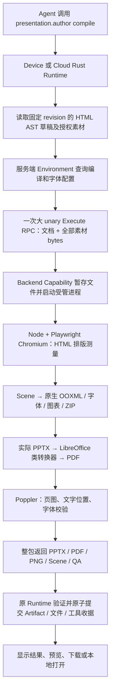
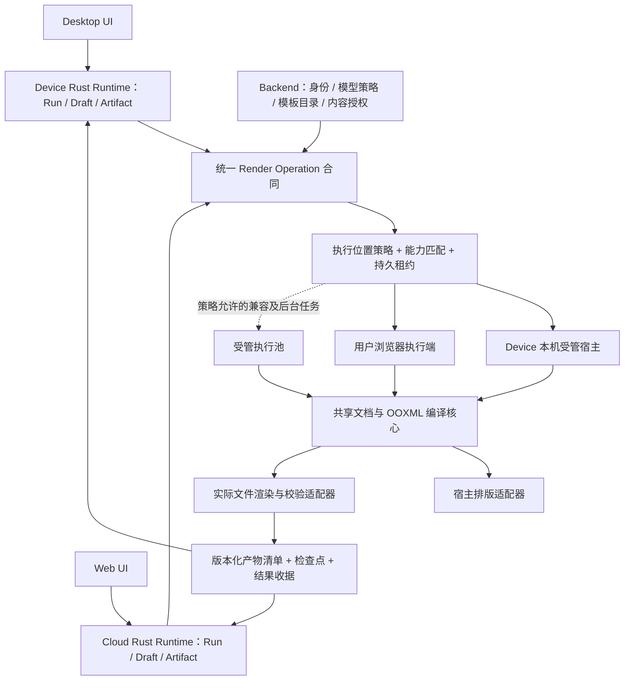
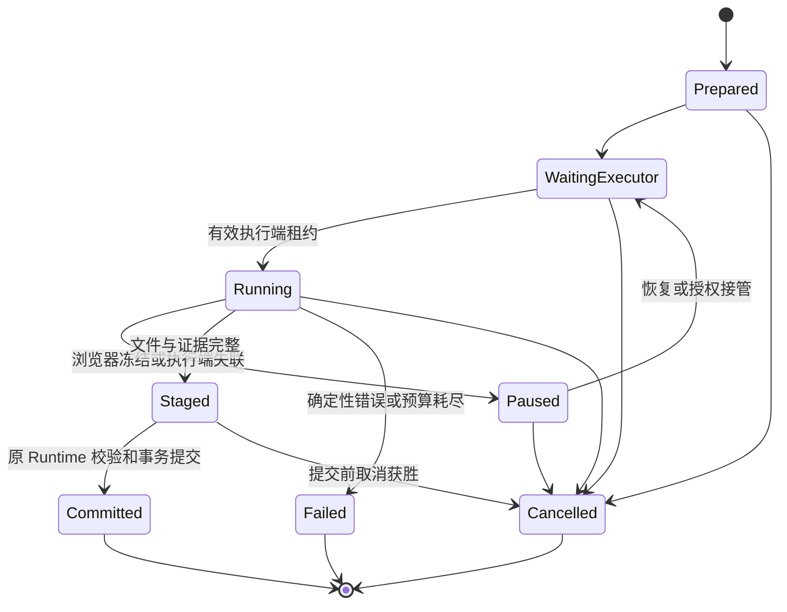

> Musterwork 历史设计快照 · 迁入日期：2026-09-24。来源：`docs/architecture/agent-runtime/proposals/presentation-client-rendering.md`。
>
> 原文中的“当前”“已采纳”和商业 SDK 选择只代表来源项目当时的状态，不是 MusterOffice 的决定或验收结论。内核以[现行设计](../../design/presentations.md)为准；来源、摘要和链接转换见[迁移清单](README.md)。

# PPT 客户端编译与渲染方案

> 状态：用户已确认，分阶段实施中。2026-09-22，桌面统一本地宿主/工作副本预览、浏览器 WASM 执行桥、可恢复分块上传及 Tool → Artifact 修订链已通过开发集成验证，见 实施记录（`Musterwork:docs/plans/agent-runtime/presentation-client-implementation.md`）。本批不打包、不部署；组织策略、个人模板浏览器派发及全部平台等价验收仍按下文退出条件执行。
> 代码核查基线：`9aeffffd3974597c4e4a43fe38a67ef4815b9719`。
> 目标优先级：功能、交付质量与可靠性不退化；桌面普通 PPT 工作全部在本机计算；Web 尽可能在用户浏览器计算；服务器保留必要控制、存储及策略允许的兼容/后台执行。
> §2–3 保留实施前源码核查、故障证据和研究基线；当前实现及新证据以实施记录为准。不能将开发集成通过等同于整个平台迁移或发行验收完成。

## 1. 建议采用的设计

**将“文稿属于哪个 Runtime”与“在哪台设备计算”分开。统一文档、编译规则和交付合同，按执行环境装配引擎。**

| 使用场景 | 推荐计算位置 | 服务端职责 | 无执行端时的行为 |
|---|---|---|---|
| Desktop 普通创作、修改、导出、文件预览 | 本机受管渲染进程；完整等价验收后切换 | 模型/身份/模板权限等既有服务；用户主动同步时的存储 | 切换前保留现有可用路径；切换后自动修复/准备受管组件并保留任务，不把云端依赖作为正常本地链的一部分 |
| Web 前台创作、修改、导出 | 有能力的浏览器：隔离页面 + Worker + 已验收的最终文件渲染器 | Cloud Runtime、内容授权、Artifact 存储；保留必要兼容执行 | 能力不足时按已有组织策略选择合格桌面/受管执行端；没有允许的执行端才可恢复等待 |
| 用户个人模板导入、重建和压力验证 | 优先当前有能力的客户端，逐阶段恢复 | 目录权限、版本、发布事务；必要兼容执行 | 保留现有模板能力，未通过等价验收的阶段继续走既有合格路径，不因客户端化取消导入或验证 |
| 平台模板发布、定时任务、无人在线的批处理 | 满足在线条件的指定桌面设备，或组织策略允许的受管计算池 | 调度、权限和目录业务 | 不把现有后台任务改成必须开着网页；显式禁止服务器计算且无在线设备时才等待 |
| 已完成文件的展示与分享 | 客户端读取既有预览，按需读取实际 PPTX | 授权读取、静态存储/CDN | 展示已持久化结果，不在每次打开时重新服务器转换 |

桌面本地化可以作为确定的落地目标。浏览器直接生成可编辑 PPTX 已验证基本可行；最终 PPTX 渲染已有商业 WASM SDK、开源浏览器渲染器和 LibreOffice WASM 等候选，见 §3。**官方能力说明不等于本产品等价验收，不预先指定某一候选为唯一可行路线。**

这里的浏览器沙箱指用户电脑上的页面/Worker/WASM。如果把 Chromium 放进服务器容器或远程浏览器，仍然消耗服务器 CPU、内存和临时盘，不满足此次目标。

本地编译也不等于整个 Agent 离线：模型调用、在线搜索、下载首次所需组件、拉取云模板、Web Artifact 同步仍可能需要网络。此次迁移要消除的是**每次 PPT 编译必须把素材送到服务器，再把整套渲染产物传回来的依赖**。

### 1.1 功能不退化是切换门槛

先冻结当前实际提供的功能、支持平台与交付合同，再逐项证明新执行端等价。未实现的 Office 高级特性另记为能力差距，不能虚构为当前功能；已提供的能力也不能因迁移而缩减。

| 必须保留的能力 | 等价验收要求 |
|---|---|
| 可编辑 PPTX | 文本、形状、表格仍是原生对象；图表保留可编辑数据；不能把整页图片当等价导出 |
| 排版与字体 | 同一字体材料下通过中文/混排、换行、溢出与关键区域对照；不以替换字体或删效果掩盖差异 |
| 最终文件预览、PDF、页图与质量验证 | 读取实际交付 PPTX bytes；保留既有输出角色和验证语义；HTML 创作预览不能冒充文件预览 |
| 现有模板导入、编辑、重建和发布 | 保留对象、主题/母版的既有支持范围、检查点、权限和版本事务 |
| 外部编辑与历史文件 | 保留 Office/WPS 修改及历史 Artifact；迁移不覆盖用户文件或重写冻结版本 |
| 已支持的 Web/移动端与后台任务 | 验证顺序可以不同，用户可用能力不能提前关闭；关闭网页后继续的既有服务承诺保留合格执行端 |
| 恢复、取消与进度 | 不丢草稿、不重复提交；失联可诊断，后台进度与非当前会话状态一致 |

只有某个“操作 × 文稿能力范围 × 平台 × 引擎/字体版本”的验收通过，才能切换该范围。新引擎失败时保留候选、检查点与失败原因，按 §9 策略恢复；禁止用关闭导出、移动端只读或省略验证来宣称迁移完成。

## 2. 实施前基线如何运行

### 2.1 普通创作的完整链路

关键代码证据：

| 位置 | 当前事实 | 影响 |
|---|---|---|
| Device 装配（`Musterwork:apps/agent-runtime/applications/device-runtime/src/presentation.rs`） | `authoring()` 第 120 行固定创建 `BackendNativePresentationEngine`；维护工具也使用该适配器 | SQLite 保存草稿，并不代表编译在本机 |
| Cloud 装配（`Musterwork:apps/agent-runtime/applications/cloud-worker/src/presentation.rs`） | 模板维护使用同一 Backend 引擎；普通工具装配同样绑定远程能力 | 普通与模板的重计算集中在服务端 |
| Rust 编译流程（`Musterwork:apps/agent-runtime/crates/runtime/artifact/src/presentation_tool.rs`） | `compile` 查询环境、执行 `author`、验证候选，再由 Runtime 导出 | 保留 Runtime 的事务提交，替换其计算适配器 |
| 远程传输（`Musterwork:apps/agent-runtime/crates/infrastructure/backend-capabilities/src/presentation_engine.rs`） | 文档、素材 bytes 合并为一个请求；编码 280 MiB、解码 272 MiB；最多 600 秒预算 | 网络中断影响整个结果，缺少按阶段恢复与独立产物传输 |
| Backend 引擎宿主（`Musterwork:backend/runtime_capabilities/presentation_engine.py`） | 暂存输入，`author` 强制 `render_preview=True`；收集多种完整输出 bytes | 文件生成、转换、校验和回传紧密耦合 |
| 主编译器（`Musterwork:packages/presentation-engine/src/author.mjs`） | 排版、编译、原生结构验证、实际 PPTX 预览和交付验证串联 | 任一后段失败阻止整体候选成功 |
| HTML 测量（`Musterwork:packages/presentation-engine/src/html/measure.mjs`） | Playwright 启动 Chromium，读取 DOM / Range / 字体测量 | 不能直接改成一个无 DOM 的 Worker |
| OOXML 编译（`Musterwork:packages/presentation-engine/src/pptx/compile.mjs`） | PptxGenJS 生成框架，再写自有 XML、关系、对象映射和字体 | 并非简单把 PptxGenJS 搬到前端就完成迁移 |
| 最终预览（`Musterwork:packages/presentation-engine/src/preview.mjs`）及交付验证（`Musterwork:packages/presentation-engine/src/quality/delivery.mjs`） | 本机进程执行 Office 类转换、`pdftoppm`、`pdftotext`、`pdffonts` | 普通浏览器不能直接调用这些宿主二进制 |
| 桌面文件预览（`Musterwork:apps/desktop/electron/musterwork-presentation-workspace-service.mjs`） | 从磁盘读取实际 PPTX，调用本机 `engine.preview` | 已有本地预览路径，但没有接入 Agent 的正式编译路径 |
| 桌面引擎打包（`Musterwork:apps/desktop/scripts/build-presentation-engine.mjs`）及校验（`Musterwork:apps/desktop/electron/presentation-engine-distribution.cjs`） | 已打包 JS 引擎和 Playwright 依赖清单 | 不足以证明 Chromium、Office 转换器、PDF 工具、字体闭包均可在干净客户机工作 |

旧方案曾明确写过“不需要为客户端打包 Chromium、完整编译器”。这一历史约束解释了上述基线；现已在 [原 HTML 方案 §15](presentation-html-authoring-and-template-compilation.md)和 [ADR 0005](0005-presentation-html-authoring-and-private-runtime.md)正式修订。实现进度与历史基线分开记录，不能仅改一个 URL 就宣称迁移完成。

### 2.2 两次故障说明了什么

- 第一次：约 1.73 MB 图片随输入发送，公网入口原 1 MiB 限制导致 HTTP 413。入口容量修复解决了请求无法到达的问题，见修复记录（`Musterwork:docs/testing/reports/2026-09-22-presentation-repair.md`）。
- 第二次：北京时间 15:55:17 开始编译；入口记录 `Execute` 已接收约 1.79 MB 请求，持续约 121 秒，向下游发送约 19.18 MB 后出现连接重置；本地工具在 16:05:17 达到 10 分钟预算并超时。HTTP 200 不等于客户端收到完整 gRPC 结果，更不等于 Artifact 已提交。
- 已知：第二次不是同一个 413 拒绝；大结果传输发生异常，且用户只看到了长时间转圈。
- 未知：现有记录不足以精确归因于 Cloudflare 的某项超时策略、用户网络或中间连接设备；不能仅因“约 120 秒”就认定某一网关规则。

本质问题包括重计算位置、请求/产物传输方式、恢复语义以及进度表达。继续调大网关限制或等待时长，无法完成本次架构目标。

### 2.3 模板不是普通导出的同一个任务

当前模板导入拥有 Backend 目录、持久 Job、权限、generation 和检查点；私有 Runtime Run 执行重建、参数化、压力验证、校验与组装。个人模板也会走共享云端流水线。详见模板工作流（`Musterwork:docs/architecture/agent-runtime/presentation-template-workflow.md`）。

本地化必须覆盖模板步骤的计算适配器，同时保留目录发布权限、逐阶段证明和重试 generation。只改普通 `compile` 会留下模板导入、后台 stress、外部文件预览等隐性服务器消耗。

## 3. 浏览器可行性：已验证与待验证

### 3.1 本次实际实验

在独立无用户数据的 Chrome 153.0.8010.53 上，用当前仓库的 PptxGenJS 4.0.1 构建 browser bundle，在断网 browser context 中运行专用 Worker：

| 项目 | 实验结果 |
|---|---|
| 生成两页可解析 PPTX | 成功，75,158 bytes |
| 原生表格 | 产物存在 `a:tbl` |
| 原生图表及内嵌数据表 | 存在 chart XML 和 XLSX，不是图表截图 |
| 页面 DOM 排版测量 | 成功，测试元素测得宽度 300 px |
| 外部 HTTP(S) 请求 | 0；仅创建了本地 `blob:` Worker |
| 现有完整 `pptx/compile.mjs` 直接打浏览器包 | 失败：`node:fs/promises`、`node:path`、`node:crypto`、`node:fs` 未解耦 |

实验仅证明浏览器基础生成和 DOM 测量能力，**没有验证本产品完整文档合同、字体嵌入、实际文件渲染、Office/WPS 保真、移动端或持续后台运行**。样本也未执行 Office 视觉验收。实验脚本、PPTX 和原始报告保存在本提案工作树 `.codex-work/ppt-browser-probe/`，不会打入产品。

PptxGenJS 官方支持浏览器和 ArrayBuffer/Blob 输出，与该实验一致。[官方安装说明](https://gitbrent.github.io/PptxGenJS/docs/installation/) · [输出格式](https://gitbrent.github.io/PptxGenJS/docs/usage-saving/)

### 3.2 各步骤的迁移边界

| 能力 | Desktop | Web 浏览器 | 实施决定 |
|---|---|---|---|
| AST 校验、编辑、模板实例化 | 本地核心 | Worker 共享核心 | 去掉文件路径及 Node 全局依赖 |
| HTML 布局、文本与字体测量 | 受管 Chromium | 隔离文档中的浏览器 DOM | 共用测量逻辑，宿主驱动分离 |
| ZIP/XML/OOXML、原生表格图表生成 | 本地后台进程 | Worker | 用二进制接口，不传整份 base64 |
| 作者侧 HTML 预览 | 本地浏览器 | 浏览器直接展示 | 只标记为创作预览 |
| 实际 PPTX 解析和文件预览 | 本机兼容引擎；合格的浏览器引擎也可被本机宿主使用 | 比较商业 WASM、LibreOffice WASM 与开源 DOM/SVG 渲染器 | 必须读取最终导出 bytes，并匹配已验收的功能范围 |
| PDF、页图、文字/字体验证 | 本机转换及校验适配器 | 已验收的转换器 + PDF 渲染/文本/字体检查适配器 | 保留证据语义；仅能展示 PPTX 的库不能自动承担全部检查 |
| 文件保存 | Runtime 内容库和授权工作目录 | OPFS 临时内容 + 下载/云存储 | OPFS 是缓存，不是云 Artifact 的唯一副本 |
| 关闭应用后的执行 | Device 后台宿主仍在时可继续 | 普通页面无法保证继续 | 需要连续后台执行的任务预先匹配合格设备/受管宿主；页面失联按策略接管或等待 |

Worker 无 DOM；OffscreenCanvas 是画布计算接口，不是 HTML/CSS 布局引擎，也不是 PPTX 解析器。[Web Workers](https://developer.mozilla.org/en-US/docs/Web/API/Web_Workers_API/Using_web_workers) · [OffscreenCanvas](https://developer.mozilla.org/en-US/docs/Web/API/OffscreenCanvas)

还有一处必须显式改造：普通网页没有 Playwright `page.screenshot()` 这样的无提示任意 DOM 截图接口。Web 作者预览直接展示隔离 DOM；最终页图从已验收的文件渲染器读取实际 PPTX 后得到的 PDF/绘制结果生成。不要引入需要用户授权的屏幕录制来完成导出。当前引擎协议中的作者 PNG 若不是交付依赖，可在新协议中明确成为可选诊断输出；旧协议仍按原闭包校验。若确实需要作者 PNG，则另验收 Scene → Canvas/SVG 的覆盖范围，不能把近似截图当最终文件证明。

浏览器适配清单还应逐项覆盖 PptxGenJS 的 `nodebuffer` → `arraybuffer` 输出、archive/ZIP 内的 Buffer 假设、fontkit 与字体二进制读取、WebCrypto 与同步摘要调用、受管字体的 FontFace 注册、图片解码，以及无文件路径的 PDF 校验输入。这些都属于共享核心和宿主接口的正式改造，不靠提供空的 `fs` polyfill 通过打包。

### 3.3 前端技术候选与能力边界

2026-09-22 核查官方文档、项目说明与 npm 元数据。下表是候选能力依据，不是供应商产品已经通过本项目测试的结论。§3.1 的离线小样本仅覆盖 PptxGenJS，未覆盖下表其他引擎。

| 候选 | 有据可查的前端能力 | 本项目定位与限制 |
|---|---|---|
| [PptxGenJS](https://gitbrent.github.io/PptxGenJS/docs/usage-saving/) | 浏览器生成 PPTX，输出 ArrayBuffer/Blob | 继续作为当前生成器的基础；不提供最终 PPTX 读取渲染。保留现有自有 OOXML、图表数据、字体与对象映射逻辑 |
| [@aiden0z/pptx-renderer](https://github.com/aiden0z/pptx-renderer) | 真实 PPTX → HTML/SVG，支持文本、表格、常用图表、组合对象等；可按页延迟渲染 | 开源轻量预览重点候选。图表布局有近似处理；动画播放、完整 OMML/3D 等不完整，不直接承担最终保真裁决 |
| [@office-kit/pptx](https://github.com/office-kit/pptx)及[preview](https://github.com/office-kit/pptx/blob/main/packages/preview/README.md) | 浏览器读写/修改 PPTX；原生图表；浏览器 SVG 预览 | 补充研究候选。预览为实验性 0.x、部分对象有占位符；文档中的 PNG/RGBA 接口属于 Node，不能写成已具备浏览器 PNG 导出 |
| [Apryse WebViewer](https://docs.apryse.com/web/guides/office/open-office) | 浏览器本地 PPTX 读取、预览、Office 转 PDF | 最终文件转换重点候选；需要 Office Conversion 授权。Office 查看/PDF 编辑不等同原 PPTX 原生往返编辑 |
| [Nutrient Web SDK](https://www.nutrient.io/guides/web/office) | Standalone 浏览器 Office → PDF；支持[无 UI 转换](https://www.nutrient.io/guides/web/conversion/headless/) | 同类转换候选。另有 PDF → Office 与模板填充 API，但不能据此认定原 PPTX 经 PDF 往返后保留原生结构 |
| [Spire.Presentation for JavaScript](https://cdn.e-iceblue.com/Introduce/presentation-for-javascript.html) | 浏览器 WASM 创建、读取、修改 PPTX，转换 PDF/PNG/SVG 等；[官方示例](https://www.e-iceblue.com/Knowledgebase/Javascript/Spire.Presentation-for-Javascript.html)使用虚拟文件系统 | 最终文件转换重点候选，也可测试模板操作。先接入转换适配器，不在无证据时整体替换既有生成器 |
| [ZetaOffice / zetajs](https://github.com/allotropia/zetajs) | 浏览器 LibreOffice、UNO 调用与后台文档转换，可自托管 | 完整兼容引擎候选；[演示页面](https://zetaoffice.net/demo1.html)仍标注 open beta，须实测字体、资源开销、API 与平台支持 |
| [dom-to-pptx](https://github.com/atharva9167j/dom-to-pptx) | 网页 DOM → 可编辑 PPTX；部分效果采用 SVG/画布输出 | 可比较 DOM 测量及对象映射实现；不凭“可编辑”宣传推断所有元素是原生对象，不引入第二套文档事实源 |

授权与产品身份必须按实际交付包核查。PptxGenJS/office-kit、aiden0z 与商业 SDK 的分发方式不同；npm `license` 字段不能覆盖二进制引擎、字体、插件和客户再分发条款。zetajs 包装层的许可也不能替代 LibreOffice/WASM 完整依赖清单。

以下方案不能混为同一种能力：

- [PPTist](https://github.com/pipipi-pikachu/PPTist)是网页编辑应用底座，承认 PPTX 导入导出有细节差异，并提供 AGPL/独立商业授权。不能用替换整个编辑器绕开本产品文档与质量合同。
- [Slidev](https://sli.dev/guide/exporting)普通 PPTX 导出为整页图片；其可编辑导出仍有元素/整页图片回退。适合其他交付目的，不能作为本项目原生可编辑合同的直接替换。
- [ONLYOFFICE Docs 常规 Conversion API](https://api.onlyoffice.com/docs/docs-api/additional-api/conversion-api/)请求 Document Server，不因 UI 在网页中就满足“浏览器承担转换”。
- `Spire.Presentation for JavaScript` API 库与 `Spire.PresentationJS / OfficeJS` 编辑器不是同一集成物。[OfficeJS 接入文档](https://cdn.e-iceblue.com/Tutorials/Spire.OfficeJs/Getting-Started/integrate-spire-officejs-into-javascript.html)仍要求部署服务；必须核清资源分发、协作、授权与转换分别发生在哪里，不能由 serverless 名称推断所有服务都可删除。

### 3.4 选型决定与验证顺序

**保留现有文档模型和 PPTX 生成核心，把生成、快速预览、最终文件转换及质量验证分成明确的能力接口。供应商或库只实现适配器，不拥有文稿、Artifact 或 Agent 状态。**

1. 生成层沿用 PptxGenJS 与自有 OOXML 逻辑，先完成无 Node 文件系统假设的浏览器出口；验证原生文本、表格、图表数据和字体。
2. 最终转换首轮使用相同语料比较 Spire、Apryse、ZetaOffice；Nutrient 进入同一合同的替代候选。任一关键功能、授权或部署条件不满足时扩大验证，不为缩短选型跳过失败项。商业/开源身份不代替质量判断。
3. 独立验证 aiden0z 的轻量文件预览；只有通过特定文稿能力范围的验收才启用，不拿它的近似画面给最终 PPTX 背书。若优选最终渲染器已满足交互性能，则不额外叠加轻量引擎。
4. office-kit、dom-to-pptx 用于有明确问题的对照实验；没有证据证明收益前不替换生成器，不长期维护两套不同编译规则。

桌面首先将现有兼容引擎纳入本地受管宿主。浏览器 SDK 若通过完整合同，也可作为桌面最终渲染适配器候选；是否共用由质量、性能、离线分发与后台宿主能力决定，不要求两个环境运行相同二进制。

浏览器完整链路必须从同一份实际交付 PPTX bytes 产生所需 PDF/页图，并提取文字、字体等证据。目前 Poppler 的命令调用可替换，验证能力不能删减。PDF.js 或其他 PDF 库能显示页面，并不证明能够提供现有全部字体/坐标检查；缺项应在适配器实现并通过对照验收。PDF/图片预览不改变原生 PPTX bytes，禁止 PPTX → PDF → PPTX 往返替代原文件保存。

### 3.5 有限原型必须产出的证据

| 验证维度 | 要求与退出条件 |
|---|---|
| 输入与产物绑定 | 使用六页故障文稿及固定回归语料；记录输入 hash、SDK/编译器/字体/浏览器版本与产物摘要 |
| 原生结构与视觉质量 | 同时检查可编辑对象/图表数据和实际画面；与固定版本 Office/WPS 及当前合格基线对照，不仅用整页相似度平均值 |
| 完整导出合同 | PPTX、PDF、页图、文字/字体检查均有实际结果；不支持项不能静默跳过，也不能将占位符算作通过 |
| 资源开销 | 分别测冷加载/热启动、1/6/20/40 页、峰值内存、UI 阻塞、失败清理；包解压大小不当作网络下载量或运行内存 |
| 网络与离线 | 组件/字体准备后阻断外网，记录全部连接；转换不能上传文稿到厂商演示站或在线 API；Web 云同步独立计量 |
| 部署与授权 | 核实 WASM/Worker/CSP/跨源隔离、企业内网资源分发、离线授权、桌面与客户私有化再分发范围；不能带试用水印交付 |
| 生命周期 | 取消、销毁、标签页冻结、组件崩溃、内存不足后任务可诊断/恢复；原型通过不是后台持久执行已经实现 |

Apryse 默认替代字体可能来自厂商域名，支持[自行托管字体](https://docs.apryse.com/web/faq/self-serve-substitute-fonts)；其[授权相关网络说明](https://docs.apryse.com/web/faq/content-security-policy)区分需要用量上报的密钥。其他 SDK 同样要核实实际配置。企业离线方案必须把资源、字体与相应授权准备完整，不能将“浏览器计算”直接写成“任意配置都不访问网络”。

原型报告必须逐项标记通过、失败、未测和适用范围。候选未通过时继续保留现有合格交付路径，或选择已授权的合格设备/受管适配器；不关闭既有 Web 导出，不用创作预览替代交付，也不以任意外部文件兼容作为未经证明的卖点。

## 4. 目标结构与唯一所有权

“统一”指一份文档与编译语义、多种宿主适配器，不是通过一个全局进程决定所有用户的执行 Home。

- Device Runtime 继续是桌面 Agent 唯一执行者。Electron 和本机渲染进程没有第二套 AgentLoop，不自行写 Artifact 或伪造工具成功。
- Cloud Runtime 继续拥有 Web Run。浏览器接收计算任务、上传结果，由 Cloud Runtime 验证和提交，不把完整 Run、模型凭据或后台权限交给浏览器。
- 渲染任务只拥有计算状态与检查点；业务文稿、Artifact、工具收据仍由原 Runtime 事务提交。
- 模板目录仍拥有发布权限。客户端完成了编译，不等于有权上架公共模板。

### 4.1 共享核心与目录边界

建议在现有 `packages/presentation-engine` 内明确环境出口，再按依赖边界拆模块，避免先制造若干互相转发的新包：

| 模块 | 职责 | 不允许依赖 |
|---|---|---|
| `core` | AST/操作/规范化、Scene 合同、OOXML 对象映射、原生结构验证 | `fs`、Electron、浏览器 DOM、后端数据库 |
| `layout-dom` | 受信测量程序、样式/字体闭包、Scene 生成 | 业务凭据、任意外链、Artifact 写入 |
| `io` 的宿主接口 | 内容读取、摘要、暂存、缓存、输出流 | 模型传入的任意绝对路径 |
| `hosts/node` | 本地/受管宿主进程、实际文件转换和文件系统适配 | Web 应用代码 |
| `hosts/browser` | Worker、二进制传输、浏览器存储与候选渲染/转换适配器 | Node polyfill、宿主 shell |
| App 内 adapter | Electron 生命周期或 Web 租约桥接 | 复制编译、授权或草稿逻辑 |

初始共享核心使用环境无关 ESM/TypeScript，资产采用 `Uint8Array`/有界读写接口；同步 Node crypto、Buffer 专用方法和路径装配移到宿主。规范化编码和哈希规则保持一致，不能因 WebCrypto 异步化改变文档 identity。

生成器返回原生 PPTX 与对象/资源清单；最终渲染适配器接收该 PPTX 的确切 bytes，返回 PDF/页图及可核对的诊断；质量适配器检查结构、文字、字体与来源绑定。能力清单分别声明这些输出，不能只报 `supports_pptx=true`。调度依据操作所需的完整输出闭包、已验收特性与宿主资源，不能以“能显示第一页”判定可完整交付。

同一候选生成后不因更换最终渲染器而重新编译文稿。每个 Attempt 的 recipe 不变；转换器切换由 Runtime 废止旧租约、创建记录新渲染/验证 recipe 的 Attempt，保留原文稿与 PPTX hash，旧证明缓存不可复用。不同 Attempt 的输出不得拼接成一份已验证结果；完整结果仍由原 Runtime 提交。仅预览适配器不得覆盖用户的原 PPTX，也不借厂商 viewer 的保存按钮创建第二条 Artifact 提交路径。

不因“要在浏览器运行”就整体重写为 Rust。先分离宿主依赖并建立 golden 语料；若剖析证实 ZIP/XML/字体成为瓶颈，将该**同一**确定性模块下沉 Rust，输出 native/WASM 两种构建，替换旧实现。禁止长期保留两套不同规则的编译器。

原固定服务器资源方案（`Musterwork:docs/architecture/agent-runtime/proposals/presentation-high-concurrency-architecture.md`）仍是未实施提案。其中持久任务、授权内容传输、公平调度和资源预算可复用；将所有重计算调度到服务器的拓扑不适用于此次目标。本文不直接修改现行 ADR，审批后的实施首批应更新规范引用与被取代章节。

## 5. Desktop：本地计算的具体落地

### 5.1 执行过程

1. Device Runtime 接受原 `compile`，固定草稿 revision/hash、编译 recipe 和素材清单，提交本地 Render Operation。
2. 可信宿主从本地 Content Store 物化已授权输入，按页计算最小依赖闭包；不向渲染器暴露全盘路径或用户凭据。
3. 本机任务进程调用共享引擎，完成排版、OOXML、最终文件渲染和校验。PPTX/PDF/PNG 直接写本地隔离暂存及内容库。
4. 只向 Runtime 返回小清单和内容句柄；Runtime 校验实际 bytes、recipe、revision 与完整产物集合。
5. 原事务提交 Artifact 版本、文件和工具收据，再物化到授权工作目录；保留用户在 WPS/Office 的修改，不覆盖旧文件。

数据控制走受限本机 IPC；素材和大产物通过受控文件句柄/内容引用访问，不把服务端 280 MiB unary RPC 原封不动改成 localhost RPC。

### 5.2 宿主与组件

当前引擎依赖 Playwright Chromium、Node、Office 转换器、PDF 工具、字体和系统库。首个本地版本把这条链组成**版本锁定、签名校验、具有平台清单的 PPT 运行组件**，不能继续依赖开发机环境变量或用户自行安装的办公软件。后续 SDK 通过等价验收后可替换对应组件，只分发选定适配器所需的依赖，不把全部候选引擎同时塞进安装包。

- JS 引擎、Node、Chromium、转换器、PDF 校验适配器、字体清单、原生隔离辅助程序都进入完整依赖清单。
- 标准安装可以按需准备组件并缓存；企业离线包提供同一组件的完整镜像。首次组件准备显示明确状态，失败不进入持续编译转圈。
- 官方模板、当前文稿素材与字体已缓存、授权有效时，确定性编译与预览应可断网完成。在线模型生成和新的云模板读取不在这个离线承诺中。
- 组件升级使用不可变目录、签名/摘要及最低协议版本校验；正在执行的任务固定原 recipe，新任务才使用新组件。
- 复用现有桌面受管组件的发行、缓存、签名与更新框架，增加完整 PPT 组件身份；不另造一套下载器或后台自更新服务。
- 不能凭本次 bundle 清单通过就宣称“本地 PPT 可用”；发布门禁必须在无开发工具、无 Homebrew、无外装 LibreOffice 的干净机器导出真实样本。

推荐本机独立受管宿主，生命周期跟随 Device 后台任务，不跟随聊天窗口。初期可复用现有 Node CLI + Chromium 的算法；OS 隔离和资源控制应从 Backend 宿主职责迁到本地适配器。现有 Linux Landlock/seccomp 与 macOS Seatbelt 实现可作为证据和实现参考，不能未经签名发布测试直接认定支持所有桌面平台，Windows 隔离须单独实现和验收。

现有桌面本地文件预览也迁入这个宿主，避免 Electron 主进程加载 ZIP/XML 大对象和承担转换调度。主进程只负责受限桥接、文件授权与窗口生命周期；普通编译与本地文件预览共享同一资源准入和取消机制。

Electron 隐藏/离屏窗口可用于布局适配器验证，官方支持离屏位图输出；但 Electron 主应用完全退出后它不能继续承担后台编译，所以不把 UI 窗口作为唯一执行基础。[Electron Offscreen Rendering](https://www.electronjs.org/docs/latest/tutorial/offscreen-rendering)

### 5.3 本地资源与安全

默认一台设备一个重型编译任务；按实测 CPU、进程组 RSS、GPU 和临时盘再调优并发。一个受管 Chromium 实例可按策略复用，但不同任务使用独立 context，禁止复用用户浏览器 profile；异常或达到资源阈值时回收整个执行组。

渲染器不获得模型密钥、系统凭据、用户登录态或任意网络。输入保持声明式 AST，拒绝脚本、活动对象及非授权资源。OS 沙箱覆盖整个进程树；仅开子进程不等于具备安全隔离，也不能仅用 JS heap 参数当进程组内存限制。Electron renderer 的 sandbox 与 Node integration 有明确关系，不能为调用 `fs` 而打开无隔离的 renderer。[Electron sandbox 文档](https://www.electronjs.org/docs/latest/tutorial/sandbox)

## 6. Web：浏览器执行端，不重写 Cloud Agent

### 6.1 执行端接入与运行

1. 浏览器向 Cloud Runtime 注册当前用户的临时执行端，声明编译/渲染 profile、SDK/字体版本、存储与可用能力；调度同时检查平台验收范围、操作要求与组织策略，不能只相信 User-Agent 或执行端自报能力。
2. Cloud Runtime 持久化 Render Operation，通过用户会话授权发出一次性、限任务的执行租约。
3. Web shell 取得小任务清单和限域内容读取权限，准备当前文稿资源。隔离渲染上下文仅接收经过验证的实际 bytes，不获得通用下载签名能力或登录 token。
4. 隔离 DOM 环境做排版；Worker 执行可脱离 DOM 的解析、编译、压缩与校验；已验收的最终渲染适配器从实际 PPTX 产生文件预览及所需证据。SDK 若需要文档环境，应由对应宿主装配，不强行放进无 DOM Worker。
5. 产物先保存浏览器检查点，再通过可恢复内容上传写入 Cloud Content Store；Cloud Runtime 验证并提交 Artifact/工具收据。
6. 页面从正常投影消费状态，下载可直接使用已有本地 bytes，避免刚上传完整文件又重复下载。

Web 端有云端持久 Artifact 的产品语义，因此最终文件与必要预览仍需上传。**省掉服务器渲染，不代表省掉云存储、上传带宽或云 Agent。** 本地下载成功与 Cloud Artifact 提交成功是两个状态，不能前者成功就把云工具标记完成。

### 6.2 浏览器沙箱和进程边界

- 使用专门的渲染 origin/文档环境，主产品登录态不进入其中；资产由受信 shell 经 MessagePort 传递，双方校验任务 nonce、revision、消息类型和序号。
- Worker 负责 CPU 重活，DOM 只处理测量必需的短任务；逐页分段让出事件循环。iframe 本身不保证独立进程，更不保证不会卡住宿主页面。
- 模型提交 AST，不提交可执行 JavaScript。受信测量脚本与不可信内容分开；CSP 禁止不需要的连接、导航、表单和弹窗，不用放宽整个站点 CSP 换取兼容。
- 不在与主产品同源的 iframe 上同时授予不可信脚本 `allow-scripts` 和 `allow-same-origin`。[iframe 沙箱说明](https://developer.mozilla.org/en-US/docs/Web/HTML/Reference/Elements/iframe)
- WASM 若依赖 SharedArrayBuffer/线程，需验证 COOP/COEP、CORS/CORP 和跨源 iframe 的实际组合；不能认为加两个响应头就自动具备能力。无该能力时用经验证的单线程配置，或明确不满足执行条件。[crossOriginIsolated](https://developer.mozilla.org/en-US/docs/Web/API/Window/crossOriginIsolated)
- 缓存/暂存采用 OPFS 或经验证的 IndexedDB 适配器，按用户、租户和 recipe 隔离。先检查可用配额，响应 quota exceeded，退出账户清理授权材料。OPFS 会受配额与站点数据清除影响，不能作为唯一 durable authority。[OPFS 文档](https://developer.mozilla.org/en-US/docs/Web/API/File_System_API/Origin_private_file_system)

### 6.2.1 已落地的计算与字节所有权（2026-09-23）

隔离 Runner 为多个编译任务提供一个资源 Worker，使用私有 MessagePort RPC 管理取消和连接生命周期。组件以固定 generation 与清单身份读取，Worker 校验后缓存不可变 Blob；LRU 保留上限 352 MiB，不将 HTTP 缓存命中视为已校验。摘要使用 Worker 内 WebCrypto，仍需要完整输入副本，须将缓存预算与运行峰值分开。Worker 崩溃结束当前任务，下一任务重建；Office 线程树仍逐任务销毁。

编译 Worker 生成交付证明和作者参考图的资源闭包。作者图按当页可见文字使用 HarfBuzz 子集（保留排版闭包、特性及 hinting）；只有该参考图的字体精简，DOM 使用原字体验证排版，PPTX 嵌入完整字体保持后续编辑能力。字体子集和 SVG 编码在 Worker 内进行，DOM 接收小图源并绘制。素材 DOM 使用 Blob URL；SVG foreignObject 光栅化所需的自包含 data URL 属于本机输入，不作为上传格式。

Web shell 使用带原鉴权和重试的二进制内容端点：每片最多 512 KiB；Backend 严格限制声明长度与流式实际长度，将领域二进制 DTO 交给 Runtime。Runtime 继续独立验证实际内容及组装合同。旧客户端 JSON 分片仅作为发行迁移入口，和新端点共用同一组装所有者；新客户端不静默回退。兼容入口随最低客户端版本及使用量清零退役。执行沙箱始终不接触 shell 的登录凭据。

测量与剩余边界见性能验收（`Musterwork:docs/testing/reports/2026-09-23-presentation-browser-performance.md`）。字体子集运行模块由锁定依赖随 Runner 自托管构建，不在执行时访问供应商 CDN。

### 6.3 关闭页面、休眠、多标签页

浏览器不能承诺关闭标签页后继续长时间排版/转换；Service Worker 也不能充当有无限生命周期的后台渲染守护进程。页面可能被冻结或丢弃，必须把它当作可失联执行端。[浏览器页面生命周期](https://developer.chrome.com/docs/web-platform/page-lifecycle-api)

- 每个 Render Operation 同一时刻只有一个有效 epoch/lease；多标签页不能重复认领后同时提交不同结果。
- 页面失联：云端保留草稿、任务和已上传检查点，废止旧租约并释放执行槽；按预先确定的策略交给可接管执行端，或显示“等待浏览器恢复”，不能继续假装执行。
- 恢复：先查询既有任务与产物，再恢复剩余阶段/上传；不得重启整个 Agent 模型轮次冒充恢复。
- 已完成上传但确认丢失：通过幂等任务 ID 和 receipt 查询完成状态，不重新生成版本。
- 更换电脑或浏览器：只有 recipe 兼容且权限有效才能接管；已经丢失的纯本地检查点允许重算，不能承诺无需重复计算。
- 需要“关网页后继续”的任务，在调度时匹配可持续在线的授权设备/受管后台执行，或保证策略允许失联接管；已有云端后台能力不因此次迁移要求用户一直开网页。只有客户显式禁止服务器计算且所有合格设备离线，才明确等待并说明限制。

原型可先测桌面 Chromium，再测 Firefox/Safari 和移动端；这是验证顺序，不是缩减产品支持范围。尚未具备完整本地链的平台继续使用现有合格执行路径，不能把已有可导出的移动端改为只预览/下载。客户端执行范围由能力与语料测试决定，不从一次 Chrome 实验外推。

### 6.4 客户端结果不能自证安全或权威质量

浏览器是用户可控环境。浏览器返回 `quality=passed`、某个 SHA 或某个引擎版本，不是可信执行证明；hash 只能检查 bytes 一致，不能证明算法按规则运行过。

Cloud Runtime 必须独立验证租户/任务权限、有效租约、输入版本、输出摘要、ZIP 路径/容量、主动内容限制、格式/页数/原生对象闭包和 Artifact 提交条件。客户端视觉证据记录来源与 profile，不能升级为“平台认证的 Office 验收”。这些有界安全与结构检查会消耗少量服务器资源，属于必要控制开销。

个人产物接受明确来源的客户端编译证据；公共模板上架或客户要求强可信兼容证明时，可在授权的可信桌面设备/受管审计池复核。不能默认全量服务器再渲染一遍，否则会失去迁移收益。若客户完全禁止受管复核，产品就不提供未经证明的权威认证标签。

## 7. 编译、预览与交付合同

### 7.1 拆步骤，不削减正确性

内部任务按以下阶段持久化：输入准备 → 文档校验 → 排版 → OOXML 构建 → 实际文件渲染 → 结构/文字/字体验证 → 产物暂存 → Runtime 提交。

将以下证据分开表达：

| 证据 | 证明什么 | 不证明什么 |
|---|---|---|
| `document_valid` | AST、素材引用、编辑操作符合合同 | Office 文件正确 |
| `native_structure_valid` | 实际 PPTX 对象、关系、图表数据和字体闭包通过结构验证 | 最终排版与作者 HTML 一致 |
| `authoring_preview` | 浏览器测量的创作布局 | 用户下载文件的真实渲染 |
| `exact_file_preview` | 从实际交付 PPTX bytes 渲染并绑定摘要 | 所有 Office/WPS 版本效果完全一致 |
| `target_application_review` | 指定应用/版本上的实测记录 | 其他版本或平台也已验收 |

现行 `presentation-artifact/2` 要求实际 PPTX 的预览及依赖闭包。第一阶段原样保留，所有步骤改为本地执行；不能简单把 `render_preview` 设为 false，再强行提交“成功”。

用户界面可在交付前显示“正在检查最终文件”，并展示清楚标记的创作预览。编译文件已生成但后续验证失败时，保留候选和诊断供同一任务修复，不丢草稿；不能把不完整候选混入已交付版本。

将来若产品决定允许“只导出、未做最终文件验证”，必须单独制定工具/Artifact successor 和可见质量语义，此次方案不把它当性能捷径。

### 7.2 版本与缓存

固定 recipe：文档合同、编译器版本、布局测量程序、实际浏览器版本、字体字节摘要、DPI/locale、OOXML 编译及最终渲染/校验器版本。不同 recipe 不共享证明缓存，也不要求不同浏览器得到逐字节相同布局。

内容缓存按 hash 复用但权限独立校验；页面布局缓存按节点/素材/字体/画布/recipe identity 计算。仅重测受影响页面。最终 PPTX 打包及 Office 类转换能否增量，取决于实际格式和引擎，不承诺“改一页就完全不处理其他页”。

字体只加载/嵌入实际依赖的 face，但保留合同要求的后续编辑字符能力；不能为了缩小文件默默改成仅含当前文本字符的字体子集。缺字、缺字体和字体替换都有明确诊断，不能悄悄依赖操作系统默认字体。

## 8. 持久任务、错误恢复与交互

复用现有外部操作恢复合同（`Musterwork:docs/architecture/agent-runtime/design/durable-external-operation-reconciliation.md`），扩展渲染执行端，不新建第二套 Run 工作流。

任务至少固定 `operation_id`、Invocation、tenant/principal、document revision/hash、recipe、授权输入清单、输出角色集合、执行端 epoch、operation lifetime 和取消状态。控制消息仅携带小清单，复杂清单自身也是内容对象。

计算重试与业务提交幂等分开。失联可能导致计算重新执行，但同一幂等键不能产生两个 Artifact 版本。取消与提交在同一权威上裁决，过期租约结果只清理，不能覆盖新版本。

客户端显示真实阶段及已完成页数，不制造百分比。建议用户看到的状态只有“准备组件/准备素材、排版、导出、检查文件、保存、等待恢复、失败、完成”；模型名、token、内部引擎标识不进普通工具面板。

本地任务失败保留草稿；浏览器没准备好显示准备/接管/等待原因。资源已准备好的本地计算不依赖服务端渲染连接，网络异常与云同步状态独立表达；若任务本身按策略使用受管执行，则显示该执行阶段的连接或恢复状态。长时间无进展由任务 supervisor 判定并给出恢复状态，不能用前端动画一直掩盖失联。

## 9. 模板、无人值守与服务端资源预算

把当前“Backend Job 固定调用云端 native 引擎”改为“目录 Job 调用有执行位置策略的阶段任务”。模型推理仍由相应 Runtime 控制，渲染步骤优先派发到合格客户端，未覆盖范围与后台任务使用策略匹配的执行端。可保留现有每页 checkpoint、generation、CAS 与发布事务。

执行策略分成两个独立维度，避免把“优先客户端”错误实现为“客户端不支持就取消功能”：

- **允许位置**：本机、用户浏览器、已授权桌面执行端、组织受管执行池；继承组织现有权限和数据驻留规则，不新增未授权上传。
- **匹配规则**：操作完整输出闭包、已验收文稿特性、连续后台需求、可用资源、SDK/字体 recipe 与授权条件。优先级只能在合格执行端之间比较。

| 产品策略 | 用途 | 能力不足/失联时 |
|---|---|---|
| `local_required` | 完成等价验收后的普通桌面本地链；客户明确要求仅本机处理 | 准备或修复本地组件、保留检查点；不自动上传素材。切换前不得删除原有可用路径 |
| `client_preferred` | Web 前台和个人模板默认迁移策略 | 浏览器合格则本地执行；否则按已授权策略使用合格设备/受管适配器，保留现有功能 |
| `background_required` | 现有无人值守、定时或关页后继续任务 | 选择具备后台生命周期的合格设备/受管宿主；不能只依赖普通页面 |

位置切换由 Runtime 统一裁决，记录能力不足、资源预算、失联或确定性错误的具体原因。不能把所有异常都自动归为“不兼容”然后反复换引擎；无效输入明确失败，可恢复故障按预算重试，过期租约不可提交。若跨执行端/引擎接管，固定原输入与 PPTX 候选，重新生成必要的渲染/验证证据。

组织策略是管理员的一次配置；已有授权范围内的日常导出不反复向用户弹确认。UI 必要时简洁显示“在此设备处理”或“在组织服务处理”，详情保留执行位置及原因；不显示模型、token 或内部 SDK 信息。位置说明不代替权限检查。

客户可以显式关闭服务器原生渲染，但必须在部署前验证其所需平台、文稿与后台场景都有合格客户端/在线设备。禁止服务器且无合格客户端时确实只能等待，属于客户选择的部署约束，不能作为默认迁移结果强加给已有用户。控制服务健康也不能依赖一个被策略关闭的渲染池。

迁移保留的服务端适配器与客户端使用同一文档、任务和产物合同，承接未覆盖范围及后台任务；不继续扩展一套独立编译逻辑。统计兼容执行的原因和覆盖缺口，逐项消除可消除的服务器依赖，而不是无限期保留无边界兜底。

平台模板公开发布保留必要审核；私人素材缓存不可因“相同 hash”跨租户直接授权。浏览器/桌面归还的结果对当前阶段和任务 generation 有严格绑定。

服务器仍承担账户、模型调用代理/计量、Cloud Agent、任务元数据、权限检查、对象存储、索引及必要安全验证。这些不会被“浏览器渲染”自动消除。已通过客户端验收的交互范围目标为零服务端重计算；其他范围保留必要受管能力并单独计量。资源节省不凌驾于功能、可靠性或交付质量。

## 10. 分阶段实施与退出条件

| 阶段 | 交付物 | 必须通过后才能切换 |
|---|---|---|
| A：合同与功能基线 | 统一 Render Operation、recipe、来源/证明、阶段状态；冻结平台/功能矩阵、现有语料和旧版本回放 | 新旧事务语义一致；取消/重试/Artifact 边界清楚；已提供能力不能遗漏 |
| A1：候选对照原型 | §3 的最终转换候选、轻量预览候选，统一真实文稿与断网/资源测试报告 | 逐项输出支持范围、失败/未测项、授权和部署条件；确定可替换适配器，不宣称已产品化 |
| B：完整桌面本地链 | Device 本机适配器、依赖组件、持久任务、进度；普通创作与本地预览共用宿主 | 打包客户机断网编译、实际 PPTX 预览/编辑成功；无生产渲染 RPC |
| C：共享核心浏览器化 | 二进制 IO、环境依赖拆分、Worker 编译、隔离 DOM 测量 | 同一受支持语料在 Node/浏览器编译均通过；无 Node polyfill 偷带宿主假设 |
| D：浏览器实际文件验证 | 优选最终渲染适配器、PDF/文字/字体证据、资源与生命周期基准 | 指定平台/文稿范围通过完整合同才切换；未通过范围继续现有合格路径 |
| E：Cloud ↔ Browser 执行桥 | 注册/租约、限域内容、断点续传、暂停/接管、云 Artifact 提交 | 断网/关页/双标签/取消竞态不重复提交、不丢已持久内容；后台承诺不退化 |
| F：模板与执行策略 | 个人模板客户端执行、兼容范围及后台任务的显式策略 | 现有模板各阶段完整保留；所有受管计算有策略与原因，可追踪资源消耗 |
| G：收敛与退役 | 已验收范围默认客户端，移除重复宿主与被替代的固定远程调用 | 现有支持矩阵无回退；必要兼容/后台适配器保留；历史合同可处理；无双写并可按范围回滚 |

阶段 A1/C/D 的验证可以与 B 的实施并行组织，但此文不派发代理或其他会话。整套迁移以阶段退出条件控制，不用未经测量的工期与吞吐数字替代可行性证明。逐范围灰度，记录交付成功率、质量差异、耗时和资源；出现回归时恢复上一合格路由/适配器，已提交 Artifact 不回写，已开始任务按固定 recipe 恢复。

旧 Tool/Skill/Artifact 的不可变版本不就地改写。引擎执行位置可在语义完全相同且版本兼容时由适配器切换；新增任务等待、证明或交付语义涉及合同变化时发布 successor，并同步 Backend、Rust、Web/Desktop 和共享解析器。历史任务按冻结合同完成/明确终止，不用新合同强行解释旧状态。

### 10.1 需要变更的责任区域

| 区域 | 预期改动 |
|---|---|
| `packages/presentation-engine` | 拆 pure core、宿主 IO、DOM 测量和最终文件渲染适配器；保持对象/字体规则 |
| `apps/agent-runtime/crates/runtime/artifact` | Render Operation 接口、阶段候选和小回执；业务提交维持唯一权威 |
| Device composition / 新本机 infrastructure adapter | 替换固定 Backend 引擎；组件能力发现、沙箱和取消 |
| Cloud Runtime + Web adapter | 限域浏览器执行租约与持久等待；不在 Vue 组件内实现业务工作流 |
| SQLite / PostgreSQL journal 与投影 | 同一操作状态、fence、恢复检查点和可见进度 |
| Desktop 组件发行与打包 | 原生依赖闭包、签名/公证、平台能力与离线包门禁 |
| Backend 模板目录和 capability 入口 | 目录业务保留，固定原生计算拆出；兼容/后台执行使用同一任务合同与显式策略 |
| 共享产品展示 | 展示来源正确的预览与阶段状态；实际运行时能力由 app 注入 |

不创建第二个内容事实源，不让共享 package 反向 import app，不继续复制 Web/Desktop 的业务状态机。

## 11. 验收与测量计划

### 11.1 必须通过的功能与故障样本

1. 六页原故障文稿及同尺寸素材：Desktop 与现有支持的 Web 平台均可完整交付，另记录哪些平台已完成客户端切换；核对 PPTX/PDF/页图和 Artifact，而非只测入口通畅。
2. 新装机器无开发环境，首次准备组件可解释；组件就绪后断网编译与预览，抓包证明未调用服务端原生渲染。
3. 中英混排、CJK 生僻字、长表格、图表及可编辑数据、分组/旋转/路径、图片裁切、透明与连接线等现有受支持语料。
4. 实际导出文件在指定 Office/WPS 版本打开、改文字与图表数据、保存再导入；分别记录平台和版本。
5. 1/6/20/40 页、少图与大图、冷热字体/组件缓存；资源不足提前限流或选择其他合格执行端，不拖死 UI，也不把现有可完成文稿静默变成不支持。
6. 浏览器刷新、关闭、冻结、系统休眠、配额不足、离线、上传确认丢失、两标签页抢同一任务。
7. 任意阶段取消、Runtime 重启、helper crash、租约过期、新版本 CAS 冲突，均不重复发布、不覆盖用户文件、不留无限运行进程。
8. 恶意压缩包、宏/活动对象、外链、超大解压、路径穿越、HTML/CSS 注入、超限图片和字体；逐平台验证真实隔离。
9. 浏览器伪造产物清单、摘要、质量报告、旧租约与跨租户 ContentRef 均不能绕过服务端权威验证。
10. 个人模板各阶段和公共发布：关闭客户端后恢复同一任务；按策略接管/等待，不越过授权边界，不缩减现有模板能力。
11. 路由矩阵：客户端合格时本地完成；不支持某特性/缺少能力/内存不足时走已授权合格路径；组织禁止服务器时确实不产生服务器渲染；普通用户无需重复审批已有策略。
12. 现有后台和移动端能力回归：关页、后台批处理、较弱设备、既有支持浏览器均保留原功能；动画/备注等以冻结的现有基线分别验收，不把候选库缺项漏出矩阵。
13. 候选渲染器显示占位符、图表变成近似形式、字体替换或只产出部分页时，必须标记未通过对应质量门槛；不能靠 HTTP 成功或 Promise resolve 判成功。
14. 企业内网和桌面离线包：SDK/字体/Worker 均可从受控资源取得；授权模式允许该分发；抓包无意外文稿外传或未声明厂商依赖。

### 11.2 报告指标

测量首次组件下载 bytes/耗时、热启动、各阶段 p50/p95、UI 长任务、进程组峰值 RSS、浏览器 WASM/JS 内存、临时盘峰值、最终文件 bytes、重复传输比例、取消回收和恢复耗时。

服务端另报每份成功交付的 native CPU 秒、原生进程次数、峰值 RSS、内容流量及元数据 API 时延，按客户端完成、兼容执行、后台执行分开。先验证功能覆盖、交付成功率和质量，再看节省比例，不能通过拒绝复杂文件改善资源数字。

**本地链验收的硬指标：已经完成客户端等价验收并选中客户端执行的范围，不触发服务端原生转换。** 所有兼容/接管调用都记录原因；切换比例按完整平台/文稿矩阵统计，不能把仍依赖服务器的用户从分母剔除后声称全面本地化。

进度首个事件建议在任务接受后 1 秒内，取消后的本机进程组回收建议 5 秒内；这是初始验收目标，不是已测性能。浏览器/宿主已失联时只能保证先废止提交权限，不能承诺远程立即杀死已失联设备上的进程。

并发由测量决定；不为了减少服务器 CPU 而无限占满用户电脑。降低预览分辨率、延迟非首屏图片、复用字体与页面测量均需保持实际文件来源和文字校验要求。

## 12. 当前结论与尚未证明范围

当前桌面远程编译是实现中的固定依赖，不是 PPTX 格式天然需要服务器。桌面已有一部分可复用引擎，但完整离线组件、后台宿主与 Agent 正式编译尚未接通。

浏览器原生文件生成已做小样本验证；新增调研确认已有商业 WASM 转换 SDK、开源 DOM/SVG 渲染器和 LibreOffice WASM 可供选型。但真实文稿上的完整渲染/校验、资源预算、跨浏览器、离线授权与失联恢复尚未证明，不能把官方能力列表视为本产品通过验收。

实施主线保留现有生成核心和文档合同，桌面完成完整本地链，Web 通过候选对照后逐范围启用客户端适配器。必要兼容与后台能力保持可用，资源优化服从功能与质量不退化；前一版“WASM 未通过则只保留草稿/预览”“移动端先只读”“普通 Web 一律 client_required”的安排由本文修订替代。

本方案只形成设计与实验记录，没有改运行代码、线上配置、模型绑定、用户会话或桌面发行包。完整迁移要通过上述发布门禁后，才能向用户承诺“PPT 在本机/浏览器完成”。

## 2026-09-22 开发实现对齐

本地开发实现见 实施记录（`Musterwork:docs/plans/agent-runtime/presentation-client-implementation.md`） 和 验收证据（`Musterwork:docs/testing/reports/2026-09-22-presentation-client-development.md`）。已接入统一核心、本机宿主、浏览器完整转换链、持久 Job、真实阶段/页数，以及默认/租户执行策略。

模板协调者通过私有 Runtime 控制 RPC 下发不可变输入，浏览器不获得隐藏聊天会话或模板发布权限。原生工具的等待状态保留在 Runtime Journal；Backend 目录任务延后查询原 operation，不要求 Agent 重新规划。后台失联接管由冻结的 `client_preferred` 策略决定，取消先写入持久墓碑并阻止新 Job 准入；渲染错误不触发切换。私有任务 CAS 引用在 generation 截止时间后七天解除临时固定，正式模板/Artifact 引用不受影响。

本次只交付本地开发验收条件。阶段 B/D/G 的发行支持矩阵、安装包及生产指标仍按原退出条件验证，不能从单机开发回归外推；用户明确要求本次不打包、不部署。
