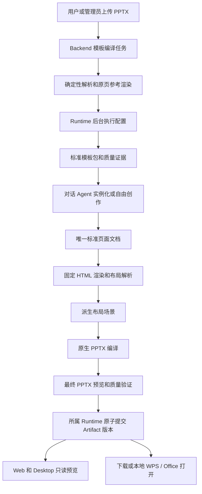

> Musterwork 历史设计快照 · 迁入日期：2026-09-24。来源：`docs/architecture/agent-runtime/proposals/presentation-html-authoring-and-template-compilation.md`。
>
> 原文中的“当前”“已采纳”和商业 SDK 选择只代表来源项目当时的状态，不是 MusterOffice 的决定或验收结论。内核以[现行设计](../../design/presentations.md)为准；来源、摘要和链接转换见[迁移清单](README.md)。

# Agent HTML 演示文稿创作与 PPT 模板编译设计

> 状态：Normative
>
> 版本：v1.4（2026-09-14）
>
> 实施状态：In Progress；已合入 main，并继续在主工作区开发环境落地。完整目标尚未完成，实际进度及证据见 实施记录（`Musterwork:docs/plans/agent-runtime/presentation-html-authoring-implementation.md`），不声明通过 Office/WPS 验收或部署。
>
> 覆盖：FR-12 演示文稿，关联 FR-01/06/08/09/10/14/20/21/22/24。
>
> 产品边界：Web、Desktop 产品内只预览；Agent 负责全部产品内创作与修订；用户手动编辑在本地 WPS/Office 完成。
>
> 稳定文档路径（保留原提案链接）：`docs/architecture/agent-runtime/proposals/presentation-html-authoring-and-template-compilation.md`。

## 1. 决策与文档归属

### 1.1 核心决策

采用“标准 HTML 页面文档 + 模板实例化 + Agent 自由创作 + 原生 PPTX 编译 + 后台模板编译任务”。模板定义初始设计和可复用规律，实例化后的页面拥有独立完整结构。Agent 不受原模板槽位数量、位置或布局列表限制。

产品内不建设画布编辑器、文本编辑面板、拖拽对象、协同编辑或 HTML 源码编辑器。HTML 是 Agent 的声明式创作表达和引擎的渲染输入；用户默认预览来自实际交付 PPTX 的页面图。用户下载或通过桌面“用 WPS/Office 打开”手动编辑原生文件。

上传模板触发立即可恢复的后台编译。所谓“Dream 式 Agent”是同一个 Musterwork Runtime 的专用后台执行配置，不创建第二持久 Agent，也不进入 Memory/Learning 的 DreamJob 队列。

### 1.2 为什么新建主设计

现行 原生模板工作流（`Musterwork:docs/architecture/agent-runtime/presentation-template-workflow.md`） 描述已经存在的模板槽位生成、原生对象保留和只读预览。新方案改变创作事实源、模板包、编译器、工具和导入执行，不能作为其末尾的几个补充字段。

旧 Template V2 提案（`Musterwork:docs/architecture/agent-runtime/design/presentation-template-v2-pipeline.md`） 包含元素树与逆向模板思路，但将自由布局当作例外，且包含产品内编辑设想。本文替代其未来方案角色；历史研究内容保留为证据。旧提案曾使用的版本名不自动成为新合同版本。

本文依据用户对产品边界与完整实施的明确授权正式采纳，决策见 [ADR-0005](0005-presentation-html-authoring-and-private-runtime.md)。PRD、Artifact 设计、字段合同与发行合同同步引用此设计；历史工作流保留为兼容依据。本文概念名称与示例解释机制，实际字段、wire discriminator、Tool 和 Runtime 枚举以字段合同指向的 Rust/Protobuf/Schema 为准。规范采纳与完整实现、目标应用验收、生产启用分别记录。

### 1.3 阅读导航

- 产品体验和验收场景：§2；当前差距：§3。
- 页面事实源、HTML 表达和模板语义：§4–7。
- Agent 工具、素材、编译和预览：§8–11。
- 上传模板编译、后台恢复和发布：§12–14。
- Artifact、外部编辑、性能和隔离：§15–18。
- 模块、实施、验收和正式采纳条件：§19–22。

## 2. 产品合同

### 2.1 用户能做什么

| 场景 | 目标行为 |
|---|---|
| 按模板制作 | 选择模板或由 Agent 检索合适模板；内容生成后仍可任意改造页面 |
| 不选模板制作 | Agent 从空白页和设计主题生成；与模板实例使用同一种页面文档 |
| 对话改稿 | “第 3 页加图片”“把两栏改成时间轴”“追加一页原生图表”由 Agent 执行 |
| 查看结果 | Web/Desktop 提供缩略图、翻页、缩放、全屏和明确的生成状态 |
| 手动编辑 | Desktop 打开已交付的本地 PPTX；Web 下载 PPTX 后由用户在本地打开 |
| 上传自己的模板 | 两端上传到同一 Backend 模板目录，后台逐页编译，完成后出现在个人模板库 |
| 外部编辑后再交给 Agent | 用户明确上传/选择修改后的 PPTX，执行“继续编辑导入”；不自动成为模板 |

例如，三栏模板生成后，用户要求改成“左侧产品图、右侧两个指标、底部时间轴”。Agent 可以删除三栏对象、插入新图和时间轴、调整文字与层级；保留主题风格和该页身份。该变更不要求新增模板、不改变其他页，也不修改模板库。

### 2.2 明确排除

- 产品内任何手动页面编辑器、多人画布协作、DOM 直接编辑和 Office 在线嵌入。
- 将任意网页应用、脚本、网络交互和插件执行视为 PPT 页面能力。
- 声称任意 PPTX、SmartArt、动画、嵌入对象都能无损转换。
- 自动回收或覆盖本地 WPS/Office 修改；自动将附件入库或将个人模板公开。
- 将整页图片包装成“所有内容可编辑”的默认 PPTX 交付。

### 2.3 自由度与可编辑性的定义

“Agent 自由编辑”指所有受支持页面对象的内容、结构、位置、尺寸、样式和组合都可修改；固定模板槽位不是边界。图像像素内部的内容通过图片编辑/替换处理，不能假定照片中的文字是文本对象。

“原生可编辑 PPTX”按对象报告：文字可编辑，表格单元格可编辑，图表有可编辑数据，图片可替换裁切。图片本来就是图片，复杂矢量保留为 SVG 图片时也不能谎称其内部路径都是 Office 形状。

## 3. 当前实现与演进范围

本节记录 2026-09-13 最初方案评估时的基线，不能用作后续实现状态。可复现 Git 基线为 `fee704b183d6dc60dd48009a60baec66251b369d`；工作区另有未提交的 PPT 模板管理、文件交付及预览调整，不把这些变更描述成已发布基线。

| 当前机制 | 现状 | 新方案处理 |
|---|---|---|
| 页面合同（`Musterwork:packages/presentation-engine/src/contracts.mjs`） | `slidespec/3` 每页绑定现有布局及同类型槽位 | 新页面文档允许完整对象树，模板绑定转成来源信息 |
| 样式合同（`Musterwork:packages/presentation-engine/src/style-contract.mjs`） | 主要开放页面/文字/表格/图表颜色 | 统一布局、富文本、图形、图像及主题属性 |
| 原生生成（`Musterwork:packages/presentation-engine/src/index.mjs`） | 克隆源页依赖图并修改槽位 | 复用原生包处理基础，增加完整页面编译 |
| 模板检查（`Musterwork:packages/presentation-engine/src/inspect.mjs`） | 提取原生槽位和粗略角色、容量 | 增加完整导入表示与模型辅助语义提炼 |
| 导入任务（`Musterwork:backend/services/presentation_templates/importer.py`） | 持久队列、租约、引擎检查、真实预览 | 扩展为逐页 checkpoint 的模板编译，不另建竞争队列 |
| 最终文件预览（`Musterwork:packages/presentation-engine/src/preview.mjs`） | 实际 PPTX 经受管转换器渲染 | 保留，作为最终交付预览和导出验收依据 |
| Artifact 解析（`Musterwork:packages/agent-runtime-product-client/src/presentation-artifact.ts`） | 共享解析原生文件、规格、QA、预览 | 新版复合清单继续使用同一解析 Owner |

现有模板目录、权限、不可变版本、ContentRef、Artifact、最终文件预览和本地交付值得保留。槽位模型不能承担未来自由创作事实源。方案不延续每增加一种需求就增补一种槽位字段的演进方式。

## 4. 总体架构与唯一事实源



### 4.1 状态与内容所有权

| 对象 | 唯一 Owner | 其他组件的角色 |
|---|---|---|
| 模板目录、上传、编译 Job、模板版本、发布 | Backend 模板域 | Runtime 执行受授权的编译子工作；UI 只消费进度 |
| 对话 Run、模型调用、工具授权和 Usage | 发起工作的 Runtime Home | Backend 不直接调用 Provider 创建第二执行循环 |
| 创作草稿、逻辑页面和 Artifact 版本 | 该文稿所属 Runtime | 编译引擎返回候选内容与证明，不直接推进 Artifact |
| HTML 规范化、布局求解、PPTX 编译和诊断 | presentation-engine | 不持有租户权限、持久业务状态或网络凭据 |
| 图片、图标、字体和原文件字节 | 相应 Content/模板存储域 | 以授权、校验过的依赖闭包参与编译 |
| 文件树位置和显示名称 | Resource | 引用同一 Presentation Artifact，不另建 File Artifact |
| 本地工作副本与打开方式 | Desktop 文件交付适配器 | 本地字节不是第二条 Runtime 版本链 |

### 4.2 单向派生

唯一创作事实源是规范化页面文档。HTML 文件、布局场景、PPTX、PDF、PNG、质量报告都是它在固定环境下的派生物。Agent 提交 HTML 片段后先进入规范化文档，不能产生一份可单独改写的旁路 HTML。

导出的 PPTX 是交付事实：用户拿到的确切字节必须持久保存。它不因“可从文档重建”而随渲染器升级被重新生成替换。外部编辑后的 PPTX 只有经显式导入才建立新的创作基线。

## 5. 标准 HTML 页面文档

### 5.1 表达选择

使用具有稳定节点身份和类型化语义的声明式 HTML AST。其规范化 JSON 是存储形式；HTML/CSS 片段是 Agent 的可选编写形式，两者共享同一个解析器和规范化结果。AST 既能表达普通容器和文本，也保留图表、表格等不能仅靠 DOM 外观推断的领域语义。

这不是一组固定版式枚举。Agent 可以任意组合容器、文本和矢量对象，模板页面与空白页面不存在两套表达模式。

### 5.2 文档层次

| 层次 | 主要信息 | 不变量 |
|---|---|---|
| Deck | 标题、语言、画布、主题、顺序、依赖、来源 | 画布尺寸全稿明确，不受浏览器窗口影响 |
| Page | 稳定页 ID、节点树、备注、引用、模板来源 | 页 ID 与位置分离；排序不更换身份 |
| Node | 稳定节点 ID、类型、内容、布局、样式、子节点 | ID 在文稿内唯一；引用可机械校验 |
| Asset | 授权内容引用、媒体类型、尺寸、来源 | 无任意 HTTP URL、绝对文件路径或隐式网络依赖 |
| Theme | 语义色、字体、间距、线型和效果 token | token 解析可追溯；页面/节点覆盖显式记录 |

文本使用保留段落、run、语言、列表和链接的结构；不能将富文本替换退化成统一首个 run 的样式。图表保存分类、系列、数值、单位和展示配置；表格保存行列、合并、单元格及格式。内容中的数字、公式显示值和原始来源分开，禁止模型在排版时擅自改写业务数值。

文档备注、证据来源与 Alt text 不得混入可见页面正文。参考材料中的设计指令被识别为不可信输入，不能取得工具或文件权限。

### 5.3 对象与布局能力

- 基础节点：容器、分组、富文本、图片、图标、矢量路径、基础形状、连接线、表格、图表。
- 布局：固定画布上的自由定位、Flex/Grid、对齐、间距、内边距、最小/最大尺寸、锚点和比例关系。
- 外观：字体族与 fallback、字号、字重、段落、填充、描边、透明度、圆角、受支持的渐变和阴影。
- 图像：contain/cover、裁切、焦点、比例锁定和形状裁切；图标可以调整颜色和线宽。
- 层级：显式绘制顺序、分组变换和裁切；连接线绑定节点锚点，移动后重新计算端点。

导入页通常使用确定的自由定位；新创作页可以使用自动布局。两者最后都解析成固定几何场景，不在 PPTX 中依赖浏览器动态重排。

### 5.4 HTML/CSS 支持边界

允许的 HTML 元素、CSS 属性、单位和语义节点由版本化可执行 Schema 与解析器共同定义，并提供 Agent 可查询的能力说明。禁止脚本、事件处理器、iframe、form、网络字体加载、外部样式、CSS import、任意 URL 和扩展执行。

Agent 可以提交整页或子树 HTML/CSS。解析失败返回页 ID、节点 ID、属性、原因与受支持替代项；不静默删除不认识的属性。对现有节点的定点编辑必须保留 ID；新节点分配新 ID。完整重构允许显式节点替换，并记录旧节点到新节点的来源关系。

支持范围按原生导出语义制定。网页交互、视频脚本和任意 CSS 滤镜不是当前产品目标；不能通过一个不受约束的 raw-html 节点绕开校验。

### 5.5 示例语义

以下是设计草图，不是可调用 Tool 请求或已发布 Schema：

```json
{
  "page_id": "market-overview",
  "origin": { "template_version_ref": "pinned-reference", "layout_key": "three-columns" },
  "notes": "Presenter notes",
  "root": {
    "node_id": "page-root",
    "kind": "container",
    "layout": { "display": "grid", "columns": ["2fr", "1fr"], "gap": 32 },
    "children": [
      { "node_id": "hero", "kind": "image", "asset_ref": "authorized-image-reference" },
      { "node_id": "insights", "kind": "container", "children": [] }
    ]
  }
}
```

来源仍可写着三栏模板，当前页面已经是两栏。验证器检查对象和导出合同，不要求恢复原始槽位。

## 6. 模板包与实例化

### 6.1 模板包内容

标准模板包包含：主题 token；每页的标准 AST 与确定性 HTML；参数 Schema；布局用途、容量和变体；素材依赖；原页映射；预览；编译器/字体基线；转换与泛化质量报告。

AST 是模板内容权威，HTML 是校验和一致的派生呈现。参数绑定使用结构路径与节点 ID，不使用字符串替换 HTML。未绑定内容、默认示例、固定品牌元素和装饰对象必须明确区分。

同一模板包可以包含多个主题变体或母版族。导入不能把每页原有的局部风格强行归一成一套颜色，造成设计信息丢失。去重保留全部原页到布局/变体的映射。

### 6.2 实例化与自由改造

实例化时复制完整页面结构，分配独立节点 ID，绑定内容和素材，固定模板版本和主题引用。完成后参数仅是快速填充入口，任何内容节点、装饰节点、布局容器都可被 Agent 修改。

主题一致性是可解释的设计默认值；品牌锁定只有明确的用户或组织策略才生效。不能把导入时识别为 decorative 的节点永久设成 Agent 不可修改。

复用模板只影响新页面。模板后继版本不自动迁移现有文稿；Agent 改造实例也不回写模板库。用户明确要求保存新模板时，走独立模板编译/发布流程。

### 6.3 身份与依赖

继续使用模板 ID、不可变版本和包摘要固定引用。包摘要覆盖规范化内容、主题、参数、素材及编译配置引用；排除签名 URL、存储位置、生成时间等传输信息。预览和质量证明作为指向包摘要的派生记录，避免内容摘要和证明摘要相互包含。

序列化必须有唯一规范：稳定键序、数值表示、Unicode 和非有限数拒绝规则。模板源摘要、标准包摘要和导出文件摘要分别记录，不能混用。

## 7. 创作版本、草稿和模板约束

Runtime 持有可恢复的创作草稿及 revision。一次用户修订绑定同一 Artifact、当前 expected version 和明确的创作基线；Agent 的操作先提交到草稿，再编译和验证，最后产生新的不可变交付版本。

草稿不占用“已交付最新版”。用户可以看到带生成状态的页面进展；失败时保留上一个完整交付版本和可继续处理的草稿，不能把一半新页、一半旧页包装成新的完整版本。

Agent 的模板选择义务分为两个阶段：初次实例化必须遵循用户选择的确切模板；实例化后页面自由改造属于被授权的文稿修订，不等于偷偷更换模板。主动改用另一品牌模板或整体换风格仍需依据用户意图与既有授权判断，不能由验证器自动替换。

多个 Run 同时修订同一文稿时，发布采用 Artifact expected-version CAS。不同页草稿可并行计算，但只能由一次确定的合并/提交推进版本。冲突者读取最新基线后重新应用自身意图，不直接覆盖新内容；此机制服务 Agent 执行，不引入用户协同画布。

## 8. Agent 创作协议

### 8.1 工具职责

以下为职责分类，正式名称与版本在合同阶段分配：

| 能力 | 输入语义 | 输出语义 |
|---|---|---|
| 检索模板与检查布局 | 查询或确切模板引用、分页游标 | 布局、样例、主题、参数、素材和能力限制 |
| 检查文稿/页面 | Artifact、版本、页 ID、节点范围 | 有界结构、来源、导出能力和诊断 |
| 创建或修订草稿 | 授权基线、预期 revision、页面/节点操作 | 新草稿 revision、变更摘要、影响页 |
| 编译导出 | draft_id、base_ref | 系统校验通过后原子保存 PPTX、实际文件预览及 Artifact 版本；草稿继续开放 |

页面操作包括插入、删除、复制、排序和整页重构。节点操作包括插入/移除/移动/替换子树、修改内容与样式、绑定素材、修改图表数据和表格结构。节点身份和 revision 由 Runtime 校验，模型不传 OOXML part 路径或原始存储键。

所有修改经过同一文档验证、编译和 Artifact 通道；不允许模型自行生成 PPTX 后绕过文档事实源。一次逻辑用户请求的内部检查、取素材、重排和验证不逐页追加确认。

### 8.2 工作循环

1. 读取用户意图、实际基线和必要模板信息，制定叙事与页面计划。
2. 绑定或取得素材，执行页面/节点修改；只读取受影响对象和必要上下文。
3. 主动调用 compile；系统校验通过后直接导出可下载 PPTX。读取精确诊断，并通过已有视觉能力逐页查看实际导出图片。
4. 修复溢出、错误裁切、内容缺失或导出问题；保持业务数据和未请求页面不变。
5. 全稿检查顺序、重复、引用和风格；修正后再次 compile 更新同一 Artifact。普通创作没有独立 reviewer 或 publish 工具门槛。

上下文使用文稿摘要、页索引、逐页/节点分页与内容引用，不每次将整份 HTML、所有图片和所有模板塞进模型输入。创作修改集中到受影响页面，整稿重建只在主题、字体、画布等全局依赖改变时触发。

### 8.3 生命周期与修复界限

普通对话的执行遵循 持续运行与恢复合同（`Musterwork:docs/architecture/agent-runtime/design/runtime-progress-recovery-context-and-loop-safety.md`），不能因内部使用了模板编译能力就套用 Dream 累计运行上限。后台模板编译是独立有界业务任务，使用冻结的任务策略和逐页修复策略，详见 §13。

失败必须分类为内容/布局可修复、编译器不支持、素材不可用、权限失败或执行故障。相同输入与环境下同一诊断重复出现且无进展时，不允许无限重试或缩小字号直至不可读；形成明确的页面问题并保留证据。

## 9. 图片、图标与字体

素材解析器接收用户素材引用、搜索意图或生成意图；经既有 Runtime 能力取得素材，再写入所属 Content Store。引擎只接收受授权字节与内容引用，不在渲染时联网取图。

图片优先级为用户明确指定 → 同稿可复用素材 → 模板素材 → 检索/生成。复用键必须包含内容摘要或完整生成输入、生成器版本与权限域，不能只按一句 prompt 跨账号复用。品牌 Logo 与指定原图不得被视觉模型重画替代。

图标从受管矢量目录检索，记录图标 ID、版本、路径及许可信息；填色、线宽和尺寸是实例属性。复杂插画可以是图片；业务流程图、数据图表、表格不因图片生成更方便而失去结构。

素材尺寸、透明通道、色彩、裁切和最小有效分辨率进入诊断。图片失败时页面保留待修复状态；占位符可以用于草稿，但不能证明交付完整。

字体注册记录实际字体文件摘要、字重、可用字符范围和嵌入许可。编译环境固定字体目录、字体解析规则和替代映射；不能依赖开发者个人机器字体。用户上传字体先校验再进入有界字体解析进程，不直接安装到宿主系统。

HTML 测量前等待字体与图片解码完成。缺字、字体替代与字重合成写入报告；需要保留中文语义与排版的模板不能静默回退到不含中文字形的字体。导出可以按许可嵌入字体或明确记录替代字体；实际 Office/WPS 打开仍需验证。

## 10. HTML 布局与原生编译

### 10.1 编译步骤

标准文档校验 → 主题/素材解析 → 生成固定 HTML/CSS/SVG → 受管浏览器布局 → 提取派生布局场景 → 原生 PPTX 编译 → 最终 PPTX 渲染 → 质量验证。

使用独立演示文稿渲染进程与受管 Chromium 构建，不借用用户登录浏览器或通用浏览器自动化会话。应用资源、数据与计时固定；该进程只运行引擎随版本发布的可信测量代码，不执行模型或 PPT 携带的脚本。

### 10.2 派生布局场景

布局场景保存解析后的绝对几何、绘制顺序、变换矩阵、clip、文本段落/run/行布局、图像裁切、图形路径、表格网格和图表语义。几何采用一种明确的内部单位；到 HTML px、PPT point/EMU 的转换统一在编译边界完成，禁止多层四舍五入。

浏览器负责支持范围内的 Flex/Grid 和文本度量，PPTX 后端消费解析结果，不再实现另一套字符宽度估算布局。容器位置通过完整变换矩阵解析，组合缩放与旋转不能简单相加。伪元素和装饰由编译器先降为可追踪节点，不能靠遍历任意 DOM 猜测对象意义。

文本测量保留段落/run 的源映射和断行信息。导出保留自然段落及可编辑文本框，避免按单字碎片化；必要时写明确换行与行距。受目标应用排版引擎影响，HTML 与 PPTX 不保证像素完全相同，必须执行 §11 的实际文件验证。

布局场景是不可变派生缓存，键包括页面内容、主题、全部素材、字体、浏览器、测量器和输出策略摘要。不能被 Agent 直接编辑后与文档分叉；任何修复回到源页面文档或编译器。

### 10.3 唯一 PPTX 后端

在现有 `packages/presentation-engine` 内建立唯一的完整页面到 OOXML 后端，复用已验证的 ZIP/关系图、媒体、图表工作簿、原生对象与最终预览构件。原生模板修订适配器负责历史文稿；新文稿统一进入标准文档编译器。两者共享底层对象和包操作，不能再复制 Cloud、Desktop、Python 各自的导出器。

PPTX 对象类型、命名、关系和能力降级由该后端显式控制。引入第三方对象写入库只能作为内部实现，需通过相同回归样本；不把通用 DOM 截图或未经验证的 DOM-to-PPTX 黑盒作为规范边界。无需引入 Presenton 专有/不明许可导出二进制。

导出固定页面尺寸、文字框边界、主题关系、对象 Z 顺序、组结构、图片裁切、备注、图表缓存和内嵌工作簿。每份原生图表及工作簿独立拥有可变数据，复用模板或复制页不能发生跨页修改泄漏。

同一规范化文档与同一固定环境必须生成可重复的输出：对象/关系 ID 由稳定页与节点身份派生，ZIP 条目顺序和时间字段规范化，文档元数据使用已冻结值，不引入当前时间或随机 UUID。编译器升级产生新派生版本及证明，不回写旧文件。跨版本或跨应用视觉等价不由字节确定性自动证明。

### 10.4 原生能力矩阵

| 标准对象 | 原生输出 | 可编辑性与限制 |
|---|---|---|
| 富文本/列表 | 文本框、段落、run | 保留文字与格式；验证中英混排、项目符号、超链接和换行 |
| 基础形状/路径 | 原生预设或自由形状 | 支持的路径、填充、描边、变换和分组可编辑 |
| 图片 | 原生图片对象 | 可替换、裁切、移动；不承诺编辑图像内部内容 |
| 图标 | 可映射的原生路径，或明确分类的 SVG 图片 | 两种编辑能力分别报告；禁止将 SVG 图片称为完整路径编辑 |
| 表格 | 原生表格 | 保留单元格、行列、合并和格式；不输出表格截图 |
| 数据图表 | 原生图表与工作簿 | 保留分类、系列、类型、样式和数据；HTML 图表外观不是唯一输入 |
| 连接线与流程 | 原生连接器/形状/文字 | 保留锚点关系；不可仅用流程图截图交付 |
| 渐变、阴影和裁切 | 能力矩阵内的 OOXML 效果 | 无等价实现时返回具体诊断并由 Agent 重构 |
| 动画、交互、嵌入应用 | 不在本次标准内容范围 | 不执行或宣称保留；原文件保留供外部使用 |

每个节点生成导出映射记录：源节点、原生对象、支持能力和任何重构说明。默认交付不静默栅格化业务文字、图表、表格或整页。确实需要图片式保留时必须有明确用户意图，标注对应区域，且不能作为通用模板“原生可编辑”验收样本。

## 11. 预览、导出与质量证据

### 11.1 三类图像必须区分

| 图像 | 生成来源 | 用途 |
|---|---|---|
| 导入参考图 | 原始 PPTX 的受管渲染 | 比较导入重建；不宣称等同于所有 Office/WPS 版本 |
| 创作预览 | 固定 HTML 渲染 | Agent 排版与模板编译自检；属于候选内容 |
| 交付预览 | 最终交付 PPTX 的受管转换 | 用户默认预览、交付验证与缓存依据 |

Web/Desktop 不向用户暴露 HTML 编辑能力，也不需要提供双预览模式。生成过程中若展示候选页面，必须标明尚未交付；提交后切换到该版本的交付预览。默认 PDF 与 PNG 同样来自最终 PPTX 转换结果，避免不同下载格式各用一套版式。

用户交付文件不能被预览服务另存修改。预览清单固定 PPTX 摘要、页顺序、转换器、字体配置、页图摘要和页数；任何一项不匹配均不能复用缓存。失败不得返回合成页面或把旧版本图片当作新结果。

### 11.2 分层质量门

1. **结构和依赖**：Schema、节点 ID、树结构、素材闭包、字体、版面与输出文件关系有效。
2. **内容完整性**：必需内容已替换；无示例业务数字残留；正文、备注、图表数据和来源完整。
3. **布局质量**：无意外溢出、遮挡、裁切错误、不可读文字和低分辨率素材；有意叠放与问题重叠区分。
4. **原生语义**：解包输出 PPTX 核对对象、文本、表格数据、图表缓存/工作簿、图片和页顺序。
5. **视觉质量**：检查 HTML、导出页及导入参考图之间差异；模型视觉评估提供解释，不能覆盖确定性错误。
6. **目标应用验收**：固定版本 Office/WPS 的打开、字体、表格、图表修改和保存，记录环境与确切文件摘要。

文本/表格/图表的数据完整性按精确语义比对；数字不接受视觉相似替代。纯截图来源的 OCR 文本必须携带来源与置信度，其“精确”不等于原始可验证文本。视觉指标按文字、图形、装饰和背景分区，不能用整页平均相似度掩盖一个数字被改错。

质量策略版本化，几何/视觉阈值由代表性正负样本在 Gate 1 校准、冻结并进入回归。默认只有结构、内容、原生语义及必需视觉检查都通过才能宣告完整交付；缺失字体、缺图和转换不完整是阻塞项。未校准阈值的开发构建不能开启正式交付能力。

保真度、原生可编辑覆盖、泛化质量、Agent 视觉检查和 Office/WPS 环境证据分别存储，不用单一 `native_editable=true` 或笼统总分替代。新清单按新合同表达这些维度，不改变历史布尔字段的含义。

## 12. PPTX 到标准模板的编译流程

### 12.1 接收与预检

模板上传是明确产品入口，提交到 Backend 后返回持久任务引用；HTTP 连接、客户端轮询和桌面在线状态不拥有任务生命周期。仅接收已支持的 PPTX 类型；旧二进制 `.ppt` 明确要求先转换，不能根据扩展名猜测文件结构。

校验文件签名、OOXML 包、页数、压缩比、解包大小和对象关系。密码文件、损坏文件、活动内容、外链资源进入分类诊断，不能先调用 Office 宏或自动联网获取缺失资源。源文件保留在私有存储，未知复杂内容也不静默删除。

现行模板工作流对 OLE/ActiveX/VBA 和外部资源存在拒绝边界；本提案不因为增加视觉 Agent 而自动放宽。支持新对象必须通过解析、隔离与导出验收，原包未经批准不得送入更宽松的转换器。

### 12.2 确定性解析与参考渲染

提取页面、布局、母版、主题继承、富文本、组变换、Z 顺序、图像裁切、表格、图表数据和可复用素材。图表使用嵌入工作簿和缓存核对，不让视觉模型猜业务数据；继承字体/位置的对象要先求值。

SmartArt 等复合图形如果具有可读取的结构和文本，先解析其语义，再重建为标准分组、连接线、形状与文本；记录原生编辑类型已改变。无法可靠读取的对象不靠视觉猜测隐藏数据。装饰的视觉重建与业务数据的结构恢复分别验收。

为每个对象建立稳定的 source map：源摘要、页序号、OOXML part、对象 ID、对象位置及关系来源。原生 ID 可能重复，必须保留复合定位信息。源定位只在引擎/证据内部，Agent 使用安全的语义节点引用。

参考渲染使用固定转换环境与独立 profile；记录替代字体、未知对象和转换差异。解析结构与原图不一致时先定位解析/转换问题，不能让模型盲目补造内容。

### 12.3 标准页面重建

可确定性表达的文本、图形、图片、表格和图表直接转换为标准文档。多模态后台执行负责理解复合构图、区分装饰与内容、重建支持范围内的复杂结构并修复可见差异。

对图片式页面，OCR/视觉结构重建输出明确的推断标记；不能把它评为原生结构无损导入。原始图片仍保留，模型不能编造隐藏的图表数据或看不到的文字。

逐页渲染标准页面，与原页对比；修复写回页面文档；通过后冻结该页 revision、依赖和证明。若全局主题/字体识别后续变化，按依赖关系使受影响页的旧证明失效，不能复用旧“通过”状态。

### 12.4 模板语义提炼

识别标题、正文、列表、关键数字、数据图表、图片意图、图标、Logo、装饰与重复组。提取主题 token、布局参数、内容容量和可变项目数，生成参数 Schema 与使用说明。

“固定装饰”仅表示默认不参加内容填充，不等于实例不可修改。例子中的公司名、人物名、业绩数字默认作为可替换样例；用户明确要求保留的品牌标识保留为素材。示例内容不能混入模板说明后在后续生成中泄漏为业务事实。

几何签名只用于候选去重，最终结合结构、语义、主题与容量确认。相似布局可以归入变体；不把相同颜色的不同业务结构误合并，也不丢弃任何原始页映射。

### 12.5 泛化测试与导出检查

每个布局至少覆盖：短/长标题，中英混排，多行正文，少/多项目数，长数字，不同比例图片，以及适用的表格/图表变体。内容使用可识别合成数据，不能作为真实业务结论进入模板检索摘要。

容量来自真实渲染和约束，不只按字符数估算。超容量时 Agent 可以改写非事实性表述、重排或拆页；不自动删除数据、切断句子或无限缩小字号。

泛化后的实例经过与普通创作完全相同的 PPTX 导出和质量门。只在原文本下截图相似，不构成标准模板成功。

### 12.6 汇总与结果

任务输出：标准模板包、每页 source map、布局/变体与主题、素材闭包、参考与生成预览、转换报告、泛化报告、导出验证报告及失败诊断。

默认所有源页都必须获得可追踪结果。任一必需页未通过时，任务保存已完成 checkpoint 并报告具体问题，不将缺页包自动设为可选模板。用户明确接受只保留合格页时创建独立选择请求与新包，记录省略页；不篡改原任务的成功含义。

## 13. 后台执行、调度与恢复

### 13.1 复用 Runtime，不复用 Dream 业务对象

参照 Memory/Learning 设计（`Musterwork:docs/architecture/agent-runtime/design/memory-learning-and-evolution.md`） 的后台执行纪律，模板编译通过统一 AgentLoop 的专用维护执行配置调用模型，冻结路由、输入、工具集和策略。模板域拥有编译意图与任务事实，Runtime 拥有 Run/Attempt/Invocation 与 Usage。

该配置只开放读取授权源页/素材、标准页面转换、渲染、诊断、语义提炼和提交候选的工具。不开放 Memory 写入、成长提案、普通用户文件遍历或任意网络；不触发 LearningSignal、Goal、用户 Automation，也不等待 Dream 的周期或静默窗口。

模板库已经是 Backend 共享能力，因此模板编译固定由受管 Cloud Runtime 执行，包括从 Desktop 上传的模板。关闭桌面不阻断处理。使用版本化的受管辅助模型路由，不要求从桌面复制用户本地凭据；模型调用用量单独归因到模板任务。

### 13.2 Job 与页面阶段

下表是模板域业务语义，正式持久化枚举在合同阶段生成，不是新增 Run 状态：

| 任务阶段 | 持久输入/输出 | 重启后处理 |
|---|---|---|
| 已接收/排队 | 源摘要、归属、编译策略、幂等键 | 按 durable due 查询调度 |
| 预检/解析 | 包诊断、页索引、素材、参考图 | 验证 checkpoint 后从未完成阶段继续 |
| 逐页重建 | 每页输入摘要、候选 revision、诊断 | 已通过页复用，未完成页恢复同一执行引用 |
| 语义提炼/泛化 | 布局、参数、主题、测试样本 | 依赖改变使对应下游证明失效 |
| 验证/封装 | 输出闭包、完整质量证明 | 可重复校验同一候选，不重复执行未知模型效果 |
| 完成/需处理/失败/取消 | 终态证据与用户可读原因 | 不由轮询或进程内异常任意翻转 |

输入冻结源文件、解析器、HTML Schema、编译器、字体环境、辅助模型路由、任务策略和目标模板引用。页面修订与阶段输入摘要构成 checkpoint key；重试不会悄悄换成最新引擎或最新模型策略。

### 13.3 跨域事务与去重

1. Backend 在提交上传任务的同一事务写 outbox。幂等键相同但请求摘要不同返回冲突。
2. Dispatcher 以模板任务、页阶段、generation 派生稳定请求身份，向 Runtime 提交维护工作；查询/去重先于重发。
3. Runtime 持久接受回执后拥有模型执行与恢复。Backend lease 过期只重取任务协调权，不能据此再发一次模型生成。
4. Runtime 持久保存输出及完成回执，通过可重放 outbox 通知 Backend；Backend 校验身份、输入、generation、权限及闭包后提交 checkpoint。
5. 模板版本、个人可用指针或平台草稿、Job 成功与通知 outbox 在 Backend 同一事务提交。

Backend Job 和 Runtime Run 是不同职责，不相互覆盖状态：Job 表示整份模板是否可用，Run 表示一次受控执行是否完成。一个 Run 完成不等于整份模板成功；一个客户端超时也不等于 Run 失败。

跨 Content Store 传递只接受经过长度/摘要验证的实际字节或受授权下载证明；不能将 Device/Cloud 的 ContentRef 直接当作 Backend 已有内容。每次状态查询保留原权限上下文，参见 异步外部操作合同（`Musterwork:docs/architecture/agent-runtime/design/durable-external-operation-reconciliation.md`）。

### 13.4 租约、取消和结果未知

协调 Worker 使用 claim、过期租约、心跳和 fencing generation；旧 Worker 的迟到结果不能更新当前 checkpoint 或发布。独立设置提交 RPC、单次状态查询和编译业务 lifetime，不能复用已过期的 HTTP deadline 终止后台任务。

取消先持久化任务意图，阻止新阶段和发布，再向活动 Runtime Run 传播取消。外部模型是否已完成需按执行回执处理；取消回执不代表物理请求从未执行。取消与发布竞争按同一事务 fence 决定：取消先成功则不发布，发布先成功则返回已完成事实。

结果未知时恢复查询同一执行身份；只有证明未执行才允许重新提交。恢复次数、模型协议修正、版式修复轮次分别计量。达到冻结的后台业务策略限制进入可诊断终态，不重置计数无限运行。

### 13.5 并发与进度

按租户公平调度、单 Job 有界页面并发和全局浏览器/转换器池隔离，避免一份大模板占满渲染进程。具体容量由部署 profile 固定并经负载基线验证。

模板预览弹窗默认展示转换后的页面，右上角提供“转换后 / 原稿”分段切换。切换视图和后台刷新均保留当前页码。转换视图禁止把原稿图片作为转换结果回退：逐页展示等待、处理中、已完成、失败或暂停状态，处理中页面显示轻量动画，缩略图同步状态；已验证页面立即开放真实渲染预览，无需等待整套模板完成。某页失败导致任务中断时，保留已验证页，区分实际失败页与被暂停的其他页。原稿仅在用户主动切换后展示。

后台提供经过模板可见性校验的逐页预览投影，复用当前有效 checkpoint 和不可变视觉证明中的实际渲染图片；历史代次仅能通过现有完整输入/策略一致性判定复用。图片读取复用冻结执行身份及已有 Runtime Content 传输，不重新运行模型、不改写检查点或发布状态，不向公共目录暴露私有 Run、诊断或模型上下文。阶段图片提前可见不授予模板使用权限；只有可使用的 HTML 版本返回选择引用。弹窗打开时增量轮询，关闭或切换身份时终止读取，刷新失败保留已有页面并支持重试；签名图片 URL 在有效期内保持稳定，避免每次轮询重新加载画面。

进度直接呈现在 Web/Desktop 共用的模板卡片内，不设置独立任务说明区。转换中在封面上显示旋转指示、简短阶段和“已验证页/总页数”进度条；总页数未知时使用不定进度动画，不按时间生成虚假百分比。待转换、转换失败、已取消、等待平台发布使用紧凑角标，卡片下只保留名称与必要操作。动画尊重减少动态效果设置。

上传即显示同尺寸占位卡片；服务端返回稳定模板身份后将导入任务与模板合并为一张卡片。模板库只查询各模板当前导入，排除已归档模板和被后续导入取代的记录，完整历史接口仍保留。个人任务支持取消及清理确认后的重试；平台模板也提供带图标的重试按钮。提交期间禁用重复点击并显示旋转指示，服务端接受后切换进度动画；提交失败保留失败状态与重试入口。重试请求绑定准确模板版本及失败代次，服务端按任务、模板顺序加锁并重新验证可见性与最新任务；相同失败代次的并发请求加入同一后继代次。下架、归档、被替代、版本变化或清理未确认时拒绝重试。各端及管理端复用唯一的任务重试状态转移，保留原稿、冻结策略和历史 checkpoint。平台目录仅投影可见模板最新编译的状态、阶段和计数，不暴露后台 Run、操作员信息或私有错误详情，同时返回当前代次与重试可用性。用户可从失败卡片发起当前可见模板的重试；模板发布、替换与后台任务管理仍由原有管理权限控制。

模板卡片打开时自动刷新真实进度，分页追加的卡片在刷新期间保留；网络失败后重试，旧账户和已关闭面板的迟到响应不得生效。关闭只停止读取，后台编译继续，重新打开恢复持久状态。编译成功但未发布的平台模板保留“待发布”标识，实际可用版本出现后移除角标且不自动选中。已有可用 HTML 版本不因后续转换任务失败而失去选择能力。模板编译进度不冒充当前普通对话 Running。

如果某次对话明确等待该模板，对话通过自己的持久等待引用关联 Job，遵循当前会话状态投影合同；后台完成后唤醒正确 Run。未打开的对话也必须更新完成与注意状态。通知由持久结果驱动并去重，只在完成、失败或需要用户处理时触达。

## 14. 模板发布与跨端使用

沿用 Backend 的 personal/platform 管理归属与 private/public 可见性分离。个人上传通过验证后自动进入个人模板库；平台上传进入草稿，发布需管理员显式操作和既有来源/权限检查。模板内容不在 Admin 内编辑，修订通过新文件或经授权 Agent 流程产生后继版本。

新编译不覆盖旧模板版本。新版本失败时旧已发布版本继续可用；多个针对同一模板的任务并发完成时，包版本按事务分配，当前指针按提交的更新 generation/CAS 推进，晚完成的旧请求不能覆盖更新意图。用户仍可检查各独立成功版本。

模板卡片展示真实缩略图、名称及当前状态；布局覆盖、主题与转换限制保留在详情和 Agent 检索结果中。Agent 检索读取语义布局和参数；先返回紧凑列表，再按布局、节点分页。签名 URL 只在读取时生成，不写入模板文档或草稿。

内置源包也经过同一标准化、泛化与发布门禁。缓存按租户授权隔离；相同字节可物理去重，但不能借摘要推断其他用户是否持有材料。个人原稿、示例、字体及非必要素材不进入公共模板或公开成果分享。

## 15. Artifact、清单和文件交付

### 15.1 一份文稿一个版本链

继续使用 Presentation Artifact。新复合清单引用标准文档、最终 PPTX、布局/对象映射、质量报告、按序交付预览和必要素材；HTML/场景按需作为内部派生依赖。源模板、输入 PPTX 与交付 PPTX 使用显式不同字段，不能按 MIME 或依赖列表位置识别输出。

模板包只是生成依赖，不能成为用户产出文件。Resource 文件节点继续指向该 Presentation 的显式输出关系，见 原生文稿资源文件（`Musterwork:docs/architecture/agent-runtime/design/presentation-resource-files.md`）。Web 下载、Desktop 落盘、打开方式与文件树都解析同一文件引用。

### 15.2 提交顺序

引擎在私有暂存空间生成候选字节；所属 Runtime 校验完整文档、模板来源、授权素材、原生文件与预览证明，然后将内容写入自己的不可变 Content Store。在 Runtime 事务内，以有效 fence 和 Artifact expected version 一并提交版本、文件输出映射、Resource 关系、Tool 成功、Ledger 与通知 outbox。

事务失败时旧版本仍为当前版本；孤立暂存内容由保留策略回收，不以清理成功作为业务提交前提。重试查同一 Invocation/草稿提交身份，不能重复建 Artifact 或重复增加版本。

Backend 的渲染完成不等于用户交付完成。Web 使用 Cloud Artifact；Desktop 文稿由其所属 Device Runtime 提交。共享 Backend 渲染服务不能通过进程全局默认 Runtime 决定用户文稿的 Home。

### 15.3 客户端和公开分享

扩展共享 `agent-runtime-product-client` 清单解析器，再由 Web、Desktop、Electron 和分享解析器使用同一版本判定。未知清单不猜字段、不降级到 HTML 文本或另一 PPTX 依赖。

用户界面只增加必要的生成/失败状态、真实页预览、下载和本地打开动作。模板上传可显示后台进度和错误；不提供 HTML 参数或源码编辑入口。2026-09-22 起，计算位置按 [客户端渲染方案](presentation-client-rendering.md)及 [ADR 0005](0005-presentation-html-authoring-and-private-runtime.md)修订：Desktop 通过受管组件承载本机 Chromium、编译器及实际 PPTX 转换器；Web 逐范围验证浏览器执行端。组件属于执行层，不新增面向用户的源码或图表数据编辑器；未完成等价验收前保留现有能力。

公开分享维持现有授权投影。不能因新清单包含源 HTML、原始 PPT、备注、质量报告和素材依赖，就把这些内容全部发布到分享页。页面预览与是否允许下载是各自明确的授权能力。

## 16. 本地 WPS/Office 编辑与重新导入

### 16.1 工作副本

Desktop 将已提交 PPTX 保存到已授权工作目录，并记录 Artifact、版本、原始摘要和实际路径。已有文件不被覆盖，新版本使用独立文件。Web 提供下载，由用户在本地选择应用打开；网页不能假定具有本地文件读取或 Office 控制能力。

用户在 WPS/Office 保存后，本地副本发生变化，Runtime 已提交版本仍保持原字节。再次本地预览时校验实际文件摘要；变化后用原生预览器渲染当前文件，标识本地修改，不能继续使用旧版本页图或 QA。新 Agent 版本的交付不能删除/覆盖用户修改，参照 Artifact 与工作空间（`Musterwork:docs/architecture/agent-runtime/design/artifact-and-workspace.md`）。

### 16.2 两种导入意图

| 导入目的 | 内容处理 | 结果 |
|---|---|---|
| 作为模板 | 参数化示例、识别重复组、抽取主题、泛化测试 | 个人模板或平台草稿版本 |
| 继续编辑 | 保留实际内容、数据、顺序和备注；不把业务值变成占位符 | 明确绑定的 Artifact 新草稿基线，或普通新文稿 |

普通附件、文件保存监听和点击预览不隐式触发上述任一种导入。用户要求 Agent 基于本地修改继续编辑时，Desktop 授权读取当前确切文件；Web 要求用户上传该文件。只需完成这个实际文件接入，不要求用户理解 HTML 或选择内部编译策略。

继续编辑可以沿用同一 Artifact，但必须显式携带原文稿关系与 expected version；无可靠关系则创建新的 Presentation 并记录来源，不依据同名文件猜身份。检测到外部修改时不尝试用旧 AST 重建覆盖它。

原生节点 ID 可作匹配证据，但可能被 Office 重写。结合页/对象映射和内容证据匹配；无法可靠匹配则为导入对象分配新 ID 并记录来源，不能声称完成无损三方合并。重建不通过的页面保留原文件和诊断，绝不静默用旧内容填补。

## 17. 性能、缓存与资源治理

### 17.1 增量工作

依赖图按节点/页面/主题/素材/字体/编译配置建立。一次局部改稿只重新布局受影响页；字体、画布、全局 token 改变时才失效相关全局结果。页面备注变化不必重新生成图片素材；图表数据变化不应重新调用无关图片生成。

逐页 AST、素材和质量证明内容寻址；模板检索按语义摘要与预览分页；UI 虚拟化缩略图、懒加载当前页和邻页，不一次解码全稿。页面内容和候选预览不通过高频完整文稿快照推送。

HTML 草稿预览可按页缓存；最终 PPTX 装配后的完整文件摘要一旦改变，必须建立对应文件的真实导出验证与预览证明。不能把旧文件的页图改一个摘要字段就当成新文件渲染。是否优化到安全的页依赖复用，需要独立等价证明；首个交付版本不依赖该优化。

### 17.2 进程与存储

浏览器和 Office 转换进程分池，租户/任务并发分别受限；使用一次性隔离目录、可取消进程树、清晰的 backpressure 和磁盘配额。浏览器可以复用受管进程以减少冷启动，但租户上下文、缓存、字体装载与文件映射不能泄漏。

原文件、已发布模板、已交付 Artifact 及其引用闭包按当前保留政策持久保存。草稿、失败中间产物、已取消任务暂存有独立 TTL 与引用计数；删除先阻断新读取/执行，再按保留政策清理，不能误删仍被其他版本引用的素材。

### 17.3 性能验收方法

基准集合至少包含短稿、当前正式页数上限的长稿、图片密集稿、中文长文本稿、复杂图表稿及多租户同时导入。记录冷/热启动、首个真实页面时间、单页改稿端到端 p50/p95、全稿完成时间、峰值内存、缓存命中和模型用量。

绝对 SLO 由 Gate 1 在指定硬件/模型/字体和有代表性的样本上测定后冻结；不在无证据时承诺秒级转换。增量优化的硬要求是未变页不重新生成内容/素材，且优化后内容、原生语义和视觉验收完全一致。最大页数/字节/进程时限从版本化能力策略读取，不把当前不同层的常量混成新的产品上限。

## 18. 解析隔离与可观测性

### 18.1 输入边界

PPTX、图片、字体、SVG、HTML 和模型输出均是不可信输入。OOXML 解包限制路径、条目、扩展大小与嵌套；XML 禁用外部实体；SVG 禁止外部资源与脚本；HTML/CSS 用结构解析器校验，不能只靠字符串清洗。

素材只能通过授权闭包装载；渲染进程无宿主凭据、无租户会话、默认无网络和本地任意路径访问。解析器、浏览器、字体和 Office 转换器各自在受管隔离与资源限制下执行，不能把 Node 内路径检查当作操作系统沙箱。

模型读取原页中的指令只作为文稿内容；控制指令来自编译配置。提取到的外链仅作为诊断/引用文本，不自动访问。权限撤回或账号变化需阻断后续阶段与新发布；处理中的旧结果必须重新通过提交授权检查。

### 18.2 事件与诊断

日志/Trace 关联模板 Job、页面、stage、generation、Runtime Run/Invocation、Artifact 版本、渲染环境和输入摘要。业务内容、私人原图、令牌和签名 URL 不写普通日志；详细证据通过有权限的 ContentRef 读取。

稳定诊断类别包括包格式、继承解析、字体、素材、布局、原生映射、视觉差异、参数化、模型协议、权限、版本冲突、取消和结果未知。用户看到页码、对象名称、原因和可采取动作；技术堆栈保留在受限日志。

统计逐阶段耗时、重建/修复次数、失败分布、原生可编辑覆盖、泛化失败、渲染池排队和缓存效果。模型费用归属到模板编译或文稿创作的真实调用，不能计入 Dream 成长或把维护 Run 混进普通用户回复统计。

## 19. 模块与合同变更

以下是目标职责，目录可在实现时依现有 package 分层调整；不创建跨应用源码依赖。

| 模块 | 负责内容 | 变更方式 |
|---|---|---|
| presentation-engine/document | AST、内容/样式 Schema、规范化、依赖、操作和验证 | 新增统一基础；替代新文稿槽位中心模型 |
| presentation-engine/html | 标准 HTML 发射、受管测量协议、场景提取 | 固定可信实现，不执行模型脚本 |
| presentation-engine/pptx | OOXML 解析、原生输出、对象映射、导入转换 | 复用 archive/native 基础并按职责拆分 |
| presentation-engine/quality | 结构、内容、原生语义、布局及视觉证据 | 同时服务普通创作和模板编译 |
| Backend presentation_templates | 编译 Job/页阶段、checkpoint、outbox、存储和发布 | 演进现有 importer/worker，不复制状态所有权 |
| Rust Artifact/Capability/Tool 层 | 草稿事务、维护执行配置、版本、授权与清单 | 普通 Run 与维护 Run 共用 Runtime 内核 |
| Rust 模型路由/Usage 层 | 受管模板编译路由及用量归因 | 配置专用目的，不复用 Dream 身份 |
| product-client / types | 新清单与进度的共享解析投影 | 从权威 Schema/IDL 生成跨语言类型 |
| frontend-shared / 产品包 | 预览、缩略图和模板任务只读视图 | 不包含编辑器或编译业务状态 |
| Desktop 交付适配器 | 本地文件、外部打开、修改后预览 | 延续现有文件保护与来源校验 |

新增合同必须涵盖：标准文档与模板包；草稿/操作事务；原生能力与证明；后台 Job/阶段/完成回执；输入与导出清单；取消、去重和失败语义。所有新 wire 名称、版本、枚举、错误码和 Tool release 由规范合同与可执行 Schema/IDL 唯一分配，文档示例不是生产常量。

当前 Tool/Skill 历史版本及其 hash 不变；新发行材料必须同时更新 Cloud/Device、Backend 适配、共享解析器、资源文件投影及相关构建门禁。新官方 Skill 明确“模板只是起点”“可自由重构”“实际 PPTX 验证”“产品只预览”；不能继续指导固定槽位生成或调用被删除的桌面脚本。

手写源码单文件不得超过 2000 行；在对象模型、解析器、导出器、任务协调、发布、质量和 UI 之间按职责拆分，不能把整个管线写进单个 importer 或 renderer。设计文档不受此行数上限约束。

## 20. 实施顺序与迁移

### 20.1 依赖顺序

| Gate | 交付 | 必须证明 | 后续依赖 |
|---|---|---|---|
| 0：合同冻结 | 标准 AST、模板实例语义、只读产品边界、工具/后台协议和能力矩阵 | 无双事实源、无在线编辑器、职责与版本完整 | 所有实现 |
| 1：编译纵切 | 空白页/模板页经 HTML 到原生 PPTX；中文、图、表、图表及真实预览 | 原生语义、目标应用可编辑、质量阈值与环境基线 | 模板批量迁移和产品接入 |
| 2：Agent 与 Artifact | 检查、节点编辑、整页重构、草稿、CAS、最终原子提交 | 局部改稿、并发、恢复和正确文件交付 | 全端生成 |
| 3：模板编译闭环 | 原生解析、重建、参数化、泛化、维护执行和发布 | 多页恢复、取消、跨域去重与完整模板可用性 | 用户上传标准化 |
| 4：Web/Desktop 预览 | 新清单、任务状态、最终页图、下载/本地打开 | 无编辑入口、非活跃任务状态正确、外部修改不丢失 | 产品验收 |
| 5：迁移与切换 | 内置/个人模板标准化、新 Skill/Tool 发行、历史读取、撤回新写入开关 | 历史不重写、无新旧双写、可诊断回退 | 正式启用 |

Gate 1 先验证完整代表页，而不是先做几十张模板再发现原生导出做不到。阶段划分只决定实施顺序，不能把临时不支持项冒充最终自由创作合同。

### 20.2 历史模板

旧原生模板包仍可读取，使用其原始 PPTX 进入新编译流程，生成独立后继标准版本。原模板引用、原文件和历史哈希不改变。迁移任务可暂停恢复；未通过的模板保留旧版本，不伪造标准化成功。

标准化未完成时，新引擎不得把旧槽位包当作标准包。能力切换按“模板已就绪 + Runtime/Backend/客户端版本已就绪”执行，不能随机分流到两套新文稿事实源。用户明确选择了尚未转换的模板时，先完成同一模板的编译并保留选择关系，不能静默换模板。

### 20.3 历史文稿

旧 Artifact 的原始 PPTX、规格和预览继续读取，不强制批量重建。用户要求继续修改时，以其确切交付文件导入标准文档，创建同一 Artifact 的新草稿并保留页/对象来源；转换不完整则返回诊断，不丢弃对象或替换原文件。

历史执行快照和封存工具保持可回放读取。新路径启用后，不再扩展旧槽位写入能力；结束在途旧任务后退休其新发现/新调用入口。历史读取兼容可以长期存在，重复生成实现不得因兼容而永久双写。

### 20.4 回退

按发布版本关闭新任务 admission；已经提交的新 Artifact 保持可读取、下载和预览。不能将新标准文档强行降成旧 slidespec。恢复历史写入只作用于仍满足旧合同的任务且有明确发布决策，新类型失败保留草稿和源文件。

数据库采用前向、可恢复迁移，旧版本不可变；编译 Worker/Runtime 协议先具备读取能力再启用生产入口。部署状态独立记录，文档/组件通过不等于线上启用。

## 21. 验收矩阵

H01–H35 是本方案唯一的场景编号；实施记录（`Musterwork:docs/plans/agent-runtime/presentation-html-authoring-implementation.md`）为每项提供实际证据与未验证边界，不把需求编号冒充已执行测试。

| ID | 必须满足的场景 | 最低证据 |
|---|---|---|
| H01 | 两端、Admin 均没有 PPT 画布、手动内容或 HTML 编辑入口 | 产品 |
| H02 | 同一三栏模板可被 Agent 重构成图文加时间轴，不增加模板 | 集成 + 视觉 |
| H03 | 空白创作与模板实例能进行同一组节点/页面操作 | 组件 + 集成 |
| H04 | 新增图片、矢量图标、形状、原生表格/图表并移动分组 | 集成 + Office/WPS |
| H05 | 模板及装饰对象可在实例自由修改，不影响其他实例 | 组件 |
| H06 | 插页、删页、复制、排序保持稳定页 ID 和图表独立性 | 组件 + 集成 |
| H07 | 长中文、中英混排、富文本、列表、缺字与字体替代可验证 | 视觉 + Office/WPS |
| H08 | 图表数据、工作簿和缓存一致；表格合并与数据不丢失 | 原生文件检查 + Office/WPS |
| H09 | CSS/节点不支持时给出定位诊断，不执行或静默删除 | 组件 |
| H10 | 只有规范化页面文档可修改；HTML/场景/PPTX 不能旁路变事实源 | 合同 + 集成 |
| H11 | 发布前精确核对最终 PPTX、页数、页序和预览摘要 | 集成 |
| H12 | 缺图、缺字、溢出、缺页与示例数据残留不得被 QA 总分掩盖 | 正负样本 |
| H13 | 相同元素树经不同字体/编译版本处理时正确失效缓存 | 组件 + 集成 |
| H14 | 用户看到的交付预览来自最终文件；加载失败不显示合成成功页 | 产品 |
| H15 | 原生输入覆盖母版/布局继承、组变换、裁切、重复对象 ID | 真实 PPTX 样本 |
| H16 | 图片式原稿标识 OCR/重建置信度，不虚构原生数据 | 真实样本 + 视觉 |
| H17 | 相似页去重保留每页映射，不丢主题变体或不同业务结构 | 组件 + 真实样本 |
| H18 | 模板通过长短文本、项目数、图比例、表/图数据泛化测试 | 编译集成 |
| H19 | 关闭客户端、Worker/Runtime 重启后从确切阶段继续 | 故障注入 |
| H20 | 提交超时、回执丢失、lease 过期不重复调用模型或发布版本 | 真实 SQL + 故障注入 |
| H21 | 旧 Worker 迟到、取消与完成竞争不能越权推进任务 | 并发 SQL + Runtime 集成 |
| H22 | 后台全局主题/字体修正使相关页旧证明失效 | 集成 |
| H23 | 缺一页不会自动发布残缺模板；显式子集请求有独立来源 | 集成 |
| H24 | personal/platform 隔离；私有材料不进入公共模板和分享闭包 | HTTP + 授权集成 |
| H25 | 并发编译同模板，晚完成旧请求不覆盖更新意图 | 真实 SQL |
| H26 | Artifact CAS 冲突、提交中断、Outbox 重放不重复版本/文件节点 | PostgreSQL + Device SQLite |
| H27 | Web 下载与 Desktop 打开均选择交付 PPTX，不能选到源模板 | 产品 |
| H28 | WPS/Office 修改后预览当前本地字节，新交付不覆盖修改 | 桌面实际应用 |
| H29 | “作为模板”与“继续编辑”分别保留正确参数化/内容语义 | 集成 + 产品 |
| H30 | 非活跃对话和模板库任务中心正确展示等待、完成和需处理 | 跨端产品 |
| H31 | HTML/SVG/XML/压缩包/字体攻击及未授权素材均被隔离拒绝 | 安全测试 |
| H32 | 增量改稿不重生成无关内容；负载测试满足冻结 SLO | 性能基线 |
| H33 | 历史包/文稿读取、显式转换、新发行与回退不改写旧身份 | 迁移 + 回放 |
| H34 | 模板编译使用专用后台配置；不写学习信号或复制 Provider 调用循环 | Runtime conformance |
| H35 | 固定文档与环境重复编译字节一致，升级不替换历史文件 | 编译回归 |

样本至少包含内部原创模板、授权商业模板、中文企业稿、复杂图表稿、母版密集稿、裁切/透明矢量稿、图片式稿和故意损坏/含活动内容稿。每个样本固定来源、许可、摘要和目标应用版本。不能只用本系统自己生成的简单 PPT 来证明用户上传兼容性。

每个交付 Gate 区分 Schema/组件、真实 SQL/执行链、实际模型与素材服务、浏览器/桌面、Office/WPS 和发布环境证据。实际应用中至少验证修改一段文字、一个表格单元格、一组图表数据、替换一张图片并保存重开。

## 22. 自检、正式采纳条件与参考

### 22.1 已作出的设计选择

| 问题 | 本文选择 |
|---|---|
| 是否建设用户页面编辑器 | 不建设；产品内只有预览与文件操作 |
| 是否给旧槽位系统追加自由字段 | 新标准页面模型拥有完整对象树；旧模型仅作历史兼容 |
| HTML 和 JSON 是否分别保存可变副本 | 否；声明式 HTML AST 的规范化文档唯一可变 |
| 模板是否强制约束生成后的版式 | 否；来源固定，实例自由修改 |
| 是否直接使用任意 HTML/JS | 否；声明式页面语法覆盖演示对象，脚本不属于产品能力 |
| 默认预览从哪里来 | 最终交付 PPTX 的真实转换；HTML 图用于创作自检 |
| 是否靠整页截图保证导出 | 否；业务内容原生映射，不能映射则明确修复或诊断 |
| 后台模板任务属于谁 | Backend 模板域；Runtime 只拥有其受控执行，独立于 Dream |
| Desktop 上传是否依赖设备持续在线 | 否；提交后的模板编译由受管 Cloud Runtime 执行 |
| 外部编辑是否自动覆盖文稿 | 否；显式导入建立新基线，保留原文件与版本 |

2026-09-14 修订：普通创作使用 `artifact.presentation.author@3`，编译通过后原子导出并保持草稿可编辑。
Agent 自己查看每页图片并按需修正；不再调用独立评审模型、不以模型自然语言 JSON 作为通过凭证。
系统继续验证字体、原生对象、文件/预览一致性、内容权限及版本 CAS。工具参数错误和可修复失败作为普通反馈
返回模型，供其调整；确定性校验不是第二次用户审批。

模板转换新策略 `presentation.compilation@2` 只冻结创作模型。原有共享 AgentLoop 执行具名工具：
`presentation_template` 完成读取、看图、编辑、编译及 `prepare_stage`；`submit_presentation_template_stage`
接受前一步返回的 output_ref，并从真实工具 Journal 验证来源、压力样本与文件闭包。模型输出一段文本或任意
JSON 文件都不能代替提交工具。新阶段结果采用 `presentation-template-stage-output/2`，不生成视觉评审证明。
历史 Tool @1/@2、策略 @1 与 artifact/1 的原始证明保持严格读取和回放；新产物采用 artifact/2、quality=compiled。
模板目录版本的发布是库管理行为，仍按已有权限执行，与普通用户导出 PPT 无关。

模板文字绑定替换内容时继承未指定的段落和文字样式，显式样式覆盖默认值；新增文字不继承原文超链接或语言。
格式继承先验证输入，既不宽松接纳错误字段，也不修改不可变模板包；实例仍支持后续自由节点操作。


### 22.2 正式采纳与交付门禁

设计已正式采纳，实施仍为 In Progress。规范同步不解除以下验收要求，也不把组件测试升级成真实应用证据。

| 层次 | 权威记录 | 当前边界 |
|---|---|---|
| 产品与架构 | PRD FR-12、ADR-0005、Artifact 设计 | 已同步 Agent 编辑、两端只预览、唯一文稿与后台归属 |
| 字段与发行 | 字段合同 §5.10 指向的 Schema/IDL、统一 Tool/Skill 发行材料 | 开发链已接入；历史版本保留，后续变更按 successor 规则 |
| 编译与 Runtime | 本文 H01–H35 与实施记录 | 普通桌面两轮及 Web 真实交付通过；两套内置模板 14/14 编译完成，Blue 新版待管理员发布 |
| 目标应用与全端产品 | 实施记录中的实际 WPS/Web 测试 | WPS 文字及表格回读、Web 认证预览与下载已有证据；WPS 图表/图片和 Office 仍需实际验收 |
| 发布环境 | 独立部署记录 | 本次不部署、不产品打包，不声明生产启用 |

已同步 规范清单（`Musterwork:docs/architecture/agent-runtime/specification-manifest.yaml`）、设计索引（`Musterwork:docs/architecture/agent-runtime/README.md`）、
PRD（`Musterwork:docs/prd/agent_runtime_prd.md`）、字段合同（`Musterwork:docs/architecture/agent-runtime/rust-agent-runtime-field-level-contracts.md`）、
Artifact 设计（`Musterwork:docs/architecture/agent-runtime/design/artifact-and-workspace.md`）和发行合同（`Musterwork:docs/architecture/agent-runtime/builtin-capability-release.md`）。
真实样本覆盖、原生能力阈值与完整应用验收仍按 §21 执行；不得据文档状态承诺任意 PPTX 无损兼容。

### 22.3 外部资料的使用范围

- Microsoft 的 [PresentationML 结构](https://learn.microsoft.com/en-us/office/open-xml/presentation/structure-of-a-presentationml-document) 和 [母版说明](https://learn.microsoft.com/en-us/office/open-xml/presentation/working-with-slide-masters)用于核对 PPTX 的结构与继承，不保证某个转换器实现全部标准。
- [Slidev 导出说明](https://sli.dev/guide/exporting.html)明确其 PPTX 页面采用图片导出，说明“支持 HTML 演示并能下载 PPTX”不能直接证明原生可编辑。
- [Presenton 官方仓库](https://github.com/presenton/presenton)将 HTML/Tailwind 模板与从 PPT 创建模板列为能力，可参考产品组合；本文不根据该声明承诺其转换保真度，也不直接采纳其实现或导出二进制。

上述公开资料于 2026-09-13 评估时查看，仅为背景与边界依据，不是采用外部源码的固定基线。若实现阶段复用第三方代码，必须另行固定 commit、读取文件、许可证、依赖与回归证据，遵循 规范治理（`Musterwork:docs/architecture/agent-runtime/specification-governance.md`）。
