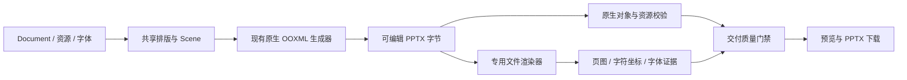

> Musterwork 历史设计快照 · 迁入日期：2026-09-24。来源：`docs/architecture/agent-runtime/proposals/presentation-lightweight-runtime.md`。
>
> 原文中的“当前”“已采纳”和商业 SDK 选择只代表来源项目当时的状态，不是 MusterOffice 的决定或验收结论。内核以[现行设计](../../design/presentations.md)为准；来源、摘要和链接转换见[迁移清单](README.md)。

# PPT 轻量客户端运行时：最终架构建议与替换门槛

日期：2026-09-23。基线：`a059ffc4c7ff16617abe0fb05050fd1f4d11fd44`。

状态：方案与可行性验证完成；产品迁移尚未实施，渲染器尚未取得无损替换资格。

## 1. 决策

采用 **共享的现有 PPTX 生成核心 + 客户端专用文件渲染器 + 宿主隔离执行**。桌面复用 Electron 的 Chromium，Web 使用浏览器。移除 PPT 专用的第二套 Chromium、Node、完整 LibreOffice 和 Poppler；不把当前 333 MB 的 LibreOffice WASM 作为长期替代品。

保留原生可编辑 PPTX；用户只需要预览和下载 `.pptx`，不提供 PPTX 转 PDF 产品功能。PDF 不再是 Artifact 的必需交付物。SDK 内部可能使用固定版式表示，这不等于增加 PDF 产品功能，也不能成为携带完整 Office 的理由。

**Apryse WebViewer 12.1.0 的无 UI Office 渲染适配器是当前首选候选，但不能立即替换上线。** 本次证明了其体积、性能和主要内容保留的可行性，同时发现环形图尺寸、字重等显示差异。需先消除或通过目标 Office 应用确定这些差异的正确行为，并完成授权确认。其他已测轻量库没有更充分的无损证据，不建立多引擎自动兜底链。

本方案确认的是架构和质量门槛，不声称一个尚未完成验收的 SDK 已经做到全场景完全一致。验证详情见报告（`Musterwork:docs/testing/reports/2026-09-23-presentation-lightweight-validation.md`）。

## 2. 质量的约束

必须保留：中文和混合文字、原有字体与字号、原图清晰度和裁剪、矢量对象、文本编辑、表格单元格与合并、图表的数据及可编辑工作簿、备注、页序和模板布局。

- 相同 Document、Scene、字体和资源输入，迁移前后生成的 PPTX 应字节一致。需要改变生成器时另立变更，不混入宿主瘦身。
- 不把幻灯片整体截图塞进 PPTX；不降分辨率、不自动缩小字体、不简化图表来满足性能预算。
- 不以“文件能够打开”“原生 XML 数据还在”替代视觉验收。
- 预览来自实际生成的 PPTX 字节，并绑定输出摘要；创作 DOM 预览仍可用于编辑，但不能冒充最终文件验证。
- 存量模板和已支持的导入链路必须覆盖。未知/不支持的源文件特性明确报告；不能把既有能力悄悄转成静态图片或删除。
- 栅格抗锯齿差异与布局差异分别评估。丢字、换字体、裁剪变化、换行变化、图表尺寸变化需要解释和解决，不能仅靠调低图像相似度阈值放行。

## 3. 职责与执行路径

1. `packages/presentation-engine` 继续拥有 Document、Scene、OOXML 编译和质量规则。将应用内的可复用执行编排提取到共享 package，禁止 Desktop 导入 Browser Runner 的源码。
2. 桌面使用独立的 Electron 隔离 renderer/Worker，复用 Electron Chromium；主窗口仅接收状态和小型索引。Rust Device Runtime 仍是任务、权限、取消和交付的唯一 Owner。
3. Web 使用现有隔离 Runner 和 Worker，复用同一生成与校验核心。不存在服务端渲染回退。
4. 存储、身份校验、任务协调、资源下载和上传仍有服务器开销；只有排版、编译、渲染这部分计算移到客户端，不能宣传整个 PPT 流程服务器零开销。

## 4. 去掉重复成本

### 生成与预览

- 主导出链不预先为每页产生两套持久化 PNG。排版保留完整 Scene；创作页图在编辑或 Agent 检查时按需生成，最终文件页图由文件渲染器生成。
- PNG、文件渲染和人工/Agent 视觉检查分开调度，但交付质量标准不降。编译完成与交付完成是不同状态。
- 只缓存当前版本的可见页和邻近页；按页内容、资源、字体与渲染器版本确定缓存键。改一页不重做整份文稿的布局和页图。
- 需要逐页审查时分批渲染，完成一页释放临时画布；不能为首屏预览一次保留几十张大图。
- 使用可转移的 ArrayBuffer、Blob/对象 URL、受控二进制流。避免跨进程反复 Base64、整份 JSON 拷贝或重复解压字体。
- 保留 SHA-256 身份校验，在 Worker/I/O 边界执行并复用结果；不在主窗口反复扫描同一文件。

### 字体与依赖

- 完整保留文稿实际使用的字体与合法可编辑嵌入。预览字体可做可靠子集；不能把仅含当前文字的子集误当成可任意继续编辑的完整字体。
- 默认字体随基础组件提供，其他字体按字体家族打包、按需准备并缓存；离线/私有化安装可预置需要的字体包。缺字不静默换成另一种字体。
- SDK 只打包选定浏览器所需的 Office/精简渲染资源，不带厂商完整编辑器 UI、多个重复引擎配置和 sourcemap。
- 字体和 SDK 均由本地或客户自己的静态资源源提供；运行时不得依赖厂商字体 CDN。签名清单、摘要、许可证和离线授权必须可验证。
- 不是把 1.3 GB 原生组件改成首次启动偷偷下载。大组件应真正移除；按需下载只用于有限、显式的字体或选定的小型资源包。

## 5. 渲染与校验接口

新的共享适配器接受已验证的 PPTX bytes 和资源闭包，输出：

- 实际页数与画布尺寸；
- 按页渲染结果与内容摘要；
- 实际排版后的字符、坐标及字体使用证据；
- 渲染器版本、输入摘要、诊断与可取消句柄。

质量规则继续检查实际文件，而不是由适配器自己宣布“通过”。本次 Apryse 直接文本/字符坐标可通过现有文字位置规则；但浏览器端实际字体证据的生产接口仍需完成，不能删除字体验证。

现有 `presentation-delivery-proof/1` 和 portable 输出合同把 PDF 当作必需文件，必须按版本正式演进，不能简单将 `render_preview=false` 或删掉 required 校验。历史 Artifact 仍可读取原来的 PDF；新 Artifact 以 PPTX、页图、证据为交付集合。

状态至少区分编译、原生校验、文件渲染校验、视觉检查和交付。错误、取消、Runner 关闭、后台冻结、资源失效都必须进入明确状态；不能无限重试或长时间只转圈。性能优化不能绕过既有交付门禁。

## 6. 体积与性能预算

以下为实施验收目标，不是已经打出来的新安装包数据：

| 项目 | 目标与口径 |
| --- | --- |
| macOS arm64 DMG | 争取回到 200–250 MB，250 MB 作为本次瘦身验收预算；签名/公证后的实物复核 |
| 基础包内容 | 零 PPT 专用 LibreOffice/第二套 Chromium/第二套 Node/Poppler，不以移到下载步骤替代删除 |
| 渲染器资源 | 当前样本实际用到的 Apryse 文件约 11.78 MB，测试替代字体与目录约 3.48 MB；不是完整产品包大小 |
| 额外字体 | 分项计量，不隐藏在“渲染器只有几 MB”的宣传口径里 |
| 10/40 页受控样本 | 资源就绪后完整导出与既有质量步骤，目标分别 ≤5 s / ≤8 s；需多轮统计 P95 |
| UI 响应 | 全程可输入/滚动/取消；目标 P95 主线程任务 <50 ms，无持续 >100 ms 阻塞；集成后测量 |
| 内存 | 分页处理、并发有界；记录峰值、完成后释放及反复导出后的稳定性，不能只报 JS heap 或文件大小 |

本次只有分阶段 PoC 和单机样本测量，没有最终 Electron 安装包、完整产品 E2E、低配置机器的 P95/峰值内存结果，不能把这些目标写成已经达成。

## 7. 落地顺序与放行条件

1. **先完成不改变 PPTX 的共享核心与宿主瘦身。** 提取执行编排，使用 Electron 自带 Chromium，取消默认的重复创作页图。所有已测样本保持输出摘要一致，原生对象/字体/资源检查不变。
2. **完成专用渲染适配器及质量合同迁移。** Apryse 是当前首选；解决图表几何和字体差异，直接使用文件渲染得到的文本/坐标，补齐字体证据。确认商业授权覆盖 Web、Electron、离线和客户私有化分发。未获确认不导入正式发行物。
3. **做发布前等价性验收。** 两套现有模板、全部已支持的图表/表格/矢量/图片特性、长中文/混合语言、导入/编辑/导出回归；由 PowerPoint/WPS 实际打开的结果裁定争议，不能默认 LibreOffice 或新 SDK 永远正确。
4. **通过后再移除旧组件并打包。** 校验安装包、首次下载、运行峰值、缓存、离线、取消和任务恢复。切换按版本原子进行，不保留双写、静默重试另一引擎等长期复杂度。

任一项出现丢字、字体替换、图表/表格不可编辑或明显布局变化，都不得以“轻量化”为由放行。阶段 1 可以验证并落地；阶段 2–4 达标之前不宣称全系统已经无损切换。

## 8. 外部依据

- [Apryse 无 UI 文档渲染 API](https://docs.apryse.com/web/advanced/lower-level-document-apis)
- [Apryse 部署资源裁剪](https://docs.apryse.com/web/best-practices/optimizing-lib-folder)
- [Apryse 自托管替代字体](https://docs.apryse.com/web/faq/self-serve-substitute-fonts)
- [Apryse Office 功能与授权入口](https://docs.apryse.com/web/ms-office/open-office)

这些文档证明接口与部署方式存在，不代替本项目的无损验收。
