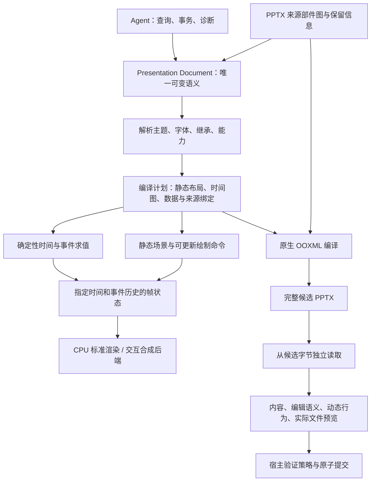

# MusterOffice 演示文稿内核设计评审

日期：2026-09-24。性质：设计与源码只读分析、范围决策记录；不是实现或兼容认证。

> 后续修订记录：本评审对应的 [v0.2 基线已归档](../archive/presentations-v0.2.md)。按用户要求，现已形成 [v0.3 设计](../design/presentations.md)及[逐问题响应表](../design/presentations/verification-and-roadmap.md)。下文保留评审当时的发现与建议；设计已有响应不等于实现和实测风险已经关闭。

## 1. 评审结论

**自研独立内核的方向成立，但详细设计 v0.2 不能直接作为当前第一期的完整施工图。** 它对静态演示文稿编译、字体资源、宿主边界和验证纪律的设计较完整；对完整演示文稿所需的时间、交互、媒体、SmartArt 和公式语义尚未形成设计。原范围还明确排除了部分新确认能力。

用户本次已明确第一期包含动画/转场、音视频、SmartArt、公式的创建、编辑和播放/呈现，并要求替换 Musterwork。该目标记录为 [ADR 0002](../decisions/0002-phase-one-complete-presentations.md)。不能把“先覆盖当前静态能力”当成一期交付，也不能用保留原 XML 冒充已能编辑和播放。

建议保留独立项目、纯计算核心、宿主负责执行和提交、同源原生/WASM 算法这些方向；先重构领域模型和互操作合同，再通过高风险纵向样本验证选型。Rust＋TS 仍是合理的首选候选，语言本身不能解决 Office 排版差异，也不能保证完整内核的包体。

评审建议：**认可产品方向；要求修订关键设计后再冻结实现基线。** 不建议按现稿先大量实现静态对象，再把动态演示作为外围扩展补上。

## 2. 证据范围与使用方法

- MusterOffice 基线：`3c03075343afef70b590c71390963d0e39289ca5`；评审对象为完整 1529 行的 `docs/design/presentations.md` v0.2，以及产品、架构和决策文档。
- 用户提供的 Musterwork 原设计路径已经变成迁移导航，完整方案在本仓库维护。
- Musterwork 当前源码 HEAD：`eb0eefcd6d1783789e4f2049181c2914178547fe`。该工作区另有未提交文档和诊断文件；本次没有改动它们。下文 `MW:` 表示该外部仓库的相对路径，不是本项目运行依赖。
- 查阅当前引擎编译、文本写出、字体嵌入、导入、客户端执行、预览容量、云端路由等实现；结合 9 月 23 日报告，区分正式旧链路和显式开发候选。
- 9 月 16 日审计只用于历史问题背景；后续报告已经改善的热点，不再当成当前尚未处理的事实。
- 本次未重跑性能、未打开 Office/WPS、未做原生/WASM 选型实验。历史测量均注明来源，不能视为本次实测或当前线上状态。
- 本文的模型、接口、预算方法及阶段安排是评审建议；只有 ADR 0002 中的用户目标已经确认。

关键源码和报告索引在第 12 节。对外技术事实补充核对了 ECMA、Microsoft、Rust 与候选组件的一手资料；链接紧邻相关结论。

## 3. Musterwork 的实际问题与可保留基础

### 3.1 现有系统已经具备的正确基础

Musterwork 并非整页截图式 PPT 生成器。源码的 `compileScene` 同时接收 Document 和 Scene，生成原生文本、图表、工作簿、表格、图片、形状及字体部件，并校验文档与 Scene 的身份。稳定对象映射、完整字体嵌入、候选校验、Runtime CAS/收据/Artifact 提交值得保留。

当前 `presentation-document/1` 是受限声明式 HTML AST；HTML、Scene 和 PPTX 是派生物。迁移应保留这些经过验证的产品行为和失败语义，重新设计底层计算，不要求保留 DOM 作为排版引擎。

### 3.2 当前存在不止一条执行路径

| 路径 | 观察到的结构 | 本次结论 |
| --- | --- | --- |
| 历史/原有发行路径 | Node/Chromium 排版、PPTX 编译、LibreOffice/Poppler 实际文件验证 | 重型依赖与多表示转换是明确的替换对象；不推断当前线上镜像 |
| 9 月 23 日开发候选 | Rust 任务所有者 → 本地/浏览器宿主 → DOM 测量 → 编译 Worker → Apryse 文件渲染 | 已有产品接入证据，仍有商业依赖及未裁定的互操作问题 |
| Cloud 路由 | Browser 与 Managed 由持久策略选择；模板维护另有受控后台接续 | 完整替换需要覆盖无客户端和后台消费者 |

客户端候选已经实现字体分包、完整字体预压缩、临时缓冲生命周期调整、布局缓存及实际文件页缓存。再次只提出这些优化，不能构成自研内核的新增架构价值。

### 3.3 历史测量指向什么

以下来自 `MW:docs/testing/reports/2026-09-23-presentation-client-integration.md` 第 11 节。环境为 Apple M4 Max、36 GiB RAM、macOS 26.2，Electron 42.7.1 / Chromium 151.0.7922.34；本地资源已准备，每组 20 次重复，清空最终页图缓存，允许资源与布局缓存。

| 环境 | 10 页完整导出 P95 | 40 页完整导出 P95 | 报告的进程组峰值 |
| --- | ---: | ---: | --- |
| Web 开发候选 | 4.066 s | 5.786 s | 1936 / 1850 MiB RSS |
| Desktop 开发候选 | 4.514 s | 6.215 s | 2009 / 2032 MiB 工作集 |

这些内存统计可能重复计入共享页，也含宿主开销，不能直接与新设计的内核增量内存做倍率比较。报告仍记录偶发长任务、低配设备未验收、Office/WPS 差异未裁定；它没有证明内存泄漏，也没有证明低内存目标达标。

由此可见：近期速度改善已有证据，**新内核应优先解决依赖闭包、内存峰值、排版统一和互操作语义**。把 JS 换成 Rust 后再跑同样的重复转换，不足以从根本上解决问题。

### 3.4 多个排版系统之间的语义转换是核心风险

当前正文先由 DOM 测量，然后 `pptx/primitives.mjs` 根据测得的行生成 `<a:br>`，同时输出 `wrap="square"` 和 `<a:noAutofit/>`。这是可见源码行为；它不等于已经证明具体用户文件有错误。

风险是：自动换行被固化为显式换行后，Office 中拉宽文本框或替换更长文字，可能保留本不该保留的断行；目标应用也仍会依据自己的字体与段落规则排版。这必须纳入编辑实验，不能只比较初次打开的截图。新内核需要明确软换行与作者显式换行的语义，而不是继续把测量结果直接当作文字内容。

## 4. 需要关闭的设计问题

P0 表示阻止冻结当前一期架构或完成定义；P1 表示必须在相应子系统实现/迁移前关闭。它们是设计问题优先级，不是生产事故评级。

| ID | 级别 | 问题及证据 | 影响 | 必须补齐的合同 |
| --- | --- | --- | --- | --- |
| R01 | P0 | v0.2 §4.3 排除动画/媒体；§9 对象模型没有 Timeline、Media、Diagram、Math | 新确认的一期目标无法由现有模型表达 | 完整演示语义、动态播放、原生读写及验收矩阵 |
| R02 | P0 | §11.2/11.6 提到目标应用会重排，但未定义文字与图表如何映射、约束与裁定 | 自家预览正确仍可能交付错版或编辑体验差 | 文字、图表、主题等的目标应用行为档案与编译规则 |
| R03 | P0 | §9/12 仅原则性描述 source map 与未知部件保留 | 全量重建可能破坏继承、扩展、动画引用、SmartArt 编辑性 | 可保留的 OPC/OOXML 来源模型、受影响闭包与对象身份规则 |
| R04 | P1 | §11.3 有嵌入原则，缺字体格式/样式槽/目标应用实际支持的细分合同 | 新字重、可变字体、外部编辑后可能换字或缺字 | 字体身份、嵌入映射、替换策略与无系统字体验收 |
| R05 | P1 | §14 预算主要依据静态 10/40 页；新增视频/效果后工作量不同 | 同页数下耗时/内存可相差很大；体积口径可能遗漏播放器 | 工作负载分类、分阶段资源账本、完整发行及播放预算 |
| R06 | P1 | §16.2 默认 40 页；现有 `apryse.mjs:65` 和 `portable/collect.mjs:64` 区分 40 页创作与 80 页预览 | 用单一 Document 限制可能误删已支持的只读预览能力 | inspect/render/edit/write 分别准入与容量验收 |
| R07 | P1 | §13.4 将无人值守执行留待决定；当前 Cloud 源码已存在 Managed 路由 | 只迁 Web/Desktop 前台不能移除旧服务器渲染依赖 | 各产品入口、后台维护、无客户端执行位置与隐私合同 |
| R08 | P1 | §20 只有迁移类别，没有逐操作/逐版本消费者表 | 历史草稿、外部改稿、模板后台和报告易产生混合语义 | 旧新合同映射、历史读取、外部文件导入及回滚门禁 |
| R09 | P1 | §15 的 T01–T30 主要是静态正确性；没有动态行为和成稿质量对照 | 文件合法不能证明播放正确或与其他产品同等成稿质量 | 时间/事件验收、实际编辑体验、代表性任务盲评 |

这些问题大多不是“文档没提到原则”，而是原则尚未落实到数据类型、算法边界、行为规则和可执行验收。现稿已经有外部验证、保留闭包、取消和信任边界，不应重复把它们列为完全缺失。

## 5. 建议的完整演示文稿架构

### 5.1 三类主要表示应扩展为有明确职责的完整链路

编译计划是派生缓存，不是第二份可修改文稿。Writer 消费语义和布局的显式结合，不能从只剩 glyph/path 的低层 Scene 猜回段落、图表、SmartArt 或公式。

现稿 §8.2 已说格式层使用 Document/Scene；这里建议把该约束写成类型化接口，消除 §8.1 中 `Scene → Writer` 简图可能带来的歧义。

### 5.2 领域模型需要新增的结构

| 结构 | 主要内容 | 应保留的编辑语义 |
| --- | --- | --- |
| 页面、母版、版式、主题 | 占位符、继承来源、颜色与字体引用、局部覆盖 | 更换主题/重置版式仍联动；不只保存最终坐标/颜色 |
| 文本与字体 | 自然段、run、列表、软/硬换行、文字范围、字体角色 | 同一段落可自然改字与重排，避免逐字文本框 |
| 图表与表格 | 数据、缓存、内嵌工作簿、系列/类别身份、合并关系 | 编辑数据后仍能重算并保持样式和绑定 |
| Timeline / Transition | 顺序/并行时间节点、触发条件、效果、对象/文本范围目标 | 可改时长、顺序和触发对象；删除/复制对象时引用一致 |
| Media | 字节引用、容器/编码元数据、裁切/时段/音量/书签、海报帧 | Office/WPS 可继续编辑受支持的媒体属性 |
| Diagram / SmartArt | 数据节点与连接、布局定义、样式/颜色、用户修改及派生绘图 | 可在目标应用中按 SmartArt 添加节点、换布局 |
| Math | 公式树、样式、行内/独立段、数学字体和布局参数 | 目标应用识别为原生公式并能修改分式、矩阵等 |
| 演示控制与文稿结构 | 页顺序、章节、隐藏页、备注、链接/动作等 | 浏览/放映行为与文稿内容一致；具体清单仍需穷举 |

对象 ID、子对象 ID、文本范围和跨页引用需要共用引用系统。现有 scalar 索引可继续作为对外协议，但文字修改必须定义动画范围的更新；否则动画仍指向改稿前的字符。外部应用回存后 ID 变化要输出重映射或冲突，不能假设自定义标签永久存在。

### 5.3 时间轴与播放不是逐帧导出 PNG

建议核心提供纯函数式的时间/事件求值：输入固定文稿、播放状态、时间和有序交互事件，输出帧状态及媒体控制命令。宿主提供时钟、点击/键盘事件、音频设备和实际调度；文档不得访问系统时钟或执行任意脚本。

必须定义 click、with-previous、after-previous、延迟、重复、自动反向、暂停、跳转、seek、重放和播放完成的行为。随机 seek 的结果不能只由时间推导：含点击触发时还需要事件历史或确定的状态快照。

Microsoft 的 PresentationML 动画文档明确区分页面 `timing` 与页面 `transition`，并允许动画指向对象或对象内文字范围。这支持将时间和对象身份作为领域能力，而不是播放器私有附加字段。[Microsoft：Working with animation](https://learn.microsoft.com/en-us/office/open-xml/presentation/working-with-animation)

CPU 标准渲染适合作为静态页和抽样帧的可复现基准；实时播放应复用静态层、纹理/字形缓存、脏区域与合成命令，评估 GPU 后端。CPU-only 是否能满足复杂动画需要实验，不能在一期需要播放后仍无条件沿用“GPU 以后再说”。GPU/媒体输出允许经过定义的像素容差，语义和时间状态仍须确定。

### 5.4 媒体分层

核心拥有媒体对象语义、时间关系、包关系与受限元数据；宿主拥有授权字节、解码会话、音视频设备和文件/网络能力。两端使用同一时间合同，避免浏览器与原生各自决定触发和暂停行为。

应按容器、视频编码、音频编码、profile、目标应用和宿主列矩阵。字节可以写进 PPTX 不等于能在目标应用播放。浏览器 WebCodecs 提供编解码接口，但容器解复用仍需要额外组件；不能把“浏览器有 API”当成所有媒体格式天然可用。[MDN：WebCodecs API](https://developer.mozilla.org/en-US/docs/Web/API/WebCodecs_API)

默认保留已满足交付条件的原媒体字节，不为减少包体自动转码。必须转换时提供明确的格式/质量决策与证据；所需解码器/转换组件计入完整依赖清单。Microsoft 的媒体扩展还有 trim、fade、bookmark 等语义，不能只建一个 `video_url` 字段。[Microsoft：CT_Media](https://learn.microsoft.com/en-us/openspecs/office_standards/ms-pptx/f8b7e1cb-976e-4f38-8139-f9e5ffa826e8)

### 5.5 SmartArt 与公式

SmartArt 不能以“一组可编辑形状”代替验收。需要保留数据图、布局规则、颜色/样式以及派生绘图的对应关系，并实现内容增减后的布局行为。原生结构涉及多个 Diagram 部件；仅保留截图或数据 XML 不足以证明完整可编辑。[Microsoft：PresentationML structure](https://learn.microsoft.com/en-us/office/open-xml/presentation/structure-of-a-presentationml-document)、[Diagram LayoutDefinition](https://learn.microsoft.com/en-us/dotnet/api/documentformat.openxml.drawing.diagrams.layoutdefinition?view=openxml-3.0.1)

公式需要自己的树结构和数学排版：分式、上下标、根式、矩阵、定界符、运算符等不能依赖普通文本盒模拟。LaTeX 可以是输入适配，但主模型应能映射原生 OMML/DrawingML 数学结构。目标应用中的公式编辑及回存必须验收；仅 SVG 预览不构成原生公式支持。[Microsoft：DrawingML Math](https://learn.microsoft.com/en-us/openspecs/office_standards/ms-odrawxml/853b19c7-68a9-4f9a-a2ae-5e6cb0d02e62)

### 5.6 Agent API 需要覆盖语义操作和动态诊断

在现有 create/query/apply/layout/render/export/verify 外，建议增加同一事务体系下的时间节点修改、媒体参数修改、SmartArt 数据节点修改、公式子树替换，以及 `playback.seek/step/dispatch`、指定状态的 `render.frame`。这些是 API 族建议，不是已冻结名称。

诊断须支持时间范围、事件序列、媒体片段、SmartArt 节点、公式子树路径。Agent 应能得到“第 3 次点击后标题仍被遮挡”及对应帧证据，而不是只得到第一页 PNG。

高层创作接口可提供可审查的布局组合、主题应用、图表/流程图构建和模板容量分析；最终均展开为领域事务。内核保持无模型，Musterwork Agent 继续负责内容、叙事和审美决策。

## 6. Office/WPS 互操作应成为编译合同

### 6.1 从“符合格式”进一步到“行为可预测”

ECMA-376 定义格式与包装基础；Microsoft 另有标准实现说明和 PPTX 扩展规范。只完成 XML/ZIP 结构不能推出目标应用显示、编辑和播放一致。[ECMA-376](https://ecma-international.org/publications-and-standards/standards/ecma-376/)、[Microsoft MS-PPTX](https://learn.microsoft.com/en-us/openspecs/office_standards/ms-pptx/efd8bb2d-d888-4e2e-af25-cad476730c9f)

建议每一类对象维护统一、版本化的行为规范：输入语义 → 可表达范围 → OOXML 编译规则 → 本引擎求值 → 目标应用测试。目标应用差异应由有样本依据的规则拥有，避免散落在宿主、SDK 或模板里的位置补偿常数。

兼容档案不能为每个应用生成视觉相似但互不相容的文件后，宣称同一文件跨端一致。面向多个目标交付时，要求同一候选 PPTX 在约定矩阵通过；确需目标专用输出时作为明确选项和独立产物，不能默默改变默认合同。

### 6.2 文字的具体缺口

需冻结字体度量、段落行距、段前/段后、内边距、baseline、项目符号缩进、RTL/东亚语言、软硬换行、自动适配与文本框增长策略，并定义导入时的继承优先级。`noAutofit` 控制自动适配，不等于替 Office 固定了所有字形坐标。[Microsoft：BodyProperties](https://learn.microsoft.com/en-us/dotnet/api/documentformat.openxml.drawing.bodyproperties?view=openxml-3.0.1)

推荐自然段保持原生段落；仅作者明确要求的断行作为显式断行。若某一版式确实需要固定断行，应在语义和编辑行为中明确表达，再验证目标应用；不能把内部自动测量结果无差别写成作者意图。禁止以每个字一个文本框或正文转路径追求截图一致。

字体策略需增加静态/可变字体、TrueType/CFF 等格式及各目标支持的矩阵。同一家族多种 weight 如何映射也不能留给通用 `fontWeight`：当前 `fonts.mjs` 已对同家族映射到同一原生样式槽的多个字重明确拒绝，表明浏览器 CSS 字重与 PPTX 字体绑定并非一对一。

### 6.3 图表的具体缺口

需定义类别/数值/日期轴、空值、负数、排序、组合图、次坐标轴、标签与数值格式、图例区域、手动/自动绘图区布局、工作簿修改后的重算。每个系列和数据点使用稳定身份，不能靠数组序号维持所有动画和标签绑定。

DrawingML 图表有手动布局的目标及位置/尺寸模式；建议对可表达且目标应用验证通过的布局显式写出，未能控制的行为用基准约束，不假设写入坐标就一定被各应用采用。[Microsoft：ManualLayout](https://learn.microsoft.com/en-us/dotnet/api/documentformat.openxml.drawing.charts.manuallayout?view=openxml-3.0.1)

当前环形图尺寸、字重差异尚未经 PowerPoint/WPS 裁定，不能让 LibreOffice、Apryse 或新内核任何一方天然成为真值。标准、创作意图和目标应用行为分别取证，差异修复要有对象级解释。

### 6.4 导入和保留应有结构化来源层

建议 Document 附带受约束的 SourcePackage 描述：原始部件身份、关系图、XML 来源片段、命名空间上下文、扩展、继承来源和语义对象映射。它是文稿来源和保留数据，不是另一个独立可写的文档。

编辑时由事务派生变更集合，确定受影响部件及关系闭包。未修改内容保留原始有效结构；修改内容由对应语义编译器重写并验证引用、共享依赖及关联缓存。这里的格式局部重写是有模型和验证约束的编辑算法，不能实现为无结构依据的字符串替换。

必须覆盖已认识对象上的未知属性/扩展，不能只把整个未知对象归为 opaque。还要处理 `AlternateContent`、命名空间、母版/主题引用、动画目标与媒体关系。Microsoft 本身使用兼容扩展表达新对象，因此保留模型须参与正确性，而非事后存一份 XML 备用。[Microsoft：Content Part Extensions](https://learn.microsoft.com/en-us/openspecs/office_standards/ms-pptx/a05ae034-990f-4474-8c97-5c70bb0a9862)

对一期承诺的 SmartArt、公式、动画等，opaque 保留只能是实现过程中的中间状态，不能满足一期退出条件。未知新扩展仍需明确边界；这不等于降低已经确认的能力要求。

### 6.5 “同等质量”需分解为可裁定标准

| 维度 | 建议通过条件 |
| --- | --- |
| 内容 | 文本、表格、数值、备注、关系和媒体完整；无静默遗漏 |
| 视觉 | 目标应用中无非预期换行、裁切、错误字体或图表几何；容差与复核规则有依据 |
| 编辑 | 文本框、母版、图表、SmartArt、公式、媒体和动画均能按各自原生语义编辑 |
| 动态行为 | 固定事件序列下的顺序、触发、时间、媒体同步和跳转正确 |
| 成稿水平 | 相同输入任务下比较叙事、排版、图表可读性、风格一致和修改成本 |
| 使用体验 | 实际 Agent 任务可修改、取消、恢复、下载和外部编辑再导入 |

“与其他产品没有差异”应落实为功能和质量不退化；不能在没有样本、版本和指标时承诺任意软件、任意字体下逐像素完全相同。若两个目标应用本身行为不同，需明确是同一交付合同下的可接受差异，还是必须阻断的功能不一致。

## 7. 轻量、高性能与小体积的可行边界

### 7.1 必须区分五类大小

分别报告基础计算包、完整演示模块集合、字体/解码资源、产品安装增量、输出 PPTX。静态页面按需不加载播放器是合理架构；完整离线安装仍需统计所有一期能力依赖，不能只公布最小 WASM。

历史报告中的 1 页 PPTX 约 27.8 MB，含两个完整嵌入字体程序；页数增长到 40 页时仍约 28.0 MB。这说明文稿体积可能被字体主导，与核心语言关系有限。Microsoft 也明确指出完整字体有利于后续编辑，仅嵌入已用字符会限制同字体编辑。[Microsoft：Benefits of embedding custom fonts](https://support.microsoft.com/en-us/office/fonts/benefits-of-embedding-custom-fonts)

因此默认可编辑离线交付应继续保留所需完整字体；从减少重复嵌入、复用已验证压缩字体、选择经过确认的字体组合等方向优化。内核小与交付文件小是两个独立目标；不能承诺任意中日韩字体与高码率视频都装入固定小文件。

### 7.2 内存必须由算法结构控制

建议建立资源账本：固定核心 + 当前页语义/布局 + 字体缓存 + 当前图片解码 + 效果离屏面 + 媒体帧队列 + 压缩/输出缓冲 + 有界缓存。所有分配归属可追踪，预估、实际用量和预算错误都可报告。

例如单张 1600 万像素 RGBA 图约占 61 MiB；40 张 1600×900 RGBA 页图同时保留约占 220 MiB。这只是存储算术，不是测量。它说明“按页释放”必须覆盖临时滤镜面、媒体帧和宿主缓冲，不能只释放最终 PNG。

推荐按页/部件处理、字体按 face 借用、图片受限解码、媒体有界帧队列、输出流式写入。需要分块效果时处理滤镜边缘区域，防止分块产生接缝；不能为预算改变阴影或图像效果。

ZIP 写出后验证还需要读回同一候选字节。现稿 ResultSink 应补充“完成但未发布的不可变输出可作为 ResourceProvider 输入”的合同，支持原生暂存和浏览器有界存储；否则实现很容易仍保留整份输出与重读副本。

缓存容量不是总内存上限。原生分配器和 WASM 线性内存的高水位也需记录；释放业务对象不代表宿主立即归还 RSS，必要时按任务销毁执行实例，在下一任务重建。共享缓存由宿主显式管理，不能靠无限常驻实例换快。

### 7.3 性能预算应按工作负载分别验证

| 档案 | 必须控制的变量 | 验收重点 |
| --- | --- | --- |
| 10/40 页静态创作 | 字体、节点、字符、图表数据点、图片像素、效果 | 沿用原有完整导出预算作为待验证目标 |
| 80 页源文件预览 | 实际部件数、字体、媒体/未知对象、目标页范围 | 与创作容量分开；不能先强制转为 40 页 Document |
| 复杂图形/SmartArt/公式 | 布局图规模、公式深度、路径段、效果范围 | 求解复杂度、预算中断、编辑后重算 |
| 动态播放 | 输出分辨率、活动对象、效果叠加、帧率目标 | 帧时间 P95/P99、掉帧、seek、音画同步、持续内存 |
| 媒体交付 | 文件字节、容器/编码、片段数量、是否转码 | 有界读取、写出/校验吞吐、完整交付与解码兼容 |
| 冷启动/离线 | 缺失模块和字体、网络条件、资源已缓存比例 | 用户端首个可见结果、总准备时间、离线完整闭包 |

静态 5/8 秒预算不能直接套用任意体积的视频文稿，也不能因新增能力就无证据放宽全部静态预算。E0 应给出分阶段目标和测试设备，目标变更保留理由与前后证据。

除页数外还需约束矢量段数、SmartArt 规则复杂度、公式节点、动画事件/循环、媒体解码尺寸及离屏像素总量。限额由宿主执行档案协商，不静默删内容。每个阶段必须可中断；单次字体、压缩或解码库调用也要纳入最长不可中断区间。

按设备/宿主进行跨任务准入，不让每个会话各自申请 512 MiB 后并发耗尽机器。准入和公平调度由 Musterwork Runtime/宿主负责，核心只报告需求并执行已授予的预算。

## 8. Musterwork 的完整替换面

### 8.1 建议建立逐消费者迁移清单

| 消费者 | 保留的产品事实 | 新内核接入要求 |
| --- | --- | --- |
| 普通 Agent 创作/修改 | Runtime 授权、草稿 revision、同一 Artifact 版本链 | 文档与操作适配、原生导出、完整报告和真实预览 |
| Desktop | Device Runtime 为唯一任务/提交所有者 | 隔离原生宿主替代 DOM 和第三方 Office 运行载体 |
| Web | Cloud Runtime 授权、Browser Job 与资源闭包 | WASM Worker、动态预览/播放宿主、取消与断线恢复 |
| API/Channel/无人值守 | 已有执行策略与权限不消失 | 无浏览器时由选定的原生受管宿主使用同一内核 |
| 私有/平台模板编译 | 上传、逐页阶段、租约、用户/管理员发布权限 | 解析、源预览、参数化材料、压力测试和整包验证 |
| 本地工作副本预览 | 外部修改后的文件字节为当前预览来源 | 独立只读渲染档案，包含既有 80 页能力 |
| 历史产物/公开分享 | 旧格式、旧证明和授权仍按原语义读取 | 新报告不冒充旧证明，媒体资源保持授权闭包 |
| 开发与发行组件 | 不可变组件版本、离线可安装、升级可恢复 | 扫描所有旧依赖消费者，完成后移除运行资源 |

`cloud-worker/src/presentation_routing.rs` 与持久路由实现已支持 Browser/Managed，并有模板任务 Pending 时的受控后台接续。建议保留既有产品策略，将 Managed 实现换为相同的原生内核；这与普通客户端任务失败后偷偷上传服务器是不同场景。

具体路由政策和接续状态机仍属于 Musterwork，不能塞进开源内核。浏览器关闭后不能保证继续运行；后台任务不能因为前台页面消失而永远等待。需要明确哪一执行者已经取得所有权、旧执行者如何被 fence、结果如何去重。

### 8.2 模板确定性导入与语义提炼应分工

Musterwork 现有模板流程有确定性解析、原稿预览、页面重建、语义参数化、压力样本和汇总。完整内核应逐步拥有已支持 PPTX 对象的确定性解析和保真编辑，Agent 主要负责识别标题/内容槽、设计意图与模板泛化。

格式解析错误不应长期交给模型根据截图重画。否则每次导入都重新猜布局，时间、费用和质量不可预测。模型可以提出显式设计变更，但不能替代内核读取原生数据和保留语义的责任。

### 8.3 外部编辑闭环必须单独验收

现有 ADR 0005 已区分：WPS/Office 本地改稿、显式“继续编辑导入”、上传为模板。新内核应继续遵守这三种意图。

外部文件变化后撤下旧 QA、从新字节生成预览；显式继续编辑时建立新基线与来源映射，保留原版本。若外部应用改变 ID、结构或未知特性，报告能映射的对象和冲突，不可拿旧 Document 覆盖用户的外部改动。

### 8.4 替换不是仅适配 `export.pptx`

应把 `document_*`、`template_*`、`source_preview`、`import_extract`、`source_page_*`、`author` 等已有操作逐一映射到新协议，同时检查 runtime result、delivery proof、candidate state、Artifact 和前端预览版本。

新增播放器/媒体证据可能需要新 manifest schema；不能把缺失 PDF 的新合同塞进旧版本，也不能让静态 PNG 证明覆盖动态内容。核心报告与产品 Artifact 分别版本化，旧新摘要和 canonical 规则同时留存。

代码替换完成后，还需检查后台镜像、桌面组件、开发准备脚本、历史只读入口、静态资源和签名安装包。消费者迁完才移除 LibreOffice/Poppler、专用 Chromium/Node 和商业 SDK；不删除 Electron 产品本身正常需要的 Chromium。

## 9. 一期能力与验收重建

### 9.1 以能力单元而非大类布尔值定义完成

建议清单字段：能力 ID、用户任务、read/create/edit/render/play/write/preserve 状态、组合限制、目标应用/版本、资源要求、对应用例、缺陷、证据。

`not_applicable` 区分静态公式的播放维度等不适用项目；`partial` 必须列实际缺口。已确认的一期功能若仍 partial，不得只靠整体通过率掩盖未完成项。

除了已明确的高级对象，还应盘点章节/隐藏页、自定义放映、动作链接、备注/讲义、批注、预设与自定义几何、图表扩展、3D/Morph 等项目，逐项确定范围和目标版本。这里是完整性调查清单，不是擅自承诺已支持，也不是自动把这些需求放到二期。

### 9.2 原有 T01–T30 之外必须增加的场景

以下 A01–A16 为建议测试编号，尚未实现。其目的在于暴露跨对象和编辑后的问题，不以单个展示样本代表全特性覆盖。

| ID | 场景 | 必须断言 |
| --- | --- | --- |
| A01 | 多层母版、版式、占位符，换主题与重置版式 | 继承来源、有效值、目标应用联动和未修改对象不退化 |
| A02 | 中文软换行/显式换行，拉宽文本框、插入更多文字 | 可自然编辑；不保留内部测量造成的错误断行 |
| A03 | 无本机所用字体，追加原稿未出现的中文字符 | 实际字体、嵌入及回存成立，无隐式换字 |
| A04 | 点击/并行/顺序动画，文字范围与路径动画 | 事件日志、抽样帧、初始/结束状态和目标引用正确 |
| A05 | 动画对象删除、复制、分组、文字增删 | 引用重写、范围更新、无悬空时间节点 |
| A06 | 转场、上一页/下一页/跳页、seek 与重放 | 状态重置、触发顺序和重复播放行为正确 |
| A07 | 音视频嵌入、片段、书签、暂停与恢复 | 文件可离线播放，时间和音画同步符合合同 |
| A08 | 媒体解码失败、权限撤销、浏览器播放限制 | 状态明确、无无限转圈、无静默格式替换 |
| A09 | SmartArt 增删节点、层级变化、换布局 | 原生 SmartArt 身份和编辑语义保留，布局正确 |
| A10 | 行内/独立公式、分式、矩阵、多级上下标 | 数学排版正确，在目标应用中按公式编辑并回存 |
| A11 | Office 创建文件 → 内核改一处 → Office/WPS 回存 → 再导入 | 变更可追踪，未编辑内容及依赖不损坏 |
| A12 | 80 页只读预览与 40 页创作分别准入 | 不因编辑模型上限拒绝原已支持的只读任务 |
| A13 | 模板后台在页面关闭后继续，API/Channel 无客户端 | 所有者、fence、取消、恢复和最终结果正确 |
| A14 | 完整动态文稿多轮播放、导出、取消和异常退出 | 帧队列/媒体设备/Worker/进程/临时输出可释放 |
| A15 | 损坏动画目标、SmartArt 关系、公式结构、媒体索引 | 对应检查可靠失败，不被静态截图通过掩盖 |
| A16 | 相同需求的产品对照与后续修改任务 | 成稿审美、可读性、完整性和编辑成本无明显退化 |

建立语义单元、对象组合、真实工作负载、恶意/损坏输入四类语料。原两套模板各 14 页是回归资产，不能代表任意外部 PPTX，更不足以覆盖一期动态行为。

### 9.3 外部应用与运行时检查分别执行

每个发布候选在固定 PowerPoint/WPS 版本、系统和字体环境中执行打开、编辑、播放、回存；条件变化后重新评估受影响范围。初期即可用少量高风险文件裁定，不能等所有特性写完才发现架构不兼容。

每份用户文稿在运行时仍执行实际字节重读、内容/关系/对象/字体/行为检查。若未实际经过 Office/WPS 打开，该文稿报告应为未现场检查，并引用适用的兼容档案。固定语料认证不等于任意组合的逐文稿证明。

图像相似度用于定位差异，内容与数据硬断言优先。动态内容还需事件轨迹、指定状态帧和目标应用行为对照；音视频使用有依据的时间容差，不要求跨硬件解码输出无条件逐字节相等。

## 10. 技术路线与实施顺序建议

### 10.1 继续调查 Rust 核心，但明确组件职责

| 候选 | 合适的职责 | 不能代替的工作 |
| --- | --- | --- |
| Rust 原生/WASM | 统一语义、内存所有权、有界执行、格式编译 | Office 行为兼容、审美和产品任务恢复 |
| HarfBuzz/Rustybuzz | 字形塑形 | 段落、表格、数学排版与整页布局 |
| Taffy 等 | 受控容器布局 | PPTX 继承、文本度量、SmartArt/图表规则 |
| tiny-skia/resvg 等 | CPU 图形基元、静态 SVG/标准帧渲染 | PPTX 语义、时间轴和媒体播放器 |
| 宿主图形/媒体适配 | 合成、呈现、解码和设备输出 | 重新定义动画/排版规则 |

这些边界有候选组件自身文档依据：[HarfBuzz](https://harfbuzz.github.io/what-is-harfbuzz.html)、[Taffy](https://github.com/DioxusLabs/taffy)、[resvg](https://github.com/linebender/resvg)。resvg 明确面向静态 SVG，不提供动画；可以用它画求值后的帧，不能把它当完整播放器。

Rust `wasm32-unknown-unknown` 的宿主能力有限，需要显式接口；原生/WASM 共享计算与字体身份，媒体解码和 GPU 则另有一致性层级。不要承诺所有宿主像素都精确相同，也不要以差异为理由复制一套排版算法。[Rust 目标说明](https://doc.rust-lang.org/rustc/platform-support/wasm32-unknown-unknown.html)

自研重点应是领域语义、兼容规则、编辑与验证闭环；不必从零重写所有 Unicode、字体、压缩和图形基元。依赖选择用质量、边界、体积和维护证据裁定，不以“全 Rust”替代设计判断。

### 10.2 先验证最难的合同

| 阶段 | 交付 | 退出条件 |
| --- | --- | --- |
| D1 范围与架构修订 | 完整能力清单、领域/来源/时间模型、目标应用矩阵、迁移表 | 不再有一期能力被旧排除项覆盖；关键接口可评审 |
| E0 风险验证 | 中文编辑、图表、母版、SmartArt、公式、动画与媒体的代表性原生/WASM链路 | 同一 PPTX 在目标应用完成相关编辑/播放；测全依赖与内存 |
| E1 纵向核心 | 固定模型、事务、资源、格式与标准渲染，动态对象贯通 | 核心不需要未来倒置职责才能补齐高级能力 |
| E2 完整能力建设 | 各一期对象、效果和组合逐项实现 | 能力清单和相应对象/组合用例通过 |
| E3 产品接入与系统验证 | 所有 Musterwork 消费者、历史数据、动态 Artifact/预览 | 产品链路、兼容、性能、资源与升级验收通过 |
| E4 替换完成 | 发行组件切换、旧依赖移除、回滚兼容 | 新用户任务默认走自研内核，存量结果可读可继续处理 |

互操作、性能和产品适配验证从 E0/E1 就贯穿进行，不是 E2 结束后的补测。阶段是研发拆分，不是缩减第一期交付范围。

E0 不应止于空白页或现有静态 6 类页面。至少包含跨字体中文文本编辑、原生图表改数据、母版/主题、SmartArt 增节点、公式改结构、点击动画及媒体书签的高风险样本。样本先小后组合，失败时修改模型/规则，不用截图化或永久旧引擎回退过关。

## 11. 对现有设计文档的具体修订建议

| 现稿位置 | 应修订内容 |
| --- | --- |
| §1、§4、§21–22 | 一期目标为完整演示文稿和产品替换；V0/V1 仅内部节点；明确新旧范围 |
| §8–9 | 语义 Document、来源部件图、编译计划、时间/事件状态、媒体/Diagram/Math |
| §10 | 动态编辑事务、文字范围更新、播放 API、时域诊断、输出回读接口 |
| §11 | 文字兼容规则、主题继承、图表行为、数学/SmartArt 布局与动态合成 |
| §12 | 受影响闭包、已知对象未知字段保留、原生高级对象、外部编辑再导入 |
| §13 | 原生/浏览器媒体宿主、无客户端执行、后台任务和播放限制 |
| §14、§16 | 静态/动态/媒体预算、完整体积、跨任务准入、复杂度限额和取消 |
| §15、附录 B | A01–A16 等新增动态/编辑/产品场景及功能组合覆盖 |
| §20 | 按消费者、工具操作、版本和旧组件建立可核验替换表 |

建议 v0.3 按职责拆出文档语义、时间与媒体、OOXML 互操作、资源性能、Musterwork 迁移五份子设计，主设计维护总体约束与追踪。不是机械追求文档数量，而是使每条规则有一个明确维护位置。

本次已记录新目标并标注 v0.2 范围失效；未把上述建议直接标为 Accepted，也未将尚未写出的子设计称为完成。开发语言、实验授权及组件选择仍遵循决策清单。

## 12. 本地证据索引

以下行号对应评审基线；后续改动以提交和符号定位为准。外部源码仅引用，不迁入本仓库。

| 证据 | 定位 | 用途 |
| --- | --- | --- |
| 原详细设计 | 本仓库 `docs/design/presentations.md` v0.2，§4/8–16/20–22 | 范围、模型、预算与完成定义 |
| 实际编译器 | `MW:packages/presentation-engine/src/pptx/compile.mjs:65` | Document/Scene 身份、原生写出 |
| 文本写出 | `MW:packages/presentation-engine/src/pptx/primitives.mjs:42` | 测量行转显式换行、段落与适配属性 |
| 字体嵌入 | `MW:packages/presentation-engine/src/pptx/fonts.mjs:113` | 完整字体与原生样式槽冲突 |
| DOM 测量 | `MW:packages/presentation-engine/src/html/measure-dom.mjs:82` | 实际浏览器 Range 行测量 |
| 导入 | `MW:packages/presentation-engine/src/import/core.mjs:57` | 40 页可编辑源提取及问题报告 |
| 客户端编译 | `MW:packages/presentation-client/src/compiler.mjs:24` | 字体作用域、实际文件验证顺序 |
| 40/80 页分离 | `MW:packages/presentation-client/src/apryse.mjs:61`；`MW:packages/presentation-engine/src/portable/collect.mjs:64` | 创作与源文件预览容量不同 |
| 现有操作族 | `MW:packages/presentation-engine/src/portable/operations.mjs`、`execute.mjs` | 迁移不是单个导出 API |
| 云端路由 | `MW:apps/agent-runtime/applications/cloud-worker/src/presentation_routing.rs:32` | Browser/Managed 与模板后台接续 |
| 持久路由策略 | `MW:apps/agent-runtime/crates/infrastructure/postgres/src/browser_gateway/presentation_route.rs:48` | client_preferred/client_only/managed_only |
| 产品 ADR | `MW:docs/architecture/agent-runtime/adr/0005-presentation-html-authoring-and-private-runtime.md` | 单一事实源、外部改稿、执行归属 |
| 模板与产品设计 | `MW:docs/architecture/agent-runtime/proposals/presentation-html-authoring-and-template-compilation.md` §12–15 | 后台模板、恢复、私有与公共目录 |
| 客户端合同 | `MW:docs/architecture/agent-runtime/proposals/presentation-client-integration.md` | 候选版本、资源与未完成验收 |
| 近期测量 | `MW:docs/testing/reports/2026-09-23-presentation-client-integration.md:217` | 设备、20 次 P95、内存与限制 |
| 字体体积与视觉差异 | `MW:docs/testing/reports/2026-09-23-presentation-lightweight-validation.md` §A/C/D | 输出大小、图表差异、未完成目标验证 |

本次文档检查覆盖新增文件、内部链接、决策状态与范围一致性。没有形成新内核的性能、Office/WPS 兼容或发行证据。
